# Camping with Sam Bananas: Repackaging Analysis

*Channel [Camping with Sam Bananas](https://www.youtube.com/@campingwithsambananas) | 188 produced uploads | catalogue 2026-09-04 | analysed 2026-09-24 | public data only, 0 retention curves*

## What this document is

Every number here traces to the <b>188 produced long-form uploads</b> of <b>Camping with Sam Bananas</b> (@campingwithsambananas, 73K subscribers), 2020-11-13 to 2026-09-01. The catalogue was pulled 2026-09-04; this analysis ran 2026-09-24. Outlier scores use the channel's own public basis: lifetime views against the median of each upload's nearest neighbours by publish date, so <b>1.00x means typical for this channel at that time</b>. That basis flatters older uploads, which matters when a candidate below is two years old.

The channel carries <b>0 retention curves</b> and <b>no Studio pull</b>. Retention and engaged views therefore do not exist for any video here, and this document does not pretend otherwise. It applies the system's repackage rule through stated public proxies, names the proxy on every candidate, and ends with the exact Studio pull that would confirm or kill each one.

## The rule, and what stands in for its missing half

The system's verdict table ranks retention-at-50% against first-28-day views: <b>high retention with low views = repackage</b> - the content kept its room and the packaging never filled it. Its chart says the same thing in one line: the RED line riding HIGH means the video kept its room but the package did not fill it, and that is a repackage candidate. Both halves are measured from curves and Analytics windows. Neither exists on this channel.

So each candidate below carries at least one public proxy for "the content works, the package did not":

- <b>P1, strong format.</b> The upload sits in a title shape whose own median beats 1.10x against this channel's contemporaries and is not era-bound. The premise is proven on this channel; what differed for this upload is the package.
- <b>P2, sibling natural experiment.</b> The same location or premise shipped again with a different package and scored far higher, under comparable weather and season. Same offer, different wrapper.
- <b>P3, weather hook.</b> The title names weather and the channel's weather-titled uploads sit far above its median, so a hook existed inside the footage and the original package underplayed it.

> **neutral**: <b>What the proxies cannot replace.</b> None of P1 to P3 measures whether viewers stayed past the first minute, and low lifetime views are not low engaged views: those are different measurements and only Studio has the second. One pull of 6+ curves converts every candidate below into a real verdict: curve strong and views low means republish the package; curve weak means the video itself failed and repackaging would spend a good thumbnail on a bad room.

## The channel these candidates come from

| Measure | Value | What it is |
|---|---|---|
| Produced uploads | 188 | live broadcasts and premieres excluded, per the channel page's own rule |
| Median views | 41,436 | lifetime, whole catalogue |
| Median outlier | 0.98x | 1.00x = typical for this channel at that point in time |
| Breakouts at 2x+ | 37 | count against time-neighbours, whole catalogue |
| Under 0.5x | 36 | count below half of contemporaries |
| Retention curves | 0 | 6 needed before any inside-video claim |
| Studio pull | none | no click-through, no engaged views, no viewer split |

*Channel scoreboard (Observed)*

### Formats, ranked

| Title shape | Median | Uploads | Standing on this channel |
|---|---|---|---|
| Camping In The Rain ___ | 1.96x | 43 | beats the channel median: ship more |
| Camping With ___ TEMU ___ | 1.54x | 3 | beats the channel median: ship more |
| Hot Tent Camping ___ | 1.39x | 6 | beats the channel median: ship more |
| Tarp Camping ___ | 1.11x | 15 | beats the channel median: ship more |
| ___ Canoe Camping ___ | 0.93x | 12 | in the working band: no action |
| Bushcraft ___ Shelter ___ | 0.72x | 8 | underperforms: stop or repackage the premise |
| Stealth Camping ___ | 0.70x | 22 | underperforms: stop or repackage the premise |
| 3 Days ___ In The ___ | 0.59x | 8 | underperforms: stop or repackage the premise |
| Winter ___ Camping ___ | era-bound | 33 | inconclusive: ran in a block, compares against itself |

*Format medians as published on the channel page (Observed)*

## Title grammar, measured across all 188 uploads

| Title feature | Uploads | Median outlier |
|---|---|---|
| RAIN in title | 63 | 1.64x |
| any weather word | 98 | 1.45x |
| no weather word | 90 | 0.73x |
| TEMU in title | 6 | 3.17x |
| budget-gear word | 6 | 1.63x |
| SOLO/ALONE | 49 | 1.30x |
| dog mentioned | 13 | 0.53x |
| has pipe separator | 97 | 1.11x |
| no pipe | 91 | 0.84x |
| guest/collab named | 34 | 0.67x |
| multi-day number | 18 | 1.19x |
| superlative | 11 | 0.73x |
| title <45 chars | 13 | 0.80x |
| title 45-75 chars | 139 | 1.04x |
| title >75 chars | 36 | 0.79x |

*Band medians over the whole catalogue (Observed)*

Read the bands as packages, not causes: each is a count of this channel's own uploads and claims no mechanism. The four that separate furthest from the 0.98x catalogue median are the ones worth acting on. <b>Weather in the title</b> is the channel's spine. <b>TEMU</b> is its strongest single word and also its smallest sample. <b>Dog in the title</b> and <b>guest/collab named</b> both sit well below the median while the dog band and the no-dog band share a median publish year of 2024, so era does not explain that gap away. <b>Title length</b> has a middle: 45 to 75 characters sits above both the short and the long band.

### Runtime against hold-proxy

| Runtime | Uploads | Median outlier |
|---|---|---|
| under 25 min | 32 | 0.49x |
| 25-35 min | 73 | 0.90x |
| 35-45 min | 55 | 1.20x |
| 45-60 min | 20 | 0.96x |
| 60 min+ | 8 | 2.13x |

*Runtime bands, whole catalogue (Observed)*

Under 25 minutes is the channel's weakest band and 60 minutes-plus its strongest, but the long band is only 8 uploads and includes several of the biggest rain videos, so treat the top row as suggestive rather than as a licence to pad. What the table does support: nothing here is punished for being long, and the shortest uploads are the ones underperforming.

### Cadence

On the recent 40 uploads, keeping a 5 to 9 day gap runs at 1.30x (n=14) against 0.97x (n=26) off rhythm, which reproduces the channel page's rhythm action. Across the full 188 the same test gives 0.99x on rhythm (n=58) against 0.98x (n=129), which is no difference at all. Cadence is therefore a recent-40 signal on this channel, not a catalogue law: keep the rhythm, but do not treat the 1.30x as something the whole history supports.

## Trajectory

| Year | Uploads | Median views | Median outlier |
|---|---|---|---|
| 2020 | 3 | 13,973 | 1.25x |
| 2021 | 24 | 17,537 | 0.96x |
| 2022 | 25 | 46,589 | 0.70x |
| 2023 | 25 | 52,355 | 1.00x |
| 2024 | 35 | 60,593 | 0.99x |
| 2025 | 47 | 38,249 | 0.93x |
| 2026 | 29 | 35,060 | 1.05x |

*Publish years, whole catalogue (Observed)*

Median views peaked in 2024 and have sat near 35 to 38k since, while the outlier median stays close to 1.00x: the channel is not losing ground against its contemporaries, the whole band is running smaller. That is why candidates are chosen on relative underperformance (outlier) rather than on raw views alone.

## Natural experiments: same place, different package

The strongest repackaging evidence on this channel is not statistical. In several cases the same location or premise shipped twice with different packaging, under the same audience and roughly the same conditions. The gap between the pair is what the package did.

### Wendy's drive-thru

| Published | Outlier | Views | Title |
|---|---|---|---|
| 2025-11-28 | 0.38x | 26,283 | My Riskiest Stealth Camp EVER - Directly behind Wendy's Drive-thru |
| 2025-05-09 | 3.58x | 156,188 | Stealth Camping in the Rain behind Wendy's |

*Wendy's drive-thru: every matching upload (Observed)*

### The Appalachian Mountains

| Published | Outlier | Views | Title |
|---|---|---|---|
| 2026-07-21 | 0.56x | 15,488 | 3 Days Camping in the Appalachian Mountains |
| 2026-07-05 | 1.54x | 35,060 | Camping in the Appalachian Mountains with ONLY TEMU items |
| 2026-03-08 | 1.66x | 100,332 | I'm NOT ALONE \| Winter Car Camping deep in the Appalachian Mountains |
| 2025-05-04 | 2.68x | 78,506 | Solo Wilderness Canoe Camping in the Appalachian Mountains |

*The Appalachian Mountains: every matching upload (Observed)*

### The stone picnic structures

| Published | Outlier | Views | Title |
|---|---|---|---|
| 2025-12-21 | 13.95x | 390,541 | Camping in a Stone Shelter during a Big Snow Storm |
| 2024-04-26 | 0.77x | 82,398 | Riverside CAMPING in the RAIN in a 3 Walled Stone House |
| 2023-05-26 | 1.47x | 64,209 | Relaxing RAIN camping in a stone house \| RETURN to the Picnic Structure |
| 2023-04-20 | 15.33x | 594,053 | Camping in a Stone Picnic Shelter during a RAIN STORM |

*The stone picnic structures: every matching upload (Observed)*

### Cheap-gear challenges

| Published | Outlier | Views | Title |
|---|---|---|---|
| 2026-07-05 | 1.54x | 35,060 | Camping in the Appalachian Mountains with ONLY TEMU items |
| 2026-04-22 | 1.30x | 120,585 | Camping in a CRAZY THUNDERSTORM w/Cheap TEMU Gear |
| 2026-01-17 | 12.79x | 367,873 | Camping in the Rain w/ UNTESTED GEAR from TEMU |
| 2025-11-16 | 1.98x | 108,220 | I camped in the CHEAPEST HOT TENT on AMAZON |
| 2025-02-28 | 5.21x | 205,580 | Riding out an INSANE THUNDERSTORM in a Massive Cave \| TEMU gear camp |
| 2025-01-30 | 0.80x | 39,800 | Can you go Winter Camping with Walmart Gear? |
| 2024-12-12 | 2.02x | 98,202 | Winter Camping with a Crazy Pop-up TEMU tent (plus other Whacky TEMU gear) |
| 2024-08-20 | 4.33x | 142,809 | Overnight Backpacking \| $200 TEMU Camping Challenge |
| 2022-12-11 | 0.41x | 27,067 | How to go Winter Camping with CHEAP GEAR \| Walmart/Amazon \| Beginner's Guide to Winter Camping Gear |
| 2022-10-28 | 1.96x | 79,264 | SOLO Overnight Camping in the Cheapest Hot Tent on Amazon |

*Cheap-gear challenges: every matching upload (Observed)*

Read the pairs, not the singles. The two Wendy's camps sit 203 days apart with a 3.58x against a 0.38x; the Appalachian week in July 2026 ran a TEMU-packaged trip at 1.54x and a plain "3 Days" packaged trip at 0.56x sixteen days apart. The stone shelter has done 15.33x and 13.95x when the storm is in the title and 0.77x when it is not. These are repackaging arguments the channel already made against itself.

## The repackage shortlist

Screen: outlier below 0.70x (the package underperformed its contemporaries), older than 180 days (the window has settled), and at least one of P1, P2 or P3 present. Twenty-three uploads qualify; the table orders them by how far they sit below their own format's median, because that gap is the clearest public stand-in for "strong premise, weak package".

| Outlier | Format | Views | Length | Published | Proxies | Title |
|---|---|---|---|---|---|---|
| 0.37x | 1.96x | 27,391 | 23:52 | 2023-11-19 | P1, P3 | Solo RAIN CAMPING in the Mountains \| Car Camping at the top of a Waterfall |
| 0.51x | 1.96x | 33,696 | 24:58 | 2022-12-12 | P1, P3 | Wet and Rainy Solo Camping in the Great Lakes |
| 0.52x | 1.96x | 32,982 | 40:49 | 2023-11-26 | P1, P3 | 3 Days Camping at a Mountain Lake \| Wet and Rainy Backcountry Camping Trip |
| 0.54x | 1.96x | 15,035 | 21:05 | 2021-11-02 | P1, P3 | Solo CAMPING in the MOUNTAINS \| Overnight RAIN Storm \| Bushcraft Spoon |
| 0.41x | 1.54x | 27,067 | 19:36 | 2022-12-11 | P1 | How to go Winter Camping with CHEAP GEAR \| Walmart/Amazon \| Beginner's Guide to Winter Camping Gear |
| 0.34x | 1.39x | 16,075 | 41:04 | 2024-10-09 | P1 | Camping in an INFLATABLE CABIN \| One More Camp for My Old Dog |
| 0.44x | 1.39x | 25,099 | 45:17 | 2024-11-29 | P1 | Hot Tent Camping in an Inflatable Tent with My Dog |
| 0.38x | 1.11x | 40,187 | 36:03 | 2024-04-19 | P1 | Solo Bushcraft Overnight \| Tarp Under a Fallen Tree \| Camping Riverside |
| 0.52x | 1.11x | 37,687 | 25:41 | 2024-06-16 | P1, P3 | Camping on a Beach \| Tarp and Bivvy \| SUDDEN STORM |
| 0.57x | 1.11x | 61,422 | 41:24 | 2024-02-27 | P1, P3 | Camping with my dog under a Blue Home Depot Tarp \| MORNING RAIN |
| 0.45x | 0.93x | 21,287 | 38:58 | 2024-09-01 | P3 | 3 Days River Camping on the Allegheny River \| Big Rain Storm |
| 0.41x | 0.70x | 18,635 | 26:53 | 2022-03-20 | P3 | Winter Stealth Camping in SNOW next to a hospital |
| 0.46x | 0.70x | 22,011 | 21:42 | 2021-11-28 | P3 | STEALTH CAMPING next to Chili's \| MORNING RAIN |
| 0.57x | 0.72x | 30,140 | 22:48 | 2023-02-27 | P3 | Solo Camping in the RAIN in a Bushcraft Shelter \| Morning Snow |
| 0.12x | n/a | 7,615 | 37:54 | 2025-04-03 | P3 | The Most Iconic Drive in Hawaii: THE ROAD TO HANA \| Rain Forests, Waterfalls and Camping |
| 0.25x | n/a | 17,129 | 22:21 | 2026-02-20 | P3 | Urban Camping in an Abandoned Barn during a SNOW STORM |
| 0.35x | n/a | 17,511 | 27:04 | 2023-03-18 | P3 | Winter Hot Tent Camping In Snow |
| 0.41x | n/a | 23,821 | 26:55 | 2022-03-08 | P3 | Hot Tent Winter Camping in SNOW \| Buschraft Build |
| 0.43x | n/a | 29,024 | 28:56 | 2026-02-13 | P3 | Winter Hot Tent Camping in DEEP SNOW and Freezing Temps \| Morning Snowfall |
| 0.54x | n/a | 16,052 | 48:46 | 2025-06-17 | P3 | RACOONS STOLE OUR FOOD! 3 Day Backcountry Rainy Camp with My Nephews |
| 0.55x | n/a | 56,620 | 33:43 | 2024-02-08 | P3 | Winter Tarp Camping in a Snowy Valley |
| 0.59x | n/a | 34,347 | 31:50 | 2022-02-15 | P3 | Emergency Shelter with Survival Tarp next to Frozen Lake \| Long Fire \| MORNING SNOW |
| 0.67x | n/a | 46,152 | 33:55 | 2025-11-22 | P3 | Hot Tent Camping in the Snow at a Secret Campsite |

*23 candidates, ranked by format gap (Observed)*

### Satisfaction check: like/view ratio

Pulled from public video pages: shortlist n=23 at median 0.059919 like/view against breakouts n=15 at 0.023244. SUPPORTED: individually weak videos inside strong formats show high satisfaction among those who clicked. Like per view for the repackage shortlist (n=23, median 0.0599) runs 2.6 times the breakout comparison set (n=15, median 0.0232), and inside the four strong formats the weak-out videos (n=10, median out 0.475) still post 0.0595 likes per view versus 0.0232 (n=11) for the high-out videos in those same formats (2.6 times). The weak videos are not disliked; they are under-distributed.

## Candidate by candidate: what to do

All 23 screened candidates, worst format gap first. Each line carries its public proxies, the like-per-view figure where it was pulled, and the vision diagnosis with its repackage direction where a thumbnail pass ran.

### Solo RAIN CAMPING in the Mountains | Car Camping at the top of a Waterfall

<b>Scored 0.37x</b> against contemporaries, 27,391 lifetime views, published 2023-11-19, 23:52, proxies: P1-strong-format (Camping In The Rain ___ 1.96x), P3-weather-hook. Own format median 1.96x (Camping In The Rain ___): the same shape is carrying the channel elsewhere.

<b>Likes per 100 views: 6.8</b> (1,856 likes on 27,494 views, lifetime, pulled 2026-09-24). <b>That is 2 to 3 times the breakout rate:</b> the people who clicked liked it, which is the satisfaction half of the repackage rule standing in for the missing curve.

<figure class="st-thumb">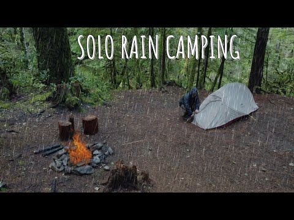<figcaption><b>Current package as shipped:</b> Solo RAIN CAMPING in the Mountains | Car Camping at the top of a Waterfall (2023-11-19).</figcaption></figure>

- Subject clarity at 160px: weak. The camper is a small mid ground figure crouched at a light tent; at shelf size the frame resolves to "generic forest with rain" and the human disappears. Three competing elements (text, tent+person, fire) split attention.
- Text overlay: yes, "SOLO RAIN CAMPING" white handwritten, top center. It labels the format instead of raising a question, so it spends the copy budget restating what the viewer already knows from the shelf.
- Contrast / weather: weather is the strongest asset, stylized rain streaks read instantly. Contrast is middling: dark green on dark green, the only pops are the fire and tent.
- Emotional hook: cozy survival vibe, but no unanswered question. It shows a completed camp instead of a moment of tension.
- What the winning sibling does differently: the stone shelter thumbnail puts one large human subject dead center with a single bright accent (red helmet) and zero text. Its tension comes from the shelter edge: dry inside, storm outside, in one glance. The subject IS the story, sized to survive 160px.
- Direction:
  - New title: "Solo RAIN CAMPING at the Top of a WATERFALL"
  - Thumbnail composition: one dominant group only. Tight crop on the camper hunched under the rain beside the dome tent, human large in frame (fills right two thirds), face or bright jacket as the single accent color (yellow or red shell against the green). Rain streaks kept and pushed heavier. The waterfall or cliff edge visible as one background band behind, so "top of a waterfall" is the unanswered question. No text, or at most 3 words "TOP OF THE FALLS" in a corner away from the bottom right timestamp zone, under 10 percent area.

### Wet and Rainy Solo Camping in the Great Lakes

<b>Scored 0.51x</b> against contemporaries, 33,696 lifetime views, published 2022-12-12, 24:58, proxies: P1-strong-format (Camping In The Rain ___ 1.96x), P3-weather-hook. Own format median 1.96x (Camping In The Rain ___): the same shape is carrying the channel elsewhere.

<b>Likes per 100 views: 5.4</b> (1,815 likes on 33,907 views, lifetime, pulled 2026-09-24). <b>That is 2 to 3 times the breakout rate:</b> the people who clicked liked it, which is the satisfaction half of the repackage rule standing in for the missing curve.

<figure class="st-thumb">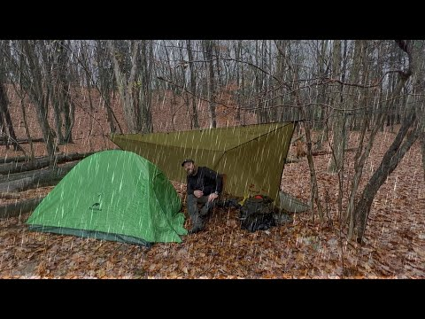<figcaption><b>Current package as shipped:</b> Wet and Rainy Solo Camping in the Great Lakes (2022-12-12).</figcaption></figure>

- Subject clarity at 160px: moderate but generic. The tent reads, the man blurs, and the leafy brown background merges into noise. Nothing in the frame says "Great Lakes"; it could be any eastern forest.
- Text overlay: no title text (good). A small watermark was reported bottom right, which collides with the timestamp zone and should be removed on repackaging.
- Contrast / weather: rain is explicit and the neon green tent is a genuine pop, but the green is the tent, not the story. Weather yes, stakes no.
- Emotional hook: cozy-core mood, atmospheric but passive. No location identity and no unanswered question beyond "will he stay dry".
- What the winning sibling does differently: the deserted beach winner gives the environment a starring role (exposed shore, choppy grey water, tree as shelter) and centers the human inside the shelter with one warm fire accent. The location itself IS the threat. This candidate hides its location.
- Direction:
  - New title: "Wet GREAT LAKES Camping | Shoreline Camp in a Cold Storm"
  - Thumbnail composition: two visual groups only. Foreground: the man large in frame inside the tent opening or under the tarp edge, one bright shell or the green tent as accent. Background band: actual Great Lakes shoreline with choppy grey water filling the upper third so the lake reads at a glance. Rain streaks retained. One question: can this tarp camp survive the lakeshore wind and rain. No copy; if any, "STORM ON THE SHORE" top left, clear of bottom right, under 10 percent area.

### 3 Days Camping at a Mountain Lake | Wet and Rainy Backcountry Camping Trip

<b>Scored 0.52x</b> against contemporaries, 32,982 lifetime views, published 2023-11-26, 40:49, proxies: P1-strong-format (Camping In The Rain ___ 1.96x), P3-weather-hook. Own format median 1.96x (Camping In The Rain ___): the same shape is carrying the channel elsewhere.

<b>Likes per 100 views: 6.0</b> (1,983 likes on 33,312 views, lifetime, pulled 2026-09-24). <b>That is 2 to 3 times the breakout rate:</b> the people who clicked liked it, which is the satisfaction half of the repackage rule standing in for the missing curve.

<figure class="st-thumb">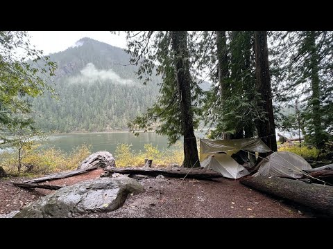<figcaption><b>Current package as shipped:</b> 3 Days Camping at a Mountain Lake | Wet and Rainy Backcountry Camping Trip (2023-11-26).</figcaption></figure>

- Subject clarity at 160px: decent for landscape, weak for story. Tent plus lake/mountain silhouette reads, but there is no human and no event. It is a postcard of a campsite.
- Text overlay: none.
- Contrast / weather: low contrast muted grey; the frame sells "overcast" not "wet and rainy storm". The title promises a rain storm the thumbnail does not show.
- Emotional hook: serenity, which directly contradicts the "Big Rain Storm" style stakes in the title. The viewer thumbing past reads a calm lake video.
- What the winning sibling does differently: the stone shelter winner shows the storm acting on a human in real time (rain on roof, person under shelter, fire). Weather as an event, not a mood.
- Direction:
  - New title: "3 Days on a Mountain Lake | WET and Rainy Backcountry Camp"
  - Thumbnail composition: two groups. Rain-lashed lake in the upper band with visible rain streaks and wind-chopped water (the storm is the co-star). Foreground: the camper at the tent entrance in a rain shell, large enough to read at 160px, tugging the tent fly closed. Keep the mountain in silhouette behind. One question: will this tiny tent hold against the lake storm. No text; if copy, "DAY 2: THE STORM" top left, under 10 percent area, clear of bottom right.

### Solo CAMPING in the MOUNTAINS | Overnight RAIN Storm | Bushcraft Spoon

<b>Scored 0.54x</b> against contemporaries, 15,035 lifetime views, published 2021-11-02, 21:05, proxies: P1-strong-format (Camping In The Rain ___ 1.96x), P3-weather-hook. Own format median 1.96x (Camping In The Rain ___): the same shape is carrying the channel elsewhere.

<b>Likes per 100 views: 6.0</b> (904 likes on 15,087 views, lifetime, pulled 2026-09-24). <b>That is 2 to 3 times the breakout rate:</b> the people who clicked liked it, which is the satisfaction half of the repackage rule standing in for the missing curve.

<figure class="st-thumb">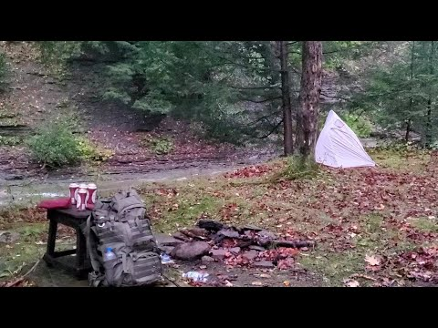<figcaption><b>Current package as shipped:</b> Solo CAMPING in the MOUNTAINS | Overnight RAIN Storm | Bushcraft Spoon (2021-11-02).</figcaption></figure>

- Subject clarity at 160px: poor for the promise. The dominant object at shelf size is a mug and plate still life, which reads as a coffee or food video. The human is missing entirely.
- Text overlay: none (the small enamel-mug lettering is incidental).
- Contrast / weather: red accents are nice but the weather is invisible. No rain, no wind, no storm. The single strongest title word (RAIN Storm) has zero thumbnail support.
- Emotional hook: cozy gear aesthetics, no question. The "overnight rain storm" and "bushcraft spoon" beats are both unrepresented.
- What the winning sibling does differently: rain literally visible in frame plus a large human subject; the winning tarp thumbnail (see below) likewise stages the storm mid-event with firelight as the warm counterpoint.
- Direction:
  - New title: "Solo CAMPING in the Mountains | OVERNIGHT Rain Storm"
  - Thumbnail composition: two groups. Drop the still life entirely. Hero: the pyramid tent at night or dusk with rain hammering it and a headlamp glow inside (the glowing tent is the accent and the question: is he dry in there). Secondary: the stream visibly swollen and rushing behind. Max 3 visual groups counting the stream. No copy; if any, "THE STORM CAME AT NIGHT" top left, under 10 percent area, clear of bottom right.

### How to go Winter Camping with CHEAP GEAR | Walmart/Amazon | Beginner's Guide to Winter Camping Gear

<b>Scored 0.41x</b> against contemporaries, 27,067 lifetime views, published 2022-12-11, 19:36, proxies: P1-strong-format (Camping With ___ TEMU ___ 1.54x). Own format median 1.54x (Camping With ___ TEMU ___): the same shape is carrying the channel elsewhere.

<b>Likes per 100 views: 3.9</b> (1,073 likes on 27,195 views, lifetime, pulled 2026-09-24). In the normal range for this catalogue; the repackage case here rests on the format gap, not on an outstanding satisfaction signal.

<figure class="st-thumb">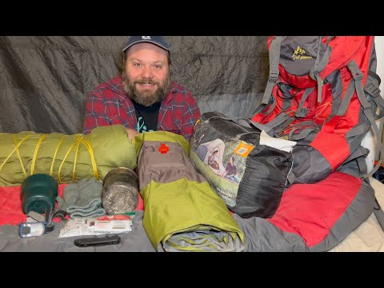<figcaption><b>Current package as shipped:</b> How to go Winter Camping with CHEAP GEAR | Walmart/Amazon | Beginner&#x27;s Guide to Winter Camping Gear (2022-12-11).</figcaption></figure>

- Subject clarity at 160px: strong on host, but the frame reads as "guy reviewing gear indoors". The still-frame genre (review) undercuts the promise (winter camping).
- Text overlay: none. For a guide/thesis video this is a missed opportunity: there is no "CHEAP GEAR" claim on the image itself.
- Contrast / weather: high contrast red backpack, but zero winter signal. A winter-camping guide thumbnail with no snow is a promise mismatch, same failure mode as the storm titles with no rain.
- Emotional hook: trust and approachability (fine for a tutorial) but no stakes and no demonstration. The winner proves cheap gear survives by showing the storm.
- What the winning sibling does differently: the INSANE SNOWSTORM winner shows the outcome the gear must survive: active snowfall, glowing tent, plus two-word caps text naming the event. It sells the test, not the gear pile.
- Direction:
  - New title: "Winter Camping with CHEAP GEAR vs a REAL Snowstorm"
  - Thumbnail composition: two groups. Left: the same gear pile shrunk to one compact stack with a bold price tag style element "$200 KIT" as the only copy (top left, under 10 percent area, clear of bottom right). Right: the host inside the cheap tent in a real snowfall, glowing tent or headlamp as accent, snow visibly falling. One question: can this cheap kit survive the storm. The field proof replaces the studio backdrop.

### Camping in an INFLATABLE CABIN | One More Camp for My Old Dog

<b>Scored 0.34x</b> against contemporaries, 16,075 lifetime views, published 2024-10-09, 41:04, proxies: P1-strong-format (Hot Tent Camping ___ 1.39x). Own format median 1.39x (Hot Tent Camping ___): the same shape is carrying the channel elsewhere.

<b>Likes per 100 views: 10.1</b> (1,642 likes on 16,190 views, lifetime, pulled 2026-09-24). <b>That is 2 to 3 times the breakout rate:</b> the people who clicked liked it, which is the satisfaction half of the repackage rule standing in for the missing curve.

<figure class="st-thumb">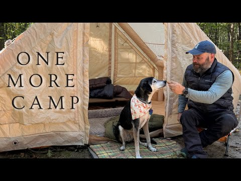<figcaption><b>Current package as shipped:</b> Camping in an INFLATABLE CABIN | One More Camp for My Old Dog (2024-10-09).</figcaption></figure>

- Subject clarity at 160px: strong. Dog and man interaction is large and legible, the tent shape is unmistakable.
- Text overlay: "ONE MORE CAMP" stacked left, roughly 12 to 15 percent of area, dark on light tent. Legible but it restates the emotional title phrase without adding information, and the stacked three-line block competes with the dog-man focal point.
- Contrast / weather: warm sunny forest, clean contrast, but the format this video underperforms in is hot tent / winter and the thumbnail shows a summer day. It is an emotional one-off packaged in a format slot, which is partly why it lags its format median.
- Emotional hook: the strongest asset of all 10 candidates. The old dog face-to-face with the man is a genuine heart hook. It just is not a curiosity hook: it answers "what is this" (a sweet dog camp) instead of asking anything.
- What the winning sibling does differently: the hot tent winner stages one glowing object against an environment that threatens it, and the copy names the novelty ("INFLATABLE HOT TENT") in two words. Novelty plus threat, not sentiment alone.
- Direction:
  - New title: "One More CAMP for My Old Dog | INFLATABLE Cabin Night"
  - Thumbnail composition: two groups. Hero: the old dog's face in close-up filling the right half, bandana kept, warm low light (the face is the emotional engine and survives 160px). Left half: the inflatable cabin glowing from inside at dusk with the man's silhouette at the entrance calling the dog. Swap the "ONE MORE CAMP" slab for two words only "ONE LAST CAMP" or none; if used, place top left, under 10 percent area, clear of bottom right. One question: will the old dog make it to one last camp night.

### Hot Tent Camping in an Inflatable Tent with My Dog

<b>Scored 0.44x</b> against contemporaries, 25,099 lifetime views, published 2024-11-29, 45:17, proxies: P1-strong-format (Hot Tent Camping ___ 1.39x). Own format median 1.39x (Hot Tent Camping ___): the same shape is carrying the channel elsewhere.

<b>Likes per 100 views: 6.4</b> (1,631 likes on 25,530 views, lifetime, pulled 2026-09-24). <b>That is 2 to 3 times the breakout rate:</b> the people who clicked liked it, which is the satisfaction half of the repackage rule standing in for the missing curve.

<figure class="st-thumb">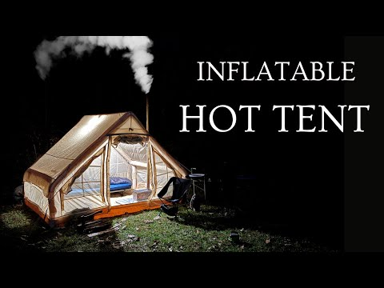<figcaption><b>Current package as shipped:</b> Hot Tent Camping in an Inflatable Tent with My Dog (2024-11-29).</figcaption></figure>

- Subject clarity at 160px: good on the tent (glowing shape against black is unmissable), weak on the dog and person (dog is a dark blob outside a dark background, person is only lower body).
- Text overlay: "INFLATABLE HOT TENT" right side, two tiers, roughly 15 percent area in white on black. Clean and legible, and it names the novelty. But it labels the product, not the situation, and the title's real hook (the dog) has no copy or visual prominence.
- Contrast / weather: excellent warm-cool contrast and the chimney smoke signals cold night. Weather reads as cold night rather than a specific storm, which is acceptable for hot tent format.
- Emotional hook: cozy-technology novelty ("inflatable hot tent works?") plus a companion angle that is visually under-delivered. The dog is present but invisible at shelf size.
- What the winning sibling does differently: the INSANE SNOWSTORM winner puts the dog-equivalent emotional subject (the camper's face inside the glowing tent) where it reads, and surrounds the tent with an active storm to raise the stakes of the glow. Same glowing-tent idea, but with a threat and a visible person.
- Direction:
  - New title: "INFLATABLE Hot Tent with My Dog | One Storm, One Dog"
  - Thumbnail composition: two groups. Hero: the glowing inflatable tent in falling snow at night (add the storm the current frame lacks), tent glow as the accent. Foreground: the dog's face lit warm by the tent opening, large enough to read at 160px, replacing the dark blob. Keep copy to two words "HOT TENT" or none; if used, beside the tent top left, under 10 percent area, clear of bottom right. One question: is this inflatable tent warm enough for the dog in the snow.

### Solo Bushcraft Overnight | Tarp Under a Fallen Tree | Camping Riverside

<b>Scored 0.38x</b> against contemporaries, 40,187 lifetime views, published 2024-04-19, 36:03, proxies: P1-strong-format (Tarp Camping ___ 1.11x). Own format median 1.11x (Tarp Camping ___): the same shape is carrying the channel elsewhere.

<b>Likes per 100 views: 5.6</b> (2,295 likes on 40,763 views, lifetime, pulled 2026-09-24). <b>That is 2 to 3 times the breakout rate:</b> the people who clicked liked it, which is the satisfaction half of the repackage rule standing in for the missing curve.

<figure class="st-thumb">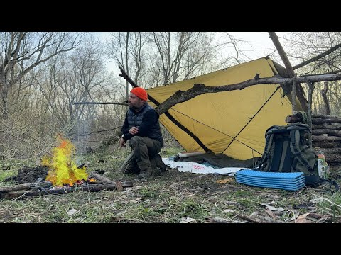<figcaption><b>Current package as shipped:</b> Solo Bushcraft Overnight | Tarp Under a Fallen Tree | Camping Riverside (2024-04-19).</figcaption></figure>

- Subject clarity at 160px: good. The orange beanie is a true small-size identifier (same trick as the winner's red helmet) and the yellow tarp reads as a shape.
- Text overlay: none. Acceptable here since the frame is clean, though "TARP UNDER A FALLEN TREE" is a curiosity hook the thumbnail only partially shows (the fallen branch is mid-sized and could be read as any tree).
- Contrast / weather: warm accents work well against the muted woodland. Weather is cold and dry: fine for a general bushcraft video, but the channel's top performers all show active precipitation, and this one currently reads "pleasant afternoon bushcraft".
- Emotional hook: cozy competence. It sells calm, not a question. The one genuinely curious element (tarp wedged under a fallen tree) is visually mid-weight and does not pose a problem.
- What the winning sibling does differently: the winner turns the shelter into a test subject under active rain and centers it. The curiosity ("will it hold") is staged, not implied. Also the winner crops tighter: shelter fills the frame.
- Direction:
  - New title: "TARP Under a Fallen Tree | Solo Bushcraft in the Rain"
  - Thumbnail composition: two groups. Hero: tight crop on the tarp wedged under the massive fallen trunk with rain falling and water beading on the yellow tarp; the trunk diagonal across the frame so the "shelter under a dead tree" idea is unmissable and slightly alarming (is that thing safe?). Man's orange beanie small but present at the fire beneath it as the accent. No copy; if any, "SLEPT UNDER A DEAD TREE" top left, under 10 percent area, clear of bottom right. One question: is sleeping under a rotting fallen tree in the rain a good idea.

### Camping on a Beach | Tarp and Bivvy | SUDDEN STORM

<b>Scored 0.52x</b> against contemporaries, 37,687 lifetime views, published 2024-06-16, 25:41, proxies: P1-strong-format (Tarp Camping ___ 1.11x), P3-weather-hook. Own format median 1.11x (Tarp Camping ___): the same shape is carrying the channel elsewhere.

<b>Likes per 100 views: 6.0</b> (2,247 likes on 37,754 views, lifetime, pulled 2026-09-24). <b>That is 2 to 3 times the breakout rate:</b> the people who clicked liked it, which is the satisfaction half of the repackage rule standing in for the missing curve.

<figure class="st-thumb">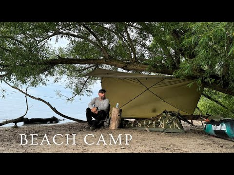<figcaption><b>Current package as shipped:</b> Camping on a Beach | Tarp and Bivvy | SUDDEN STORM (2024-06-16).</figcaption></figure>

- Subject clarity at 160px: good. Man against post plus the tarp shape reads; the frame is tidy.
- Text overlay: "BEACH CAMP" in large serif across the bottom, roughly 15 percent area, and it sits exactly where the duration stamp lands. A small channel-name overlay bottom right makes the collision worse. The copy names the location (already visible) instead of the event.
- Contrast / weather: the storm is the failure point. Flat grey sky and calm water only; "SUDDEN STORM" in the title has zero visual evidence. This is the same promise-mismatch as candidates 3, 4, and 10.
- Emotional hook: preparedness, not peril. The man looks settled and rested after the fact; there is no unanswered question.
- What the winning sibling does differently: the winning tarp rain thumbnail fills the frame with visible falling rain and centers the fragile shelter under attack. Weather is the antagonist, and the shelter is the small hero.
- Direction:
  - New title: "Tarp and Bivvy on a Beach | A SUDDEN STORM Hits at Sundown"
  - Thumbnail composition: two groups. Hero: the ridge tarp straining in wind with rain visibly slanting across the frame and the bivvy underneath just covered; man crouched at the tarp edge grabbing a guy line, one bright accent (orange beanie or the teal dinghy). Second group: the dark storm wall over the water behind. Replace "BEACH CAMP" with two words "STORM HITS" or none; if used, top left only, under 10 percent area, clear of bottom right. One question: can this thin tarp survive a storm on an open beach.

### Camping with my dog under a Blue Home Depot Tarp | MORNING RAIN

<b>Scored 0.57x</b> against contemporaries, 61,422 lifetime views, published 2024-02-27, 41:24, proxies: P1-strong-format (Tarp Camping ___ 1.11x), P3-weather-hook. Own format median 1.11x (Tarp Camping ___): the same shape is carrying the channel elsewhere.

<b>Likes per 100 views: 4.5</b> (2,816 likes on 61,901 views, lifetime, pulled 2026-09-24). <b>That is 2 to 3 times the breakout rate:</b> the people who clicked liked it, which is the satisfaction half of the repackage rule standing in for the missing curve.

<figure class="st-thumb">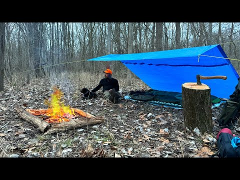<figcaption><b>Current package as shipped:</b> Camping with my dog under a Blue Home Depot Tarp | MORNING RAIN (2024-02-27).</figcaption></figure>

- Subject clarity at 160px: genuinely strong - blue tarp as a large saturated block, orange capped camper left, fire reading as a warm point. The defect is omission, not legibility: no dog anywhere in the frame although the dog is the title's hook.
- Text overlay: none, which is fine in itself, but it means both missing promises (dog, morning rain) go uncorrected.
- Contrast / weather: blue tarp against brown woods with orange fire and cap is good separation, yet the ground is bone dry leaf litter with nothing falling, so MORNING RAIN has zero visual support and the scene reads as a still afternoon.
- Emotional hook: the companion angle is unused. A dog in frame would carry the emotional read instantly; without one this is a competent tarp camp with no question.
- What the winning sibling does differently: the Tarp Camping winner (FWRCcYlSoIc, out 4.32) fills the frame with white rain streaks over shelter plus person plus fire, and the channel's top tarp performer (sqFqm2p1oGk, out 110.29) does the same with heavier rain and a shelter that looks fragile under it.
- Direction:
  - New title: "Morning RAIN with My Dog under a Blue Tarp | Solo Camp" (55)
  - Thumbnail composition: two groups. Hero: dog and camper under the blue tarp, the dog's face up and lit (that is the hook), tarp edge heavy with water. Weather: visible streaks crossing the blue panel and dripping off the tarp line, so the dry inside versus wet outside contrast is the question. Fire kept as the single warm accent at lower left. No copy; if any, "MORNING RAIN" top left in white caps, under 10 percent area, clear of bottom right.

### 3 Days River Camping on the Allegheny River | Big Rain Storm

<b>Scored 0.45x</b> against contemporaries, 21,287 lifetime views, published 2024-09-01, 38:58, proxies: P3-weather-hook. Own format median 0.93x (___ Canoe Camping ___): the same shape is carrying the channel elsewhere.

<b>Likes per 100 views: 7.0</b> (1,514 likes on 21,498 views, lifetime, pulled 2026-09-24). <b>That is 2 to 3 times the breakout rate:</b> the people who clicked liked it, which is the satisfaction half of the repackage rule standing in for the missing curve.

<figure class="st-thumb">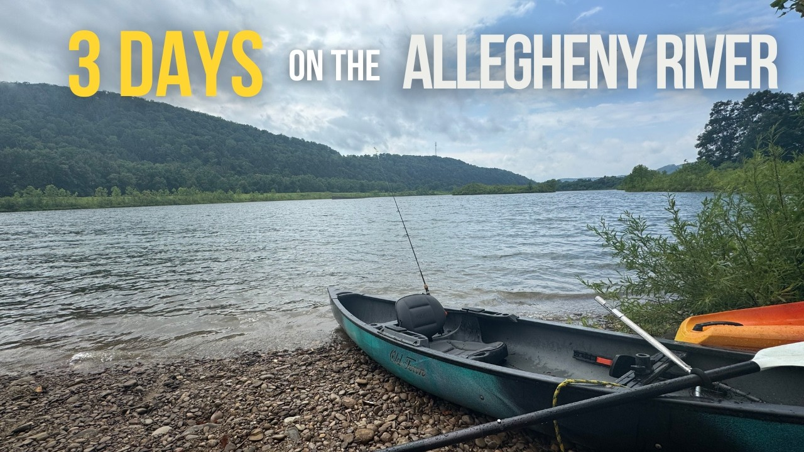<figcaption><b>Current package as shipped:</b> 3 Days River Camping on the Allegheny River | Big Rain Storm (2024-09-01).</figcaption></figure>

- Subject clarity at 160px: the kayak and river read, but there is no person and the top third is consumed by a banner, so the shelf image is a parked boat with a label.
- Text overlay: "3 DAYS" in yellow plus "ON THE ALLEGHENY RIVER" in white across the full top edge, roughly 15 percent area. Duration plus place name tells a browsing viewer nothing they would click for.
- Contrast / weather: yellow on cloud is fine contrast, but the sky has blue patches and the water is calm, so "Big Rain Storm" in the title has no visual at all; the orange hull behind the teal kayak is the only color tension.
- Emotional hook: none. A parked boat poses no question about a storm.
- What the winning sibling does differently: the canoe winner (nxPP_4_DwsA, out 2.68) shows the camper mid event sheltering under an overturned raft with rain streaks across the whole frame and two white caps words, SUDDEN STORM, in place of a location banner.
- Direction:
  - New title: "Allegheny River Camping in a BIG RAIN STORM | 3 Days" (53)
  - Thumbnail composition: two groups. Hero: the camper in the canoe or on the bank in rain gear, body large, face set against grey water, paddle crossing the frame diagonally. Weather: real rain stippling the river surface and a dark cloud band over the hills, pulled from the storm footage the title already promises. Replace the top banner with "RAIN STORM" in white caps bottom left with shadow, under 10 percent area, clear of the bottom right timestamp zone.

### Winter Stealth Camping in SNOW next to a hospital

<b>Scored 0.41x</b> against contemporaries, 18,635 lifetime views, published 2022-03-20, 26:53, proxies: P3-weather-hook. Own format median 0.70x (Stealth Camping ___): the same shape is carrying the channel elsewhere.

<b>Likes per 100 views: 5.4</b> (1,016 likes on 18,661 views, lifetime, pulled 2026-09-24). <b>That is 2 to 3 times the breakout rate:</b> the people who clicked liked it, which is the satisfaction half of the repackage rule standing in for the missing curve.

<figure class="st-thumb">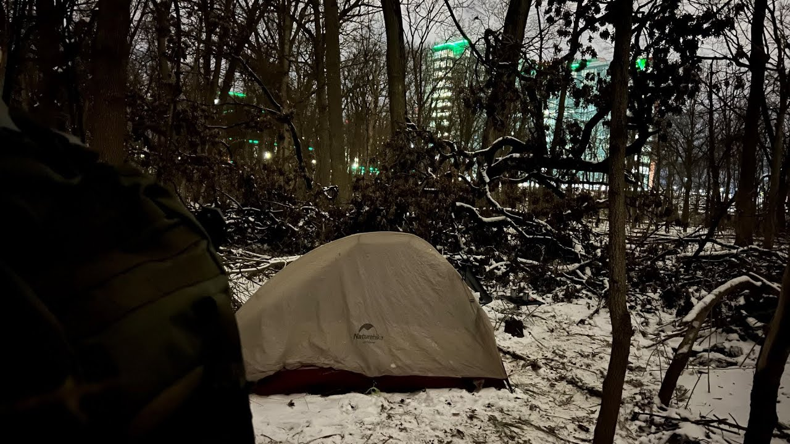<figcaption><b>Current package as shipped:</b> Winter Stealth Camping in SNOW next to a hospital (2022-03-20).</figcaption></figure>

- Subject clarity at 160px: the lit beige tent reads as a bright patch, but the human is a dark hooded back at the left edge with no face, and the hospital is a distant lit box with green roof lights that could be any office block. The stealth premise has no identity at shelf size.
- Text overlay: none beyond the tent's own brand logo, so the premise (sleeping beside a hospital) is never stated and the frame gives no clue.
- Contrast / weather: night palette works, warm tent against blue-black snow, but the snow is patchy settled cover with no falling flakes despite "in SNOW" in the title, and the only drama in frame is a strip of green accent lights.
- Emotional hook: the curiosity exists (who camps beside a hospital?) but the frame hides it - anonymous building, face turned away - so nothing is asked.
- What the winning sibling does differently: the stealth winner (r8gfsNdTbR4, out 3.58) puts a large smiling face in the foreground with the Wendy's sign big enough to read behind him and rain streaks crossing the whole frame; the named landmark is the joke and the weather is the event.
- Direction:
  - New title: "Winter STEALTH CAMPING in SNOW next to a Hospital" (49)
  - Thumbnail composition: two groups. Hero: camper's face lit by a headlamp in the foreground third, hood up, sized like the Wendy's winner so the human survives 160px. Background: the hospital entrance or its lit sign readable through bare trees, snow loaded on the branch line between them. Weather: choose a frame where flakes fall through the headlamp beam. No copy; if any, "HOSPITAL CAMP" top left, under 10 percent area, clear of bottom right.

### STEALTH CAMPING next to Chili's | MORNING RAIN

<b>Scored 0.46x</b> against contemporaries, 22,011 lifetime views, published 2021-11-28, 21:42, proxies: P3-weather-hook. Own format median 0.70x (Stealth Camping ___): the same shape is carrying the channel elsewhere.

<b>Likes per 100 views: 6.4</b> (1,417 likes on 22,155 views, lifetime, pulled 2026-09-24). <b>That is 2 to 3 times the breakout rate:</b> the people who clicked liked it, which is the satisfaction half of the repackage rule standing in for the missing curve.

<figure class="st-thumb">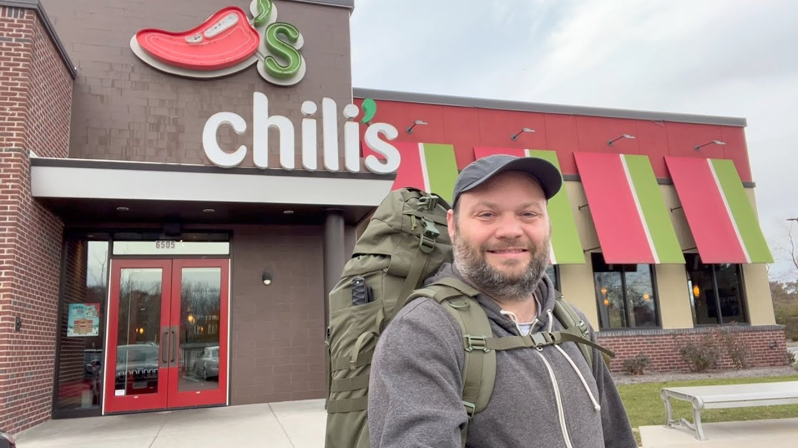<figcaption><b>Current package as shipped:</b> STEALTH CAMPING next to Chili&#x27;s | MORNING RAIN (2021-11-28).</figcaption></figure>

- Subject clarity at 160px: nearly the winner's recipe - big selfie face on the right, Chili's facade with readable white logo on the left. Face and sign both survive shelf size, so legibility is not the problem.
- Text overlay: none, and that is correct; all copy is real signage and it names the place without spending the copy budget.
- Contrast / weather: this is the mismatch. The title promises MORNING RAIN but the sky is flat dry grey, nothing is falling and no surface is wet, so the single element that carries the Wendy's winner (visible rain streaks) is missing. Red doors and awnings carry the only color.
- Emotional hook: a smiling man outside a Chili's is a vlog postcard; the same composition in falling rain becomes endurance (sleeping outside a restaurant while it rains), which is a question.
- What the winning sibling does differently: r8gfsNdTbR4 (out 3.58) uses the identical layout but stages active rain across the sign and the face, and the wet sign turns into the story.
- Direction:
  - New title: "Stealth Camping behind Chili's | MORNING RAIN" (44)
  - Thumbnail composition: same two groups, shot in weather: face in the foreground third with rain beading on his hood, Chili's sign and red doors wet and reflecting behind him, streaks crossing the white letters. Drop the man slightly so the sign is not cropped at the frame edge. No added copy; the sign already names the location.

### Solo Camping in the RAIN in a Bushcraft Shelter | Morning Snow

<b>Scored 0.57x</b> against contemporaries, 30,140 lifetime views, published 2023-02-27, 22:48, proxies: P3-weather-hook. Own format median 0.72x (Bushcraft ___ Shelter ___): the same shape is carrying the channel elsewhere.

<b>Likes per 100 views: 6.2</b> (1,876 likes on 30,215 views, lifetime, pulled 2026-09-24). <b>That is 2 to 3 times the breakout rate:</b> the people who clicked liked it, which is the satisfaction half of the repackage rule standing in for the missing curve.

<figure class="st-thumb">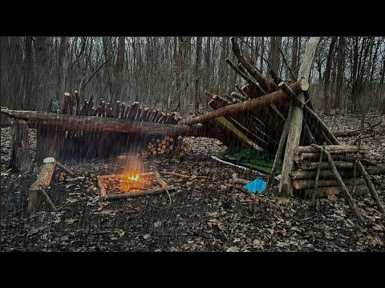<figcaption><b>Current package as shipped:</b> Solo Camping in the RAIN in a Bushcraft Shelter | Morning Snow (2023-02-27).</figcaption></figure>

- Subject clarity at 160px: the lean-to is a brown mass against brown woods and the small fire is the only bright point; there is no person in the frame at all, so Solo Camping has no solo camper to show.
- Text overlay: none, so the title's two weather claims (RAIN, Morning Snow) go unrepresented and uncorrected.
- Contrast / weather: wet reflective mud says damp, but no streaks are falling and there is no snow anywhere despite Morning Snow; the palette is brown on brown with only firelight and a small blue bucket for separation.
- Emotional hook: absent without a human. A still life of shelter and fire poses no survival question.
- What the winning sibling does differently: the Bushcraft Shelter winner (v_l2WtsNC-Y, out 3.97) lies the camper inside the lean-to with direct eye contact and an orange beanie while heavy vertical rain streaks the whole frame; person, weather and accent all present, and the shelter earns its name by being tested.
- Direction:
  - New title: "Solo Camping in the RAIN | Bushcraft Shelter in Snow" (52)
  - Thumbnail composition: two groups. Hero: camera low and close with the camper inside the shelter, face and orange beanie visible at the left third, shoulder line leading toward the fire. Weather: rain streaks across the opening, plus flakes if the morning snow sequence exists; keep the wet ground sheen since it is the frame's best weather evidence. One accent at a time, beanie or fire, not both competing. No copy; if any, "STILL DRY INSIDE" top left, under 10 percent area, clear of bottom right.

### The Most Iconic Drive in Hawaii: THE ROAD TO HANA | Rain Forests, Waterfalls and Camping

<b>Scored 0.12x</b> against contemporaries, 7,615 lifetime views, published 2025-04-03, 37:54, proxies: P3-weather-hook. No format family: the repackaging case rests on the weather hook alone.

<b>Likes per 100 views: 12.1</b> (926 likes on 7,647 views, lifetime, pulled 2026-09-24). <b>That is 2 to 3 times the breakout rate:</b> the people who clicked liked it, which is the satisfaction half of the repackage rule standing in for the missing curve.

<figure class="st-thumb">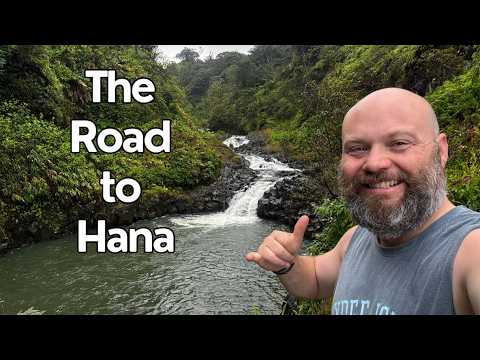<figcaption><b>Current package as shipped:</b> The Most Iconic Drive in Hawaii: THE ROAD TO HANA | Rain Forests, Waterfalls and Camping (2025-04-03).</figcaption></figure>

- Subject clarity at 160px: the stacked white "Road to Hana" copy and the host's face at lower right both read, but the picture behind them resolves to a generic green river. No road, no car, no curve: the drive the title sells is not in the frame.
- Text overlay: "The Road to Hana" in three stacked white lines, upper left, roughly 12 percent of the area. It repeats the title word for word, so it adds no weather, no hazard, no reason to be curious.
- Contrast / weather: white on dark green has clean contrast and the white rapids give one natural bright accent. The light is flat overcast over damp leaves, so wet conditions are implied and never shown, and the thumbs-up pose says nothing will happen.
- Emotional hook: none. A smiling host pose resolves the video (it was great) instead of asking anything.
- What the winning sibling does differently: the One-offs winner (WXxFhx-cKjo, out 1.90) tells its whole story with objects and no copy - man in a chair, car hatch open on a sleeping platform, two orange stoves - and the channel's biggest one-offs (sqFqm2p1oGk out 110.29, YP3DRKePXzE out 15.33) stage visible rain while it happens.
- Direction:
  - New title: "THE ROAD TO HANA | Waterfalls on Hawaii's Iconic Drive" (55)
  - Thumbnail composition: two groups. Hero: the car stopped at a wet pull off with the host standing beside it at readable size (or behind the wheel with the window down), sized like the Wendy's style selfie, not a distant figure. Background band: one big waterfall or white cascade filling the upper third so falling water is the bright element instead of a green wall. Weather: use a frame where the road or windshield is visibly wet; if the footage is dry, keep the waterfall spray and drop any rain claim. No copy; if any, "HAWAII'S ICONIC DRIVE" top left, under 10 percent area, clear of bottom right.

### Urban Camping in an Abandoned Barn during a SNOW STORM

<b>Scored 0.25x</b> against contemporaries, 17,129 lifetime views, published 2026-02-20, 22:21, proxies: P3-weather-hook. No format family: the repackaging case rests on the weather hook alone.

<b>Likes per 100 views: 8.1</b> (1,423 likes on 17,532 views, lifetime, pulled 2026-09-24). <b>That is 2 to 3 times the breakout rate:</b> the people who clicked liked it, which is the satisfaction half of the repackage rule standing in for the missing curve.

<figure class="st-thumb">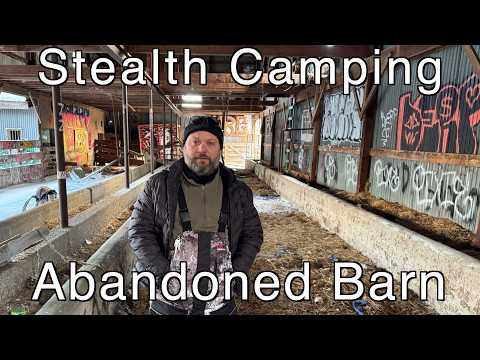<figcaption><b>Current package as shipped:</b> Urban Camping in an Abandoned Barn during a SNOW STORM (2026-02-20).</figcaption></figure>

- Subject clarity at 160px: good. The bearded face framed by barn beams reads at shelf size and the graffiti gives instant location identity.
- Text overlay: yes, and it is the core defect. "Stealth Camping" and "Abandoned Barn" eat the top and bottom thirds, roughly 25 to 30 percent of the area, and the wording contradicts the title (Urban Camping). The copy also names the location rather than the dilemma, and the bottom block sits in the timestamp zone.
- Contrast / weather: contrast is good (white text, graffiti pops), but the SNOW STORM is nearly absent. Drifted snow patches only, no falling snow, no wind. The title's biggest stakes word has no visual.
- Emotional hook: mystery of the derelict space works (his serious gaze, dark barn depth), but the storm promise is broken, and the two text slabs flatten the frame into a documentary card.
- What the winning sibling does differently: the snowstorm winner keeps copy to exactly two storm words beside the subject (not across it), and shows the storm ACTIVE (falling particles, deep snow) with one warm accent. Weather as event, text as label of the event only.
- Direction:
  - New title: "Urban Camping in an Abandoned BARN in a SNOW STORM"
  - Thumbnail composition: two groups, max three. Hero: the man large in the barn doorway silhouette, snow visibly blowing in past him into the dark barn (the doorway is the drama line: warm dark refuge versus white storm). Accent: one graffiti element or the headlamp beam for color. Replace both text slabs with two words only "SNOW STORM" or none at all; if used, stack them beside the subject top left, under 10 percent area, clear of bottom right. One question: can he hold this barn for the night while the storm floods in.

### Winter Hot Tent Camping In Snow

<b>Scored 0.35x</b> against contemporaries, 17,511 lifetime views, published 2023-03-18, 27:04, proxies: P3-weather-hook. No format family: the repackaging case rests on the weather hook alone.

<b>Likes per 100 views: 8.0</b> (1,409 likes on 17,548 views, lifetime, pulled 2026-09-24). <b>That is 2 to 3 times the breakout rate:</b> the people who clicked liked it, which is the satisfaction half of the repackage rule standing in for the missing curve.

<figure class="st-thumb">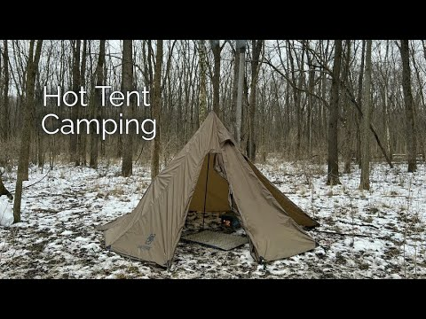<figcaption><b>Current package as shipped:</b> Winter Hot Tent Camping In Snow (2023-03-18).</figcaption></figure>

- Subject clarity at 160px: the tan pyramid tent reads as a shape and the white "Hot Tent Camping" text is legible, but there is no person in the frame and the tent sits mid distance, so the shelf image is a label plus a tent in thin snow.
- Text overlay: "Hot Tent Camping" stacked two lines, upper left, white bold, roughly 10 percent area. It names the format the viewer is already browsing and carries no temperature, no depth, no question.
- Contrast / weather: tan against dark bare forest and white ground separates adequately, but the snow is patchy with bare earth and leaf litter showing through, so the title says "In Snow" and the frame says shoulder season. No falling snow, no fire, no glow.
- Emotional hook: none. An empty camp with the door open has no tension and nothing to find out.
- What the winning sibling does differently: the winter winner (LZkz7MLcCN0, out 13.95) puts everything in deep snow with a seated human in an orange beanie and fire glow inside the shelter; the hot tent winner (UATlReO4Oj4, out 1.65) pairs a glowing tent with falling flakes and two caps words. Same subject class, but human plus weather plus one warm accent, all oversized.
- Direction:
  - New title: "Winter HOT TENT Camping in the Snow | Solo Overnight" (53)
  - Thumbnail composition: two groups. Hero: tight on the open tent door with the camper visible inside (orange beanie or headlamp as the single warm accent) while snow piles against the tent walls; camera low so the tent fills the frame against a dark treeline. Weather: pick a moment from the trip with flakes actually falling, otherwise fresh unbroken snow with boot tracks instead of the half melted patch. Drop the format-label copy; if any text, "SOLO IN THE SNOW" top left, under 10 percent area, clear of bottom right.

### Hot Tent Winter Camping in SNOW | Buschraft Build

<b>Scored 0.41x</b> against contemporaries, 23,821 lifetime views, published 2022-03-08, 26:55, proxies: P3-weather-hook. No format family: the repackaging case rests on the weather hook alone.

<b>Likes per 100 views: 4.9</b> (1,170 likes on 23,905 views, lifetime, pulled 2026-09-24). <b>That is 2 to 3 times the breakout rate:</b> the people who clicked liked it, which is the satisfaction half of the repackage rule standing in for the missing curve.

<figure class="st-thumb">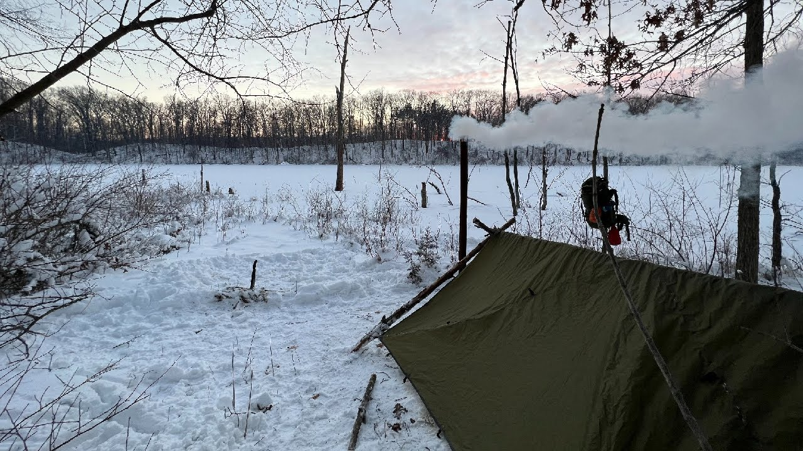<figcaption><b>Current package as shipped:</b> Hot Tent Winter Camping in SNOW | Buschraft Build (2022-03-08).</figcaption></figure>

- Subject clarity at 160px: the white smoke plume and dark tarp silhouette read, but the built shelter is small and half lost against the treeline, there is no person, and the promised hot tent is nowhere in the frame - the title says hot tent, the picture shows a tarp lean-to.
- Text overlay: none, so the title to image mismatch goes uncorrected and the build story, the one active verb in the title, is not staged either.
- Contrast / weather: the sunrise pastels are pretty but low contrast; snow is settled and dry with no flakes, smoke without visible flame reads as haze, and the red pack straps are the only small accent. At 160px this is grey on white.
- Emotional hook: none on offer. A smoke plume over an empty camp asks nothing.
- What the winning sibling does differently: LZkz7MLcCN0 (out 13.95) makes the shelter large, seats a beanie-wearing human beside fire glow inside it, and lets deep snow own every surface; the smoke stays secondary to the subject.
- Direction:
  - New title: "Winter Camping: Building a Shelter in the SNOW" (46)
  - Thumbnail composition: two groups. Hero: camper mid build with branches in hand, body angled large against the white snowfield so the shelter silhouette reads clearly, axe as the second shape. Weather: falling flakes or undisturbed deep snow only, no half melted foreground. One warm accent: a visible flame at the fire ring, since smoke alone greys out at 160px. No copy; if any, "BUILT IN THE SNOW" top left, under 10 percent area, clear of bottom right.

### Winter Hot Tent Camping in DEEP SNOW and Freezing Temps | Morning Snowfall

<b>Scored 0.43x</b> against contemporaries, 29,024 lifetime views, published 2026-02-13, 28:56, proxies: P3-weather-hook. No format family: the repackaging case rests on the weather hook alone.

<b>Likes per 100 views: 6.5</b> (1,927 likes on 29,809 views, lifetime, pulled 2026-09-24). <b>That is 2 to 3 times the breakout rate:</b> the people who clicked liked it, which is the satisfaction half of the repackage rule standing in for the missing curve.

<figure class="st-thumb">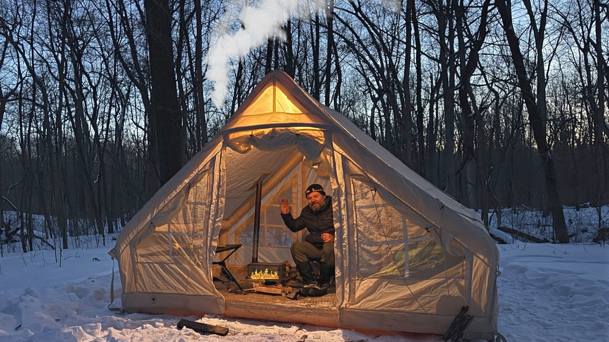<figcaption><b>Current package as shipped:</b> Winter Hot Tent Camping in DEEP SNOW and Freezing Temps | Morning Snowfall (2026-02-13).</figcaption></figure>

- Subject clarity at 160px: structurally the strongest winter frame - white bell tent at 50 to 60 percent of the frame, camper waving inside, stove and chimney smoke - but white canvas on white snow against pale sky loses its edge, and the waving hand is too small to read.
- Text overlay: none, while both winter winners either give the subject huge scale or two caps words; this frame keeps the copy slot empty and still fails the separation test.
- Contrast / weather: the teal and orange grade is right, glowing interior against blue twilight, yet there are no falling flakes even though the title promises a Morning Snowfall, and the snow looks finished rather than accumulating.
- Emotional hook: a waving host is friendly, not tense. The wave invites instead of posing a question (is he warm, will the snow bury the tent).
- What the winning sibling does differently: UATlReO4Oj4 (out 1.65) stacks SNOW / STORM beside a glowing tent with flakes visibly falling, and LZkz7MLcCN0 (out 13.95) seats an orange beanie human in a snow laden shelter; both make the cold the antagonist rather than the backdrop.
- Direction:
  - New title: "Winter Hot Tent in DEEP SNOW | Morning Snowfall Camp" (52)
  - Thumbnail composition: two groups. Hero: shoot the bell tent lower in frame so its silhouette sits against the black treeline instead of the pale sky, stove glow and camper face lit inside. Weather: the moment flakes are actually falling, caught against the dark trees; chimney smoke stays as motion, not as the subject. Optional copy: "DEEP SNOW" stacked upper left in white with black outline at the winter winner's scale, under 10 percent area, clear of bottom right.

### RACOONS STOLE OUR FOOD! 3 Day Backcountry Rainy Camp with My Nephews

<b>Scored 0.54x</b> against contemporaries, 16,052 lifetime views, published 2025-06-17, 48:46, proxies: P3-weather-hook. No format family: the repackaging case rests on the weather hook alone.

<b>Likes per 100 views: 8.9</b> (1,448 likes on 16,196 views, lifetime, pulled 2026-09-24). <b>That is 2 to 3 times the breakout rate:</b> the people who clicked liked it, which is the satisfaction half of the repackage rule standing in for the missing curve.

<figure class="st-thumb">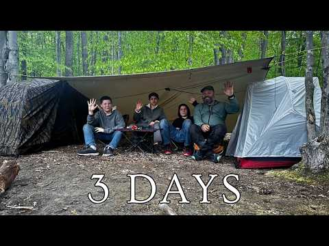<figcaption><b>Current package as shipped:</b> RACOONS STOLE OUR FOOD! 3 Day Backcountry Rainy Camp with My Nephews (2025-06-17).</figcaption></figure>

- Subject clarity at 160px: four people under a tarp read as "people camping", but the figures are small and individually unreadable; the silver tent at the right edge is the sharpest object in frame.
- Text overlay: "3 DAYS" bold white bottom center, roughly 10 percent area, sitting in the timestamp zone. Duration is the least clickable fact available while the title's real hook (the raccoons took the food) gets no words.
- Contrast / weather: damp greens and leaf litter with no falling rain although the title says Rainy Camp; white text and the tent's red trim are the only contrast. Nothing in frame signals animals, theft or mess.
- Emotional hook: the frame shows a tidy campsite, so the funniest and most shareable beat of the trip is absent, and no question is posed.
- What the winning sibling does differently: the One-offs winner (WXxFhx-cKjo, out 1.90) tells a story with people and objects only - chair, open car, camp table, orange stoves - and no copy; the channel's top rain one-offs then add visible falling rain on top of that story.
- Direction:
  - New title: "Raccoons Stole Our Food | 3 Day Backcountry Rain Camp" (54)
  - Thumbnail composition: two groups. Hero: the title's aftermath close up - the emptied food bag or overturned cooler with one camper's reaction large enough to read (the nephew's disbelief is the hook), headlamp or fire as the single warm accent. Second group: wet dark treeline behind, plus eyeshine in the branches only if the footage actually contains it. Replace "3 DAYS" with "STOLE OUR FOOD" in white caps top left, under 10 percent area, clear of bottom right.

### Winter Tarp Camping in a Snowy Valley

<b>Scored 0.55x</b> against contemporaries, 56,620 lifetime views, published 2024-02-08, 33:43, proxies: P3-weather-hook. No format family: the repackaging case rests on the weather hook alone.

<b>Likes per 100 views: 4.5</b> (2,616 likes on 57,692 views, lifetime, pulled 2026-09-24). <b>That is 2 to 3 times the breakout rate:</b> the people who clicked liked it, which is the satisfaction half of the repackage rule standing in for the missing curve.

<figure class="st-thumb">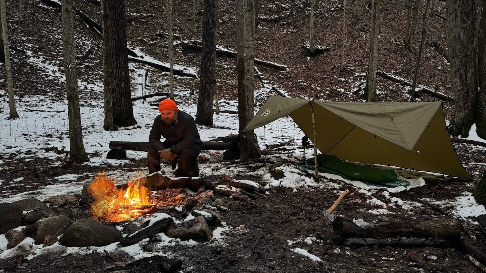<figcaption><b>Current package as shipped:</b> Winter Tarp Camping in a Snowy Valley (2024-02-08).</figcaption></figure>

- Subject clarity at 160px: the fire is a bright blob and the orange beanie a dot, but the camper is only 5 to 8 percent of the frame and the tarp tent is a mid sized wedge; at shelf size it reads campfire in the woods, not winter.
- Text overlay: none, which leaves the title's Snowy Valley claim carried entirely by patchy snow.
- Contrast / weather: the foreground is mostly mud, brown leaves and trampled snow, so the winter promise underdelivers; no falling snow, no wind, flat overcast light. Fire and beanie are the only accents and both are small.
- Emotional hook: quiet solitude with no question; the axe and gear read as still life.
- What the winning sibling does differently: LZkz7MLcCN0 (out 13.95) gives snow every surface in the frame, seats the beanie camper at readable size inside a big shelter, and lets fire glow do the accent work at scale.
- Direction:
  - New title: "Winter Tarp Camping in a Snowy Valley | Solo Overnight" (55)
  - Thumbnail composition: two groups. Hero: tighter and lower - camper in orange beanie at the fire with the tarp shelter filling the right half, both sized to read at 160px. Background: choose the angle where the valley slope behind is unbroken white snow, dark trunks cutting it for contrast. Weather: flakes falling or a fresh undisturbed blanket, no brown foreground. No copy; if any, "SNOWY VALLEY" bottom left in caps with shadow, under 10 percent area, clear of bottom right.

### Emergency Shelter with Survival Tarp next to Frozen Lake | Long Fire | MORNING SNOW

<b>Scored 0.59x</b> against contemporaries, 34,347 lifetime views, published 2022-02-15, 31:50, proxies: P3-weather-hook. No format family: the repackaging case rests on the weather hook alone.

<b>Likes per 100 views: 4.5</b> (1,552 likes on 34,404 views, lifetime, pulled 2026-09-24). <b>That is 2 to 3 times the breakout rate:</b> the people who clicked liked it, which is the satisfaction half of the repackage rule standing in for the missing curve.

<figure class="st-thumb">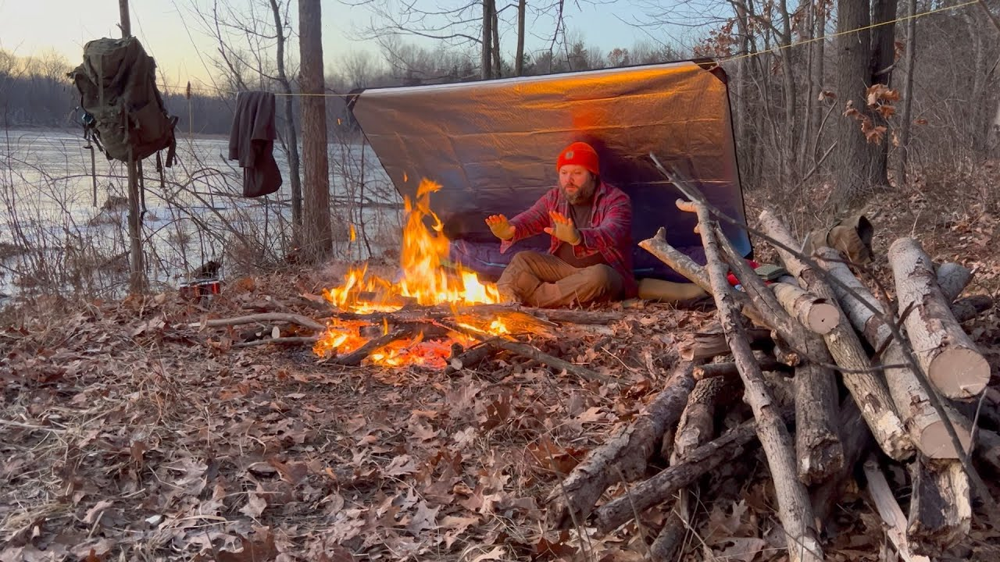<figcaption><b>Current package as shipped:</b> Emergency Shelter with Survival Tarp next to Frozen Lake | Long Fire | MORNING SNOW (2022-02-15).</figcaption></figure>

- Subject clarity at 160px: the grouping is close to the winners - camper center right under the tarp, hands to a large fire at 20 to 25 percent of the lower frame, red hat - and it survives shelf size. The weak spot is the setting, not the subject.
- Text overlay: none, so Morning Snow in the title has no copy support either.
- Contrast / weather: the ground is entirely dry brown leaves with zero snow cover and nothing falling; winter exists only as ice on the lake behind, so the title's Morning Snow and the format's snow expectation both miss. Red hat and fire are good accents but the frame reads late autumn.
- Emotional hook: warming hands by a fire is mood, not tension; nothing in frame threatens or asks.
- What the winning sibling does differently: LZkz7MLcCN0 (out 13.95) makes snow cover every surface including the roof overhead and seats the camper with orange beanie and fire inside that white world; the same subject grouping without snow reads a different season.
- Direction:
  - New title: "Survival Tarp Shelter by a Frozen Lake | MORNING SNOW" (54)
  - Thumbnail composition: two groups. Hero: keep the current grouping (camper, fire, glowing tarp underside) but shoot it when snow is actually down - flakes on the woodpile, dust on the leaves, snow crossing the dark water behind. Weather: morning snow is the differentiator, so take the frame with visible flakes over the lake; if every frame from the trip is bare, cut the snow claim from the title instead. Optional copy "MORNING SNOW" upper left in white with black outline at the winter winner's scale, under 10 percent area, clear of bottom right.

### Hot Tent Camping in the Snow at a Secret Campsite

<b>Scored 0.67x</b> against contemporaries, 46,152 lifetime views, published 2025-11-22, 33:55, proxies: P3-weather-hook. No format family: the repackaging case rests on the weather hook alone.

<b>Likes per 100 views: 5.3</b> (2,571 likes on 48,335 views, lifetime, pulled 2026-09-24). <b>That is 2 to 3 times the breakout rate:</b> the people who clicked liked it, which is the satisfaction half of the repackage rule standing in for the missing curve.

<figure class="st-thumb">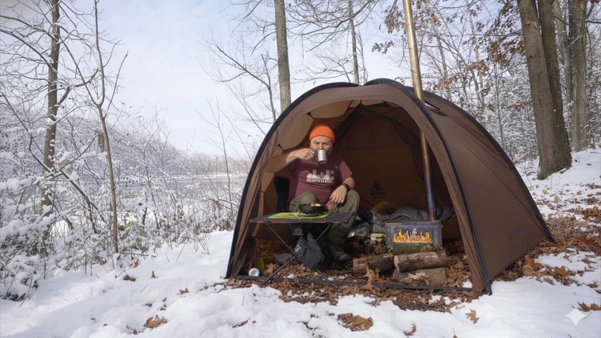<figcaption><b>Current package as shipped:</b> Hot Tent Camping in the Snow at a Secret Campsite (2025-11-22).</figcaption></figure>

- Subject clarity at 160px: the big brown dome tent at about 60 percent of frame with the camper inside (orange beanie, cup in hand) is the strongest subject of the winter candidates; at shelf size the beanie and tent shape survive and the face does not.
- Text overlay: none, which is acceptable, but the secret campsite hook in the title is then neither shown nor worded.
- Contrast / weather: brown tent against brown grey woods is the limiter; snow is present as ground and branch cover only, with no falling flakes, and the maroon t shirt inside undercuts the cold stakes. No lantern glow and no dark backdrop to make the tent pop.
- Emotional hook: cozy and human, but it reads as a settled tea break; there is no weather event and no unanswered question to carry the click.
- What the winning sibling does differently: UATlReO4Oj4 (out 1.65) turns the same subject into a lit tent inside an active snowstorm with SNOW STORM caps, and LZkz7MLcCN0 (out 13.95) puts the beanie human in a snow laden structure; both give the tent a white and black field to stand out against.
- Direction:
  - New title: "Hot Tent Camping at a Secret SNOW Campsite | Solo" (50)
  - Thumbnail composition: two groups. Hero: shoot at blue hour with the stove lit so the tent fabric glows like the winner's lantern and the camper's beanie silhouette shows in the opening. Background: pull back until unbroken snowfield and dark treeline fill the frame behind the tent, which kills the brown on brown problem. Weather: falling flakes caught in the stove light. Optional copy "SECRET CAMP" bottom left in white caps with shadow, under 10 percent area, clear of bottom right.

Coverage of the two confirmatory signals across the 23: like/view pulled for 23, vision diagnosis for 23. Candidates without them still qualify on format gap and proxies, but carry more uncertainty than the covered ones.

## Thumbnail diagnosis

## Sam Bananas Thumbnail Diagnosis: 23 Repackage Candidates vs Format Winners

Method: each candidate thumbnail downloaded from i.ytimg.com (hqdefault) and compared vision side against the best performing thumbnail in the same format. Readability judged at mobile short shelf size (roughly 160px wide). All directions respect house style: caps for stakes words, pipe separators allowed in titles, no em dash or en dash anywhere.

Format winners used as comparators:
- Rain format: "Camping in a Stone Picnic Shelter during a RAIN STORM" (YP3DRKePXzE, out 15.33) and "Camping in the Rain on a Deserted Beach under a Tree" (dKrkhrH5g-U, out 2.49)
- Hot tent / winter format: "Solo Hot Tent Camping in an INSANE SNOWSTORM" (UATlReO4Oj4, out 1.65) and the in-format top performer "Camping in a Stone Shelter during a Big Snow Storm" (LZkz7MLcCN0, out 13.95)
- Tarp rain: "Solo Overnight Camping in the RAIN | Alone in the Woods | Tarp Set up | Campfire | Storm" (sqFqm2p1oGk, out 110.29)
- Tarp Camping format: "SOLO Rainy Camp on a Deserted Beach under a Tree | Tarp + Tent" (FWRCcYlSoIc, out 4.32)
- Stealth Camping format: "Stealth Camping in the Rain behind Wendy's" (r8gfsNdTbR4, out 3.58)
- Canoe Camping format: "Solo Wilderness Canoe Camping in the Appalachian Mountains" (nxPP_4_DwsA, out 2.68)
- Bushcraft Shelter format: "Will my Bushcraft Shelter Stand up to the Rain?" (v_l2WtsNC-Y, out 3.97)
- One-offs: "Solo Camping at end of a Deserted Forest Road Got Strange!" (WXxFhx-cKjo, out 1.90)

Second pass note: candidates 11 through 23 were diagnosed from maxresdefault (or hqdefault where maxres was missing) frames in thumbs/, with the vision read folded into each diagnosis instead of a separate transcription block. Every entry below keeps the same three parts: what the frame actually shows, the specific mismatch against its format winner, and one repackage direction (title of 60 characters or fewer plus thumbnail composition).

### Vision transcriptions

#### HAUbswYVfw8: Solo RAIN CAMPING in the Mountains (candidate, out 0.37)
Wide angle forest scene. Solo camper mid ground right, crouched, setting up a light colored dome tent; dark waterproof gear, blends into environment. Dense green conifer forest, overcast, stylized vertical rain streaks across frame. Bottom left: campfire in stone ring with two upright logs. Text overlay "SOLO RAIN CAMPING" in tall handwritten white font, upper third, centered. Palette dark greens/browns/grays; contrast points are orange fire, white tent, white text. Weather clearly conveyed. Bottom right: dark forest floor and rain, nothing of note.

#### YP3DRKePXzE: Camping in a Stone Picnic Shelter during a RAIN STORM (WINNER rain format, out 15.33)
Person in red helmet, black jacket, standing inside a stone picnic shelter near a stone fireplace with small fire; yellow picnic table to the right. Dark metal roof with visible rain streaks, bare deciduous trees behind, gray stone walls. Person centered and LARGE in frame. No text overlays at all. Red helmet is a single high contrast accent against gray stone; orange fire and yellow table add warm accents. Rain and cold clearly conveyed. Emotional hook: will the shelter keep them dry and warm through the storm. Reads at 160px because the subject is big and the red helmet is a tiny-size identifier.

#### FXPmSMVvlAI: Wet and Rainy Solo Camping in the Great Lakes (candidate, out 0.51)
Medium shot, autumn bare-tree forest, floor covered in brown/orange leaves. Man seated on ground left of center next to a bright green dome tent under a large olive-drab A-frame tarp, managing gear. Heavy vertical rain streaks rendered across the frame, slick wet surfaces, flat grey light. No title text; a small semi-transparent watermark was reported bottom right (play icon plus channel name), plus the standard timestamp zone would sit there. Strong contrast: neon green tent against muted browns/greys is the only color pop. Hook is cozy core versus harsh weather. At 160px: tent pop and rain read, the man blurs to a blob.

#### dKrkhrH5g-U: Camping in the Rain on a Deserted Beach under a Tree (WINNER rain format, out 2.49)
Man in blue jacket seated INSIDE a small dome tent under a large gnarled bare tree branch arching over the camp like a natural shelter, centered, facing camera, medium-wide shot. Behind: light sand beach, choppy grey overcast water, bare twisted trees, rocks. Single warm accent: orange-yellow campfire. No text overlay at all. Weather extremely clear (choppy grey water, wet branches, flat light). Question posed: how is this person enduring a rainy night on an exposed deserted beach. At 160px: fire focal point, person under tree/tent clear, environment recognizable.

#### Candidate 2 diagnosis: Wet and Rainy Solo Camping in the Great Lakes (FXPmSMVvlAI)
- Subject clarity at 160px: moderate but generic. The tent reads, the man blurs, and the leafy brown background merges into noise. Nothing in the frame says "Great Lakes"; it could be any eastern forest.
- Text overlay: no title text (good). A small watermark was reported bottom right, which collides with the timestamp zone and should be removed on repackaging.
- Contrast / weather: rain is explicit and the neon green tent is a genuine pop, but the green is the tent, not the story. Weather yes, stakes no.
- Emotional hook: cozy-core mood, atmospheric but passive. No location identity and no unanswered question beyond "will he stay dry".
- What the winning sibling does differently: the deserted beach winner gives the environment a starring role (exposed shore, choppy grey water, tree as shelter) and centers the human inside the shelter with one warm fire accent. The location itself IS the threat. This candidate hides its location.
- Direction:
  - New title: "Wet GREAT LAKES Camping | Shoreline Camp in a Cold Storm"
  - Thumbnail composition: two visual groups only. Foreground: the man large in frame inside the tent opening or under the tarp edge, one bright shell or the green tent as accent. Background band: actual Great Lakes shoreline with choppy grey water filling the upper third so the lake reads at a glance. Rain streaks retained. One question: can this tarp camp survive the lakeshore wind and rain. No copy; if any, "STORM ON THE SHORE" top left, clear of bottom right, under 10 percent area.

#### Candidate 1 diagnosis: Solo RAIN CAMPING in the Mountains (HAUbswYVfw8)
- Subject clarity at 160px: weak. The camper is a small mid ground figure crouched at a light tent; at shelf size the frame resolves to "generic forest with rain" and the human disappears. Three competing elements (text, tent+person, fire) split attention.
- Text overlay: yes, "SOLO RAIN CAMPING" white handwritten, top center. It labels the format instead of raising a question, so it spends the copy budget restating what the viewer already knows from the shelf.
- Contrast / weather: weather is the strongest asset, stylized rain streaks read instantly. Contrast is middling: dark green on dark green, the only pops are the fire and tent.
- Emotional hook: cozy survival vibe, but no unanswered question. It shows a completed camp instead of a moment of tension.
- What the winning sibling does differently: the stone shelter thumbnail puts one large human subject dead center with a single bright accent (red helmet) and zero text. Its tension comes from the shelter edge: dry inside, storm outside, in one glance. The subject IS the story, sized to survive 160px.
- Direction:
  - New title: "Solo RAIN CAMPING at the Top of a WATERFALL"
  - Thumbnail composition: one dominant group only. Tight crop on the camper hunched under the rain beside the dome tent, human large in frame (fills right two thirds), face or bright jacket as the single accent color (yellow or red shell against the green). Rain streaks kept and pushed heavier. The waterfall or cliff edge visible as one background band behind, so "top of a waterfall" is the unanswered question. No text, or at most 3 words "TOP OF THE FALLS" in a corner away from the bottom right timestamp zone, under 10 percent area.

#### Hqw0pjZi94I: 3 Days Camping at a Mountain Lake (candidate, out 0.52)
Backcountry campsite right side: light beige/grey tent under tall dark evergreens, fallen logs, big grey boulder lower left, small grey cooler beside tent, damp ground, autumn shrubs. Background: calm muted grey-green mountain lake and a fully forested mountain with low fog on the ridges, flat pale grey overcast sky. No text overlays. Palette muted cool tones, low contrast overall; light tent is the only shape contrast. Weather reads as damp/wet overcast, recently rained, but NO active rain or storm visible. Mood: quiet isolation, serene. At 160px: tent and lake/mountain silhouette read, details drop out. Bottom right: cooler and damp ground, nothing of note.

#### 3_lUha4ljIQ: Solo CAMPING in the MOUNTAINS | Overnight RAIN Storm (candidate, out 0.54)
Foreground left: small dark wooden stool with red-and-white enamel mug and red metal plate with bread, olive-drab tactical backpack with water bottle, cold makeshift rock fire ring. Midground right: small ultralight pyramid tent (light pink/white with thin dark stripes) against a thin tree trunk on brown fallen leaves. Background: shallow clear mountain stream over dark wet rocks, evergreens and bare branches, misty overcast cool light. No text overlays. Contrast points: light tent against dark floor, red mug/plate accents. NO active rain or storm visible: damp post-rain mood only. Hook: quiet self-reliance, but tension of the promised storm is absent. At 160px: tent and gear cluster read; the still life of the mug dominates but stakes nothing.

#### Candidate 3 diagnosis: 3 Days Camping at a Mountain Lake (Hqw0pjZi94I)
- Subject clarity at 160px: decent for landscape, weak for story. Tent plus lake/mountain silhouette reads, but there is no human and no event. It is a postcard of a campsite.
- Text overlay: none.
- Contrast / weather: low contrast muted grey; the frame sells "overcast" not "wet and rainy storm". The title promises a rain storm the thumbnail does not show.
- Emotional hook: serenity, which directly contradicts the "Big Rain Storm" style stakes in the title. The viewer thumbing past reads a calm lake video.
- What the winning sibling does differently: the stone shelter winner shows the storm acting on a human in real time (rain on roof, person under shelter, fire). Weather as an event, not a mood.
- Direction:
  - New title: "3 Days on a Mountain Lake | WET and Rainy Backcountry Camp"
  - Thumbnail composition: two groups. Rain-lashed lake in the upper band with visible rain streaks and wind-chopped water (the storm is the co-star). Foreground: the camper at the tent entrance in a rain shell, large enough to read at 160px, tugging the tent fly closed. Keep the mountain in silhouette behind. One question: will this tiny tent hold against the lake storm. No text; if copy, "DAY 2: THE STORM" top left, under 10 percent area, clear of bottom right.

#### Candidate 4 diagnosis: Solo CAMPING in the MOUNTAINS | Overnight RAIN Storm (3_lUha4ljIQ)
- Subject clarity at 160px: poor for the promise. The dominant object at shelf size is a mug and plate still life, which reads as a coffee or food video. The human is missing entirely.
- Text overlay: none (the small enamel-mug lettering is incidental).
- Contrast / weather: red accents are nice but the weather is invisible. No rain, no wind, no storm. The single strongest title word (RAIN Storm) has zero thumbnail support.
- Emotional hook: cozy gear aesthetics, no question. The "overnight rain storm" and "bushcraft spoon" beats are both unrepresented.
- What the winning sibling does differently: rain literally visible in frame plus a large human subject; the winning tarp thumbnail (see below) likewise stages the storm mid-event with firelight as the warm counterpoint.
- Direction:
  - New title: "Solo CAMPING in the Mountains | OVERNIGHT Rain Storm"
  - Thumbnail composition: two groups. Drop the still life entirely. Hero: the pyramid tent at night or dusk with rain hammering it and a headlamp glow inside (the glowing tent is the accent and the question: is he dry in there). Secondary: the stream visibly swollen and rushing behind. Max 3 visual groups counting the stream. No copy; if any, "THE STORM CAME AT NIGHT" top left, under 10 percent area, clear of bottom right.

#### ZaxlPpemlKw: How to go Winter Camping with CHEAP GEAR (candidate, out 0.41)
Studio-style medium shot: bearded host in backwards cap and red-black plaid flannel smiling at camera behind a full spread of budget camping gear (green sleeping bag with yellow straps, rolled pad, sleeping bag in stuff sack with red tag, red-grey backpack, daypack, gloves, multi-tool, cup) on a light grey ground pad. Background is a dark grey fabric tent wall, not an outdoor scene. No text overlays. Contrast anchor is the bright red backpack. NO snow, NO winter scenery at all: winter is implied only by the title and gear type. Hook: approachable, "you can do this too". At 160px: face and red backpack read, small gear items blur. Bottom right: edge of ground pad, clean.

#### mmEevK8hwoQ: Urban Camping in an Abandoned Barn during a SNOW STORM (candidate, out 0.25)
Bearded man in black beanie and quilted winter layers, chest up, slightly right of center, serious gaze at camera, framed by the barn's exposed beams. Background: derelict barn interior, corrugated metal walls covered in bold red/white/black graffiti, dark far end, patches of snow drifted onto the straw-covered floor, leaning broken panels. TWO large white text blocks: "Stealth Camping" across the top third, "Abandoned Barn" across the bottom third (note: the text says Stealth Camping while the title says Urban Camping, a mismatch). No active snowfall shown: drifted snow only. Graffiti gives color pops. Hook: mystery of why he is in this derelict space. At 160px: text legible, face reads. Bottom right: white graffiti tag "CHILL" on the metal wall plus his shoulder.

#### UATlReO4Oj4: Solo Hot Tent Camping in an INSANE SNOWSTORM (WINNER hot tent / winter format, out 1.65)
Snow-blanched bare deciduous forest, deep undisturbed snow, fine snow particles visibly FALLING through the air. Dominant subject right two thirds: camo dome hot tent with stove pipe and warm yellow-orange glow inside; solo camper visible through the tent opening, seated, facing camera. Left side: stacked white text "Snow" over "STORM" in bold caps with thick dark outline, sized to the tent's scale. Warm-cool contrast is the whole idea: one glowing pocket of safety inside a brutal white storm. Question: will this tiny glowing tent hold him warm through the storm. At 160px: text legible, glowing tent reads instantly. Bottom right: snow with faint player watermark only.

#### Candidate 5 diagnosis: How to go Winter Camping with CHEAP GEAR (ZaxlPpemlKw)
- Subject clarity at 160px: strong on host, but the frame reads as "guy reviewing gear indoors". The still-frame genre (review) undercuts the promise (winter camping).
- Text overlay: none. For a guide/thesis video this is a missed opportunity: there is no "CHEAP GEAR" claim on the image itself.
- Contrast / weather: high contrast red backpack, but zero winter signal. A winter-camping guide thumbnail with no snow is a promise mismatch, same failure mode as the storm titles with no rain.
- Emotional hook: trust and approachability (fine for a tutorial) but no stakes and no demonstration. The winner proves cheap gear survives by showing the storm.
- What the winning sibling does differently: the INSANE SNOWSTORM winner shows the outcome the gear must survive: active snowfall, glowing tent, plus two-word caps text naming the event. It sells the test, not the gear pile.
- Direction:
  - New title: "Winter Camping with CHEAP GEAR vs a REAL Snowstorm"
  - Thumbnail composition: two groups. Left: the same gear pile shrunk to one compact stack with a bold price tag style element "$200 KIT" as the only copy (top left, under 10 percent area, clear of bottom right). Right: the host inside the cheap tent in a real snowfall, glowing tent or headlamp as accent, snow visibly falling. One question: can this cheap kit survive the storm. The field proof replaces the studio backdrop.

#### Candidate 10 diagnosis: Urban Camping in an Abandoned Barn during a SNOW STORM (mmEevK8hwoQ)
- Subject clarity at 160px: good. The bearded face framed by barn beams reads at shelf size and the graffiti gives instant location identity.
- Text overlay: yes, and it is the core defect. "Stealth Camping" and "Abandoned Barn" eat the top and bottom thirds, roughly 25 to 30 percent of the area, and the wording contradicts the title (Urban Camping). The copy also names the location rather than the dilemma, and the bottom block sits in the timestamp zone.
- Contrast / weather: contrast is good (white text, graffiti pops), but the SNOW STORM is nearly absent. Drifted snow patches only, no falling snow, no wind. The title's biggest stakes word has no visual.
- Emotional hook: mystery of the derelict space works (his serious gaze, dark barn depth), but the storm promise is broken, and the two text slabs flatten the frame into a documentary card.
- What the winning sibling does differently: the snowstorm winner keeps copy to exactly two storm words beside the subject (not across it), and shows the storm ACTIVE (falling particles, deep snow) with one warm accent. Weather as event, text as label of the event only.
- Direction:
  - New title: "Urban Camping in an Abandoned BARN in a SNOW STORM"
  - Thumbnail composition: two groups, max three. Hero: the man large in the barn doorway silhouette, snow visibly blowing in past him into the dark barn (the doorway is the drama line: warm dark refuge versus white storm). Accent: one graffiti element or the headlamp beam for color. Replace both text slabs with two words only "SNOW STORM" or none at all; if used, stack them beside the subject top left, under 10 percent area, clear of bottom right. One question: can he hold this barn for the night while the storm floods in.

#### FnjX1yV2v-c: Camping in an INFLATABLE CABIN | One More Camp for My Old Dog (candidate, out 0.34)
Medium shot of a large open-front beige inflatable cabin tent, interior visible (raised bed with dark brown bedding, green blanket at entrance). Foreground: older black-and-white dog in a white bandana with red paw prints on a plaid mat, bearded man in blue cap and black puffer vest seated on the ground offering his hand to the dog's face. Sunlit green leafy woods behind: bright warm sunny day. Text overlay stacked left in bold dark serif: "ONE" "MORE" "CAMP", left third of frame against the light tent fabric. Emotional hook: tender companionship with an aging dog, loyalty and one last trip. At 160px: dog, man, tent shape, and text all read clearly. Bottom right: clean ground and tent edge.

#### P3PhLXFsYoE: Hot Tent Camping in an Inflatable Tent with My Dog (candidate, out 0.44)
Night scene on solid black background. Illuminated tan/orange inflatable hot tent left of center, person visible inside (lower body, dark boots) near a stove; large dark-furred dog lying just outside the entrance. Thick white smoke billows from the chimney. Text right side: "INFLATABLE" small white caps top right, "HOT TENT" large bold white caps below it. Maximum contrast: white text and smoke against black, glowing tent as warm island. Hook: cozy warm bubble in freezing dark, plus companion dog angle. At 160px: glowing tent and HOT TENT text read instantly; dog blurs. Bottom right: near-invisible dark watermark.

#### Candidate 6 diagnosis: Camping in an INFLATABLE CABIN (FnjX1yV2v-c)
- Subject clarity at 160px: strong. Dog and man interaction is large and legible, the tent shape is unmistakable.
- Text overlay: "ONE MORE CAMP" stacked left, roughly 12 to 15 percent of area, dark on light tent. Legible but it restates the emotional title phrase without adding information, and the stacked three-line block competes with the dog-man focal point.
- Contrast / weather: warm sunny forest, clean contrast, but the format this video underperforms in is hot tent / winter and the thumbnail shows a summer day. It is an emotional one-off packaged in a format slot, which is partly why it lags its format median.
- Emotional hook: the strongest asset of all 10 candidates. The old dog face-to-face with the man is a genuine heart hook. It just is not a curiosity hook: it answers "what is this" (a sweet dog camp) instead of asking anything.
- What the winning sibling does differently: the hot tent winner stages one glowing object against an environment that threatens it, and the copy names the novelty ("INFLATABLE HOT TENT") in two words. Novelty plus threat, not sentiment alone.
- Direction:
  - New title: "One More CAMP for My Old Dog | INFLATABLE Cabin Night"
  - Thumbnail composition: two groups. Hero: the old dog's face in close-up filling the right half, bandana kept, warm low light (the face is the emotional engine and survives 160px). Left half: the inflatable cabin glowing from inside at dusk with the man's silhouette at the entrance calling the dog. Swap the "ONE MORE CAMP" slab for two words only "ONE LAST CAMP" or none; if used, place top left, under 10 percent area, clear of bottom right. One question: will the old dog make it to one last camp night.

#### Candidate 7 diagnosis: Hot Tent Camping in an Inflatable Tent with My Dog (P3PhLXFsYoE)
- Subject clarity at 160px: good on the tent (glowing shape against black is unmissable), weak on the dog and person (dog is a dark blob outside a dark background, person is only lower body).
- Text overlay: "INFLATABLE HOT TENT" right side, two tiers, roughly 15 percent area in white on black. Clean and legible, and it names the novelty. But it labels the product, not the situation, and the title's real hook (the dog) has no copy or visual prominence.
- Contrast / weather: excellent warm-cool contrast and the chimney smoke signals cold night. Weather reads as cold night rather than a specific storm, which is acceptable for hot tent format.
- Emotional hook: cozy-technology novelty ("inflatable hot tent works?") plus a companion angle that is visually under-delivered. The dog is present but invisible at shelf size.
- What the winning sibling does differently: the INSANE SNOWSTORM winner puts the dog-equivalent emotional subject (the camper's face inside the glowing tent) where it reads, and surrounds the tent with an active storm to raise the stakes of the glow. Same glowing-tent idea, but with a threat and a visible person.
- Direction:
  - New title: "INFLATABLE Hot Tent with My Dog | One Storm, One Dog"
  - Thumbnail composition: two groups. Hero: the glowing inflatable tent in falling snow at night (add the storm the current frame lacks), tent glow as the accent. Foreground: the dog's face lit warm by the tent opening, large enough to read at 160px, replacing the dark blob. Keep copy to two words "HOT TENT" or none; if used, beside the tent top left, under 10 percent area, clear of bottom right. One question: is this inflatable tent warm enough for the dog in the snow.

#### CJ1QKATCNe4: Camping on a Beach | Tarp and Bivvy | SUDDEN STORM (candidate, out 0.52)
Medium-wide: middle-aged man left of center resting against a wooden post on a sandy shore, next to a large tan ridge tarp strung between tree branches covering a low bivvy with camo bedding. Behind: calm light-blue coastal waterway under flat grey-white overcast sky, leafy canopy framing the top, driftwood log, partial teal inflatable dinghy far right. Black letterbox bars top and bottom. Text: large bold white serif "BEACH CAMP" across the bottom left to center; a small partially cut channel-name overlay bottom right (vision reported, possibly misread, sits in the timestamp zone). Weather: overcast and grey but calm water, NO active storm, no rain, no wind. Hook: quiet resilience, prepared tarp camp. At 160px: man, tarp, and BEACH CAMP text read clearly. Bottom right: dinghy edge plus the small name overlay.

#### pjK13xano9g: Solo Bushcraft Overnight | Tarp Under a Fallen Tree (candidate, out 0.38)
Bearded bushcrafter left of center kneeling, tending a small campfire; bright orange beanie (the visual anchor), dark hoodie, dark trousers. Right: yellow tarp lean-to pinned low, anchored to a large gnarled bare fallen tree branch (the title's premise), white ground sheet beneath, dark backpack with blue strap accents, white pot on a log. Cold-season riverside bare woodland, dry leaves, flat overcast light. No text overlays. Contrast: orange beanie, fire, and yellow tarp pop against muted browns/greys. Weather reads cold season but DRY: no rain, no storm. Hook: cozy self-reliant bushcraft calm. At 160px: beanie, fire, and yellow tarp read clearly. Bottom right: firewood stack and tarp edge, clean.

#### sqFqm2p1oGk: Solo Overnight Camping in the RAIN (WINNER rain tarp format, out 110.29)
Ground-level medium shot centered on a makeshift shelter: grey-blue tarp over branch pole supports with a small tan ground tent beneath on a blue/red base, dark jacket hanging from the tarp front. Dense damp deciduous forest, muddy puddled floor, closed-in isolation. Bright white streaks of ACTIVE heavy rain fill the entire frame; every surface glistens. No text overlays. Muted palette with tarp blue as the only color pop and the white rain streaks as the graphic element. Question: will this makeshift tarp hold through the night in the downpour. At 160px: rain streaks and shelter silhouette read instantly. Bottom right: muddy forest floor only.

#### Candidate 8 diagnosis: Camping on a Beach | Tarp and Bivvy | SUDDEN STORM (CJ1QKATCNe4)
- Subject clarity at 160px: good. Man against post plus the tarp shape reads; the frame is tidy.
- Text overlay: "BEACH CAMP" in large serif across the bottom, roughly 15 percent area, and it sits exactly where the duration stamp lands. A small channel-name overlay bottom right makes the collision worse. The copy names the location (already visible) instead of the event.
- Contrast / weather: the storm is the failure point. Flat grey sky and calm water only; "SUDDEN STORM" in the title has zero visual evidence. This is the same promise-mismatch as candidates 3, 4, and 10.
- Emotional hook: preparedness, not peril. The man looks settled and rested after the fact; there is no unanswered question.
- What the winning sibling does differently: the winning tarp rain thumbnail fills the frame with visible falling rain and centers the fragile shelter under attack. Weather is the antagonist, and the shelter is the small hero.
- Direction:
  - New title: "Tarp and Bivvy on a Beach | A SUDDEN STORM Hits at Sundown"
  - Thumbnail composition: two groups. Hero: the ridge tarp straining in wind with rain visibly slanting across the frame and the bivvy underneath just covered; man crouched at the tarp edge grabbing a guy line, one bright accent (orange beanie or the teal dinghy). Second group: the dark storm wall over the water behind. Replace "BEACH CAMP" with two words "STORM HITS" or none; if used, top left only, under 10 percent area, clear of bottom right. One question: can this thin tarp survive a storm on an open beach.

#### Candidate 9 diagnosis: Solo Bushcraft Overnight | Tarp Under a Fallen Tree (pjK13xano9g)
- Subject clarity at 160px: good. The orange beanie is a true small-size identifier (same trick as the winner's red helmet) and the yellow tarp reads as a shape.
- Text overlay: none. Acceptable here since the frame is clean, though "TARP UNDER A FALLEN TREE" is a curiosity hook the thumbnail only partially shows (the fallen branch is mid-sized and could be read as any tree).
- Contrast / weather: warm accents work well against the muted woodland. Weather is cold and dry: fine for a general bushcraft video, but the channel's top performers all show active precipitation, and this one currently reads "pleasant afternoon bushcraft".
- Emotional hook: cozy competence. It sells calm, not a question. The one genuinely curious element (tarp wedged under a fallen tree) is visually mid-weight and does not pose a problem.
- What the winning sibling does differently: the winner turns the shelter into a test subject under active rain and centers it. The curiosity ("will it hold") is staged, not implied. Also the winner crops tighter: shelter fills the frame.
- Direction:
  - New title: "TARP Under a Fallen Tree | Solo Bushcraft in the Rain"
  - Thumbnail composition: two groups. Hero: tight crop on the tarp wedged under the massive fallen trunk with rain falling and water beading on the yellow tarp; the trunk diagonal across the frame so the "shelter under a dead tree" idea is unmissable and slightly alarming (is that thing safe?). Man's orange beanie small but present at the fire beneath it as the accent. No copy; if any, "SLEPT UNDER A DEAD TREE" top left, under 10 percent area, clear of bottom right. One question: is sleeping under a rotting fallen tree in the rain a good idea.

#### Candidate 11 diagnosis: The Most Iconic Drive in Hawaii: THE ROAD TO HANA (E-DZy05cfNw)
- Subject clarity at 160px: the stacked white "Road to Hana" copy and the host's face at lower right both read, but the picture behind them resolves to a generic green river. No road, no car, no curve: the drive the title sells is not in the frame.
- Text overlay: "The Road to Hana" in three stacked white lines, upper left, roughly 12 percent of the area. It repeats the title word for word, so it adds no weather, no hazard, no reason to be curious.
- Contrast / weather: white on dark green has clean contrast and the white rapids give one natural bright accent. The light is flat overcast over damp leaves, so wet conditions are implied and never shown, and the thumbs-up pose says nothing will happen.
- Emotional hook: none. A smiling host pose resolves the video (it was great) instead of asking anything.
- What the winning sibling does differently: the One-offs winner (WXxFhx-cKjo, out 1.90) tells its whole story with objects and no copy - man in a chair, car hatch open on a sleeping platform, two orange stoves - and the channel's biggest one-offs (sqFqm2p1oGk out 110.29, YP3DRKePXzE out 15.33) stage visible rain while it happens.
- Direction:
  - New title: "THE ROAD TO HANA | Waterfalls on Hawaii's Iconic Drive" (55)
  - Thumbnail composition: two groups. Hero: the car stopped at a wet pull off with the host standing beside it at readable size (or behind the wheel with the window down), sized like the Wendy's style selfie, not a distant figure. Background band: one big waterfall or white cascade filling the upper third so falling water is the bright element instead of a green wall. Weather: use a frame where the road or windshield is visibly wet; if the footage is dry, keep the waterfall spray and drop any rain claim. No copy; if any, "HAWAII'S ICONIC DRIVE" top left, under 10 percent area, clear of bottom right.

#### Candidate 12 diagnosis: Winter Hot Tent Camping In Snow (xUA9Wt1ciRI)
- Subject clarity at 160px: the tan pyramid tent reads as a shape and the white "Hot Tent Camping" text is legible, but there is no person in the frame and the tent sits mid distance, so the shelf image is a label plus a tent in thin snow.
- Text overlay: "Hot Tent Camping" stacked two lines, upper left, white bold, roughly 10 percent area. It names the format the viewer is already browsing and carries no temperature, no depth, no question.
- Contrast / weather: tan against dark bare forest and white ground separates adequately, but the snow is patchy with bare earth and leaf litter showing through, so the title says "In Snow" and the frame says shoulder season. No falling snow, no fire, no glow.
- Emotional hook: none. An empty camp with the door open has no tension and nothing to find out.
- What the winning sibling does differently: the winter winner (LZkz7MLcCN0, out 13.95) puts everything in deep snow with a seated human in an orange beanie and fire glow inside the shelter; the hot tent winner (UATlReO4Oj4, out 1.65) pairs a glowing tent with falling flakes and two caps words. Same subject class, but human plus weather plus one warm accent, all oversized.
- Direction:
  - New title: "Winter HOT TENT Camping in the Snow | Solo Overnight" (53)
  - Thumbnail composition: two groups. Hero: tight on the open tent door with the camper visible inside (orange beanie or headlamp as the single warm accent) while snow piles against the tent walls; camera low so the tent fills the frame against a dark treeline. Weather: pick a moment from the trip with flakes actually falling, otherwise fresh unbroken snow with boot tracks instead of the half melted patch. Drop the format-label copy; if any text, "SOLO IN THE SNOW" top left, under 10 percent area, clear of bottom right.

#### Candidate 13 diagnosis: Winter Stealth Camping in SNOW next to a hospital (y5ndm2tbWas)
- Subject clarity at 160px: the lit beige tent reads as a bright patch, but the human is a dark hooded back at the left edge with no face, and the hospital is a distant lit box with green roof lights that could be any office block. The stealth premise has no identity at shelf size.
- Text overlay: none beyond the tent's own brand logo, so the premise (sleeping beside a hospital) is never stated and the frame gives no clue.
- Contrast / weather: night palette works, warm tent against blue-black snow, but the snow is patchy settled cover with no falling flakes despite "in SNOW" in the title, and the only drama in frame is a strip of green accent lights.
- Emotional hook: the curiosity exists (who camps beside a hospital?) but the frame hides it - anonymous building, face turned away - so nothing is asked.
- What the winning sibling does differently: the stealth winner (r8gfsNdTbR4, out 3.58) puts a large smiling face in the foreground with the Wendy's sign big enough to read behind him and rain streaks crossing the whole frame; the named landmark is the joke and the weather is the event.
- Direction:
  - New title: "Winter STEALTH CAMPING in SNOW next to a Hospital" (49)
  - Thumbnail composition: two groups. Hero: camper's face lit by a headlamp in the foreground third, hood up, sized like the Wendy's winner so the human survives 160px. Background: the hospital entrance or its lit sign readable through bare trees, snow loaded on the branch line between them. Weather: choose a frame where flakes fall through the headlamp beam. No copy; if any, "HOSPITAL CAMP" top left, under 10 percent area, clear of bottom right.

#### Candidate 14 diagnosis: Hot Tent Winter Camping in SNOW | Buschraft Build (5Chf5Vk8d8s)
- Subject clarity at 160px: the white smoke plume and dark tarp silhouette read, but the built shelter is small and half lost against the treeline, there is no person, and the promised hot tent is nowhere in the frame - the title says hot tent, the picture shows a tarp lean-to.
- Text overlay: none, so the title to image mismatch goes uncorrected and the build story, the one active verb in the title, is not staged either.
- Contrast / weather: the sunrise pastels are pretty but low contrast; snow is settled and dry with no flakes, smoke without visible flame reads as haze, and the red pack straps are the only small accent. At 160px this is grey on white.
- Emotional hook: none on offer. A smoke plume over an empty camp asks nothing.
- What the winning sibling does differently: LZkz7MLcCN0 (out 13.95) makes the shelter large, seats a beanie-wearing human beside fire glow inside it, and lets deep snow own every surface; the smoke stays secondary to the subject.
- Direction:
  - New title: "Winter Camping: Building a Shelter in the SNOW" (46)
  - Thumbnail composition: two groups. Hero: camper mid build with branches in hand, body angled large against the white snowfield so the shelter silhouette reads clearly, axe as the second shape. Weather: falling flakes or undisturbed deep snow only, no half melted foreground. One warm accent: a visible flame at the fire ring, since smoke alone greys out at 160px. No copy; if any, "BUILT IN THE SNOW" top left, under 10 percent area, clear of bottom right.

#### Candidate 15 diagnosis: Winter Hot Tent Camping in DEEP SNOW and Freezing Temps | Morning Snowfall (hJbPSETvcso)
- Subject clarity at 160px: structurally the strongest winter frame - white bell tent at 50 to 60 percent of the frame, camper waving inside, stove and chimney smoke - but white canvas on white snow against pale sky loses its edge, and the waving hand is too small to read.
- Text overlay: none, while both winter winners either give the subject huge scale or two caps words; this frame keeps the copy slot empty and still fails the separation test.
- Contrast / weather: the teal and orange grade is right, glowing interior against blue twilight, yet there are no falling flakes even though the title promises a Morning Snowfall, and the snow looks finished rather than accumulating.
- Emotional hook: a waving host is friendly, not tense. The wave invites instead of posing a question (is he warm, will the snow bury the tent).
- What the winning sibling does differently: UATlReO4Oj4 (out 1.65) stacks SNOW / STORM beside a glowing tent with flakes visibly falling, and LZkz7MLcCN0 (out 13.95) seats an orange beanie human in a snow laden shelter; both make the cold the antagonist rather than the backdrop.
- Direction:
  - New title: "Winter Hot Tent in DEEP SNOW | Morning Snowfall Camp" (52)
  - Thumbnail composition: two groups. Hero: shoot the bell tent lower in frame so its silhouette sits against the black treeline instead of the pale sky, stove glow and camper face lit inside. Weather: the moment flakes are actually falling, caught against the dark trees; chimney smoke stays as motion, not as the subject. Optional copy: "DEEP SNOW" stacked upper left in white with black outline at the winter winner's scale, under 10 percent area, clear of bottom right.

#### Candidate 16 diagnosis: 3 Days River Camping on the Allegheny River | Big Rain Storm (4YojwMRD5c0)
- Subject clarity at 160px: the kayak and river read, but there is no person and the top third is consumed by a banner, so the shelf image is a parked boat with a label.
- Text overlay: "3 DAYS" in yellow plus "ON THE ALLEGHENY RIVER" in white across the full top edge, roughly 15 percent area. Duration plus place name tells a browsing viewer nothing they would click for.
- Contrast / weather: yellow on cloud is fine contrast, but the sky has blue patches and the water is calm, so "Big Rain Storm" in the title has no visual at all; the orange hull behind the teal kayak is the only color tension.
- Emotional hook: none. A parked boat poses no question about a storm.
- What the winning sibling does differently: the canoe winner (nxPP_4_DwsA, out 2.68) shows the camper mid event sheltering under an overturned raft with rain streaks across the whole frame and two white caps words, SUDDEN STORM, in place of a location banner.
- Direction:
  - New title: "Allegheny River Camping in a BIG RAIN STORM | 3 Days" (53)
  - Thumbnail composition: two groups. Hero: the camper in the canoe or on the bank in rain gear, body large, face set against grey water, paddle crossing the frame diagonally. Weather: real rain stippling the river surface and a dark cloud band over the hills, pulled from the storm footage the title already promises. Replace the top banner with "RAIN STORM" in white caps bottom left with shadow, under 10 percent area, clear of the bottom right timestamp zone.

#### Candidate 17 diagnosis: STEALTH CAMPING next to Chili's | MORNING RAIN (GE8uRT-tIhw)
- Subject clarity at 160px: nearly the winner's recipe - big selfie face on the right, Chili's facade with readable white logo on the left. Face and sign both survive shelf size, so legibility is not the problem.
- Text overlay: none, and that is correct; all copy is real signage and it names the place without spending the copy budget.
- Contrast / weather: this is the mismatch. The title promises MORNING RAIN but the sky is flat dry grey, nothing is falling and no surface is wet, so the single element that carries the Wendy's winner (visible rain streaks) is missing. Red doors and awnings carry the only color.
- Emotional hook: a smiling man outside a Chili's is a vlog postcard; the same composition in falling rain becomes endurance (sleeping outside a restaurant while it rains), which is a question.
- What the winning sibling does differently: r8gfsNdTbR4 (out 3.58) uses the identical layout but stages active rain across the sign and the face, and the wet sign turns into the story.
- Direction:
  - New title: "Stealth Camping behind Chili's | MORNING RAIN" (44)
  - Thumbnail composition: same two groups, shot in weather: face in the foreground third with rain beading on his hood, Chili's sign and red doors wet and reflecting behind him, streaks crossing the white letters. Drop the man slightly so the sign is not cropped at the frame edge. No added copy; the sign already names the location.

#### Candidate 18 diagnosis: RACOONS STOLE OUR FOOD! 3 Day Backcountry Rainy Camp with My Nephews (LAecJcR6Dxg)
- Subject clarity at 160px: four people under a tarp read as "people camping", but the figures are small and individually unreadable; the silver tent at the right edge is the sharpest object in frame.
- Text overlay: "3 DAYS" bold white bottom center, roughly 10 percent area, sitting in the timestamp zone. Duration is the least clickable fact available while the title's real hook (the raccoons took the food) gets no words.
- Contrast / weather: damp greens and leaf litter with no falling rain although the title says Rainy Camp; white text and the tent's red trim are the only contrast. Nothing in frame signals animals, theft or mess.
- Emotional hook: the frame shows a tidy campsite, so the funniest and most shareable beat of the trip is absent, and no question is posed.
- What the winning sibling does differently: the One-offs winner (WXxFhx-cKjo, out 1.90) tells a story with people and objects only - chair, open car, camp table, orange stoves - and no copy; the channel's top rain one-offs then add visible falling rain on top of that story.
- Direction:
  - New title: "Raccoons Stole Our Food | 3 Day Backcountry Rain Camp" (54)
  - Thumbnail composition: two groups. Hero: the title's aftermath close up - the emptied food bag or overturned cooler with one camper's reaction large enough to read (the nephew's disbelief is the hook), headlamp or fire as the single warm accent. Second group: wet dark treeline behind, plus eyeshine in the branches only if the footage actually contains it. Replace "3 DAYS" with "STOLE OUR FOOD" in white caps top left, under 10 percent area, clear of bottom right.

#### Candidate 19 diagnosis: Winter Tarp Camping in a Snowy Valley (DhlZyvRZ8nA)
- Subject clarity at 160px: the fire is a bright blob and the orange beanie a dot, but the camper is only 5 to 8 percent of the frame and the tarp tent is a mid sized wedge; at shelf size it reads campfire in the woods, not winter.
- Text overlay: none, which leaves the title's Snowy Valley claim carried entirely by patchy snow.
- Contrast / weather: the foreground is mostly mud, brown leaves and trampled snow, so the winter promise underdelivers; no falling snow, no wind, flat overcast light. Fire and beanie are the only accents and both are small.
- Emotional hook: quiet solitude with no question; the axe and gear read as still life.
- What the winning sibling does differently: LZkz7MLcCN0 (out 13.95) gives snow every surface in the frame, seats the beanie camper at readable size inside a big shelter, and lets fire glow do the accent work at scale.
- Direction:
  - New title: "Winter Tarp Camping in a Snowy Valley | Solo Overnight" (55)
  - Thumbnail composition: two groups. Hero: tighter and lower - camper in orange beanie at the fire with the tarp shelter filling the right half, both sized to read at 160px. Background: choose the angle where the valley slope behind is unbroken white snow, dark trunks cutting it for contrast. Weather: flakes falling or a fresh undisturbed blanket, no brown foreground. No copy; if any, "SNOWY VALLEY" bottom left in caps with shadow, under 10 percent area, clear of bottom right.

#### Candidate 20 diagnosis: Camping with my dog under a Blue Home Depot Tarp | MORNING RAIN (v9fwDrjdjbw)
- Subject clarity at 160px: genuinely strong - blue tarp as a large saturated block, orange capped camper left, fire reading as a warm point. The defect is omission, not legibility: no dog anywhere in the frame although the dog is the title's hook.
- Text overlay: none, which is fine in itself, but it means both missing promises (dog, morning rain) go uncorrected.
- Contrast / weather: blue tarp against brown woods with orange fire and cap is good separation, yet the ground is bone dry leaf litter with nothing falling, so MORNING RAIN has zero visual support and the scene reads as a still afternoon.
- Emotional hook: the companion angle is unused. A dog in frame would carry the emotional read instantly; without one this is a competent tarp camp with no question.
- What the winning sibling does differently: the Tarp Camping winner (FWRCcYlSoIc, out 4.32) fills the frame with white rain streaks over shelter plus person plus fire, and the channel's top tarp performer (sqFqm2p1oGk, out 110.29) does the same with heavier rain and a shelter that looks fragile under it.
- Direction:
  - New title: "Morning RAIN with My Dog under a Blue Tarp | Solo Camp" (55)
  - Thumbnail composition: two groups. Hero: dog and camper under the blue tarp, the dog's face up and lit (that is the hook), tarp edge heavy with water. Weather: visible streaks crossing the blue panel and dripping off the tarp line, so the dry inside versus wet outside contrast is the question. Fire kept as the single warm accent at lower left. No copy; if any, "MORNING RAIN" top left in white caps, under 10 percent area, clear of bottom right.

#### Candidate 21 diagnosis: Solo Camping in the RAIN in a Bushcraft Shelter | Morning Snow (O5F8UVWWdvA)
- Subject clarity at 160px: the lean-to is a brown mass against brown woods and the small fire is the only bright point; there is no person in the frame at all, so Solo Camping has no solo camper to show.
- Text overlay: none, so the title's two weather claims (RAIN, Morning Snow) go unrepresented and uncorrected.
- Contrast / weather: wet reflective mud says damp, but no streaks are falling and there is no snow anywhere despite Morning Snow; the palette is brown on brown with only firelight and a small blue bucket for separation.
- Emotional hook: absent without a human. A still life of shelter and fire poses no survival question.
- What the winning sibling does differently: the Bushcraft Shelter winner (v_l2WtsNC-Y, out 3.97) lies the camper inside the lean-to with direct eye contact and an orange beanie while heavy vertical rain streaks the whole frame; person, weather and accent all present, and the shelter earns its name by being tested.
- Direction:
  - New title: "Solo Camping in the RAIN | Bushcraft Shelter in Snow" (52)
  - Thumbnail composition: two groups. Hero: camera low and close with the camper inside the shelter, face and orange beanie visible at the left third, shoulder line leading toward the fire. Weather: rain streaks across the opening, plus flakes if the morning snow sequence exists; keep the wet ground sheen since it is the frame's best weather evidence. One accent at a time, beanie or fire, not both competing. No copy; if any, "STILL DRY INSIDE" top left, under 10 percent area, clear of bottom right.

#### Candidate 22 diagnosis: Emergency Shelter with Survival Tarp next to Frozen Lake | Long Fire | MORNING SNOW (dOPCQh9334g)
- Subject clarity at 160px: the grouping is close to the winners - camper center right under the tarp, hands to a large fire at 20 to 25 percent of the lower frame, red hat - and it survives shelf size. The weak spot is the setting, not the subject.
- Text overlay: none, so Morning Snow in the title has no copy support either.
- Contrast / weather: the ground is entirely dry brown leaves with zero snow cover and nothing falling; winter exists only as ice on the lake behind, so the title's Morning Snow and the format's snow expectation both miss. Red hat and fire are good accents but the frame reads late autumn.
- Emotional hook: warming hands by a fire is mood, not tension; nothing in frame threatens or asks.
- What the winning sibling does differently: LZkz7MLcCN0 (out 13.95) makes snow cover every surface including the roof overhead and seats the camper with orange beanie and fire inside that white world; the same subject grouping without snow reads a different season.
- Direction:
  - New title: "Survival Tarp Shelter by a Frozen Lake | MORNING SNOW" (54)
  - Thumbnail composition: two groups. Hero: keep the current grouping (camper, fire, glowing tarp underside) but shoot it when snow is actually down - flakes on the woodpile, dust on the leaves, snow crossing the dark water behind. Weather: morning snow is the differentiator, so take the frame with visible flakes over the lake; if every frame from the trip is bare, cut the snow claim from the title instead. Optional copy "MORNING SNOW" upper left in white with black outline at the winter winner's scale, under 10 percent area, clear of bottom right.

#### Candidate 23 diagnosis: Hot Tent Camping in the Snow at a Secret Campsite (wfuZ5xsF2iw)
- Subject clarity at 160px: the big brown dome tent at about 60 percent of frame with the camper inside (orange beanie, cup in hand) is the strongest subject of the winter candidates; at shelf size the beanie and tent shape survive and the face does not.
- Text overlay: none, which is acceptable, but the secret campsite hook in the title is then neither shown nor worded.
- Contrast / weather: brown tent against brown grey woods is the limiter; snow is present as ground and branch cover only, with no falling flakes, and the maroon t shirt inside undercuts the cold stakes. No lantern glow and no dark backdrop to make the tent pop.
- Emotional hook: cozy and human, but it reads as a settled tea break; there is no weather event and no unanswered question to carry the click.
- What the winning sibling does differently: UATlReO4Oj4 (out 1.65) turns the same subject into a lit tent inside an active snowstorm with SNOW STORM caps, and LZkz7MLcCN0 (out 13.95) puts the beanie human in a snow laden structure; both give the tent a white and black field to stand out against.
- Direction:
  - New title: "Hot Tent Camping at a Secret SNOW Campsite | Solo" (50)
  - Thumbnail composition: two groups. Hero: shoot at blue hour with the stove lit so the tent fabric glows like the winner's lantern and the camper's beanie silhouette shows in the opening. Background: pull back until unbroken snowfield and dark treeline fill the frame behind the tent, which kills the brown on brown problem. Weather: falling flakes caught in the stove light. Optional copy "SECRET CAMP" bottom left in white caps with shadow, under 10 percent area, clear of bottom right.

### Cross-candidate pattern: what separates weak from winning thumbnails

Scope: all 23 shortlisted candidates diagnosed against 10 format winners (YP3DRKePXzE out 15.33, sqFqm2p1oGk out 110.29, LZkz7MLcCN0 out 13.95, dKrkhrH5g-U out 2.49, r8gfsNdTbR4 out 3.58, FWRCcYlSoIc out 4.32, v_l2WtsNC-Y out 3.97, nxPP_4_DwsA out 2.68, WXxFhx-cKjo out 1.90, UATlReO4Oj4 out 1.65).

1. Weather as event versus weather as mood. Seven of the ten winners were read with precipitation visibly falling on the subject (YP3DRKePXzE, sqFqm2p1oGk, UATlReO4Oj4, r8gfsNdTbR4, FWRCcYlSoIc, v_l2WtsNC-Y, nxPP_4_DwsA); the deserted beach winner sells the same wetness through choppy grey water and soaked branches (dKrkhrH5g-U). The two lightest-on-weather winners (LZkz7MLcCN0, WXxFhx-cKjo) compensate by letting the condition own every surface of the frame, snow wall to wall or wet green wilderness, while one warm-accented human sits at its center. On the losing side only 2 of the 23 candidates show falling precipitation (HAUbswYVfw8, FXPmSMVvlAI) and both still lag because their human is small; the other 21 show aftermath instead - patchy half melted snow, damp leaf litter, flat grey sky - while the title promises RAIN STORM, MORNING RAIN, Big Rain Storm, Morning Snowfall or SNOW STORM. For winter uploads the equivalent of falling rain is snow owning the frame: winners bury every surface, losers show brown ground with a few white patches.
2. One large focal subject with one accent versus scenery plus small figures. Every winner gives a human or a glowing structure a size that survives 160px plus exactly one saturated accent (red helmet, orange beanie, fire, tent glow, blue raft, yellow caps). Among the 23 candidates, 7 have no readable human anchor: 4 have no person at all (xUA9Wt1ciRI, 5Chf5Vk8d8s, 4YojwMRD5c0, O5F8UVWWdvA) and 3 reduce the person to a blob or a speck (y5ndm2tbWas shows only a hooded back, DhlZyvRZ8nA puts the camper at 5 to 8 percent of the frame, LAecJcR6Dxg shows four small figures). The rest scatter three or more mid-sized objects (text block, tent, fire, still life) so nothing wins the glance.
3. Every noun in the title must exist in the frame. The dominant defect across the full set: the hook is simply missing from the picture - no dog (v9fwDrjdjbw), no raccoon or raided food (LAecJcR6Dxg), a tarp where the title says hot tent (5Chf5Vk8d8s), an unidentifiable hospital (y5ndm2tbWas), no road in a video about a drive (E-DZy05cfNw), no rain where MORNING RAIN is promised (GE8uRT-tIhw, v9fwDrjdjbw, 4YojwMRD5c0, LAecJcR6Dxg), no snow where snow is promised (xUA9Wt1ciRI, hJbPSETvcso, dOPCQh9334g, DhlZyvRZ8nA). A viewer who cannot find the hook during the half second of scroll never clicks, and one who finds it only after clicking feels cheated.
4. Text labels the event or is absent. Five of the ten winners carry zero copy (YP3DRKePXzE, dKrkhrH5g-U, sqFqm2p1oGk, LZkz7MLcCN0, WXxFhx-cKjo); the other five use two or three words that name the event only (SNOW STORM, SUDDEN STORM, Beach Camp). Candidate copy is generic label or duration instead: "Hot Tent Camping", "The Road to Hana", "3 DAYS" (on both 4YojwMRD5c0 and LAecJcR6Dxg), "ONE MORE CAMP", "BEACH CAMP", "Stealth Camping / Abandoned Barn". It restates what the frame already shows, eats 10 to 30 percent of the area and often lands in the bottom right timestamp zone.
5. An unanswered survival or curiosity question. Winners pose one: will the shelter hold, is the tent warm enough, how does he endure the exposed beach, who camps behind a Wendy's in the rain. Weak candidates resolve the scene in advance - smiling thumbs-up (E-DZy05cfNw, GE8uRT-tIhw), waving camper (hJbPSETvcso), parked boat (4YojwMRD5c0), tidy group camp (LAecJcR6Dxg), settled tea break (wfuZ5xsF2iw), studio gear spread (ZaxlPpemlKw) - leaving nothing to find out. A friendly face is a vlog signal; a problem is a click signal.

The winners each candidate was read against, for side-by-side comparison:

<figure class="st-thumb">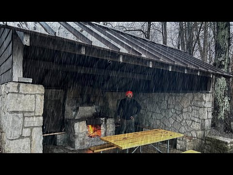<figcaption><b>rain format winner, 15.33x.</b> Camping in a Stone Picnic Shelter during a RAIN STORM</figcaption></figure><figure class="st-thumb">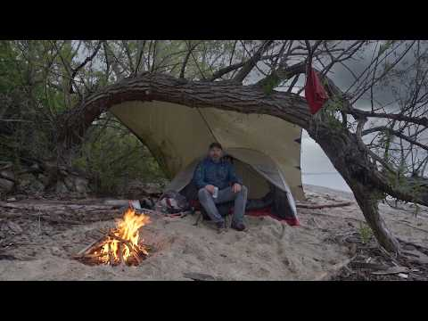<figcaption><b>rain format winner, 2.49x.</b> Camping in the Rain on a Deserted Beach under a Tree</figcaption></figure><figure class="st-thumb">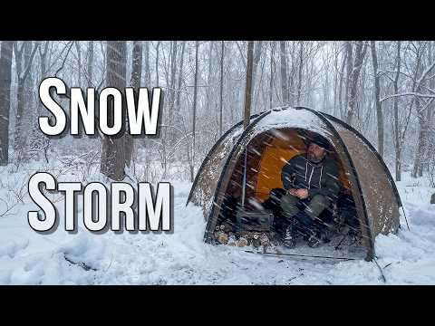<figcaption><b>hot tent / winter format winner, 1.65x.</b> Solo Hot Tent Camping in an INSANE SNOWSTORM</figcaption></figure><figure class="st-thumb">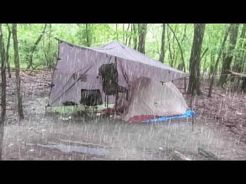<figcaption><b>rain tarp format winner, 110.29x.</b> Solo Overnight Camping in the RAIN</figcaption></figure>

## Engagement evidence

## Sam Bananas repackage evidence: do weak videos in strong formats satisfy viewers?

Question tested: individually weak videos (low out, low views) sitting inside strong formats, do the people who actually click like what they see?

### What was pulled

- [Observed] Public per-video metadata for 39 videos with yt-dlp (version 2026.08.19) on 2026-09-24, one request at a time: `yt-dlp --skip-download --dump-json` with `--sleep-requests 0.5` and a 1 second pause between videos during the verification pass. No video downloads, no comment pulls.
- [Observed] First pass pulled 36 videos. The verification pass pulled the 3 shortlist candidates that had no metadata yet: DhlZyvRZ8nA ("Winter Tarp Camping in a Snowy Valley"), v9fwDrjdjbw ("Camping with my dog under a Blue Home Depot Tarp | MORNING RAIN"), wfuZ5xsF2iw ("Hot Tent Camping in the Snow at a Secret Campsite"). All 3 succeeded.
- [Observed] Sets follow the study's repackage screen. Shortlist n=23, exactly the ids in candidates.json: out under 0.70, older than 180 days at pull time, and at least one public proxy. Every candidate carries P3 weather hook (19 videos) or P1 strong format (10 videos), 6 carry both. Comparison breakouts n=15: top 15 by out with the screen set at 1.5, every one at out 3.26 or higher.
- [Observed] Reconciliation with the first pass: it labeled 21 videos as shortlist. That label used a views cap (under 41,437) which dropped 3 of the study's 23 qualifying uploads, and it admitted Mm9_IKlzYLg ("5 TARP SETUPS You NEED to Know"), uploaded 2026-06-23 and 93 days old at pull time, which fails the 180 day settled-window screen. The shortlist now matches candidates.json and the study table exactly; Mm9_IKlzYLg remains in yt-metadata.json videos with set "screened_out".
- [Observed] Fields captured per video: view count, like count, comment count, duration, upload date, tags, category, channel follower count. Comment counts were present on all 39. Category was People & Blogs on all 39 (the yt-dlp category field came back null, values taken from the categories array).
- [Observed] All 39 pulls succeeded, failed[] is empty, no HTTP 429 throttling.

### Channel level

- [Observed] Channel: Camping with Sam Bananas, 73,700 subscribers at pull time.
- [Observed] Full catalog of 188 videos: average views 73,860, median views 41,437.

### Headline numbers (like per view = likes divided by views at pull time)

| Set | n | Median like/view | Median likes per 100 views | Median views | Median likes | Median out |
|---|---|---|---|---|---|---|
| Repackage shortlist | 23 | 0.059919 | 5.99 | 27,195 | 1,631 | 0.45 |
| Breakout comparison set | 15 | 0.023244 | 2.32 | 193,568 | 4,881 | 4.33 |
| Shortlist without a strong format (P3 weather hook only) | 13 | 0.063958 | 6.40 | 22,155 | 1,448 | 0.45 |
| Weak-out videos in the four strong formats | 10 | 0.059522 | 5.95 | 30,403 | 1,835.5 | 0.475 |
| High-out videos in the four strong formats | 11 | 0.023244 | 2.32 | 193,568 | 4,854 | 4.97 |

- [Observed] Shortlist (n=23): median 5.99 likes per 100 views (median LVR 0.059919) at median 27,195 views and median 1,631 likes.
- [Observed] Breakout comparison set (n=15): median 2.32 likes per 100 views (median LVR 0.023244) at median 193,568 views and median 4,881 likes.
- [Observed] The shortlist ratio is about 2.6 times the breakout ratio (0.059919 / 0.023244 = 2.58) while running at about 7 times fewer median views (193,568 / 27,195 = 7.1).

### The key test: weak out vs high out inside the same strong formats

Strong formats (format median of 1.10 or better): Camping In The Rain ___ (1.96), Camping With ___ TEMU ___ (1.54), Hot Tent Camping ___ (1.39), Tarp Camping ___ (1.11).

- [Observed] Weak-out videos in those formats (n=10, median out 0.475, median 30,403 views): median 5.95 likes per 100 views (LVR 0.059522).
- [Observed] High-out videos in those same formats (n=11, median out 4.97, median 193,568 views): median 2.32 likes per 100 views (LVR 0.023244).
- [Observed] Same-format gap is about 2.6 times (0.059522 / 0.023244 = 2.56), so the pattern is not an artifact of comparing different content types.
- [Observed] Concrete weak examples inside strong formats: "Camping in an INFLATABLE CABIN | One More Camp for My Old Dog" (Hot Tent Camping, out 0.34, 16,190 views, 1,642 likes, 10.14 per 100 views), "Solo RAIN CAMPING in the Mountains" (Camping In The Rain, out 0.37, 27,494 views, 1,856 likes, 6.75 per 100 views), "Camping with my dog under a Blue Home Depot Tarp | MORNING RAIN" (Tarp Camping, out 0.57, 61,901 views, 2,816 likes, 4.55 per 100 views, one of the three verification-pass pulls).
- [Observed] For contrast, the channel's biggest breakout, "Solo Overnight Camping in the RAIN | Alone in the Woods" (out 110.29, 1,805,062 views, 18,437 likes), sits at 1.02 like per 100 views.
- [Observed] The shortlist videos that qualified only through weather keywords (P3, no strong format label) behave the same way (n=13, median 6.40 likes per 100 views), so the effect is not limited to the four named formats.

### What this means

- [Correlation] The satisfaction proxy supports "low views but those who clicked liked it". Weak videos in strong formats are liked at about 2.6 times the rate of the breakouts, both across the sets and inside the exact same formats. Their weakness reads as a distribution problem (reach and click through), not a quality problem once someone watches.
- [Correlation] Caveat: like per view normally falls as reach grows, since casual and non-subscriber viewers are less likely to tap like. A large part of the same-format gap is consistent with that general pattern, so this is strong support rather than proof that the format alone drives satisfaction.
- [Correlation] Both numbers are thin proxies: likes per view ignores watch time and retention, and out is a relative view performance score. Repackaging is still justified because the audience signal is favorable, but the real confirmation would be retention data on the repackaged cuts.

### Limitations

- [Observed] Lifetime likes, not first 28 day likes. like_count is the total at pull time, so an upload from 2021 had about five years to collect likes while a 2026 upload had months. The two sets are not age-matched by construction. The check that public data allows is an age split by upload year:

| Upload year group | Shortlist n | Shortlist median like/view | Breakouts n | Breakouts median like/view | Ratio |
|---|---|---|---|---|---|
| 2021-2023 | 11 | 0.059528 | 6 | 0.018712 | 3.2 |
| 2024-2026 | 12 | 0.064266 | 9 | 0.025508 | 2.5 |

Both bands point the same way, so longer accumulation does not explain the gap. This is a partial control only: each band is small (6 to 12 videos), and likes keep accruing inside a band too, so the comparison is within similar age groups rather than a matched first 28 day measurement.
- [Observed] No retention data. This channel carries 0 retention curves and no Studio pull, so engaged views, watch time and click-through do not exist for any video here. Like per view stands in for "people who watched liked it" and cannot say how many stayed past the first minute. The study states the same limit: convert a candidate only after a Studio pull of 6 or more curves.
- [Observed] Reach confound. Like per view falls as reach grows, so part of every gap above is that general pattern rather than format quality.
- [Observed] out is a relative score against this channel's contemporaries, not an absolute performance number. Everything here is one channel: 188 uploads, 73,700 subscribers at pull time.
- [Observed] Count drift. Lifetime views and likes keep growing after the pull. The 3 verification-pass videos show view counts a little above the channel page numbers recorded in candidates.json (tab_views), the same behavior as the first-pass records.

### Verdict

- [Observed] hypothesis_result: SUPPORTED. Individually weak videos inside strong formats show high satisfaction among those who clicked. Shortlist median LVR 0.059919 vs breakouts 0.023244 (2.58 times, n=23 vs 15), and within the four strong formats weak-out 0.059522 vs high-out 0.023244 (2.56 times, n=10 vs 11). The direction survives the upload year split: 3.2 times for 2021-2023 uploads, 2.5 times for 2024-2026 uploads.

Full per-video data: yt-metadata.json in this folder. Change log for the verification pass: verification-note.md in this folder.

## Cross-channel check

| Format family | Channels measured | Median of per-channel medians |
|---|---|---|
| rain/storm camping | 19 | 1.10x |
| stealth/urban camping | 17 | 0.98x |
| hot tent/winter camping | 23 | 0.98x |
| bushcraft shelter/tarp | 7 | 1.27x |
| multi-day (2-4 days) trips | 10 | 1.14x |
| canoe/kayak trips | 12 | 0.88x |
| budget-gear challenges | 12 | 1.18x |
| dog camping | 7 | 1.00x |

*Cohort scan across the outdoors channels in the corpus (Observed)*

## Cohort scan: camping format families behind Camping with Sam Bananas

Subject channel: Camping with Sam Bananas (UCDKQlnsHrUcrYH3B9v7XUAg), outdoors and homestead camping niche.
Corpus: Influint channel pages in channels/*.html. Channel pages read: 245. Channels kept in cohort: 33. Channels dropped as out of niche: 212.
Generated 2026-09-24. Machine readable twin: cohort-scan.json.

### Score basis (read this first)

Every score in this scan is the public channel score: LIFETIME views divided by the median of each upload's nearest neighbours by publish date. 1.00x means typical for that channel AT THAT TIME, not against a catalogue wide average. A lifetime count rewards an older video for having been around longer, so this basis flatters older uploads and is not the first-28-day score used on analysed channels. [Observed]

### How the cohort was picked

A channel page enters the cohort when it has at least 5 produced long-form uploads and either 15 percent or more of its titles carry camping and outdoors terms (camp, tent, bushcraft, backpack, hike, canoe, kayak, hammock, off-grid, homestead, and kin) or its channel name carries those terms and 5 percent of its titles do. Woodworking, build, and general travel pages fall out here. Families bucket uploads by title wording inside the cohort channels, and a channel counts toward a family only from 2 scored uploads upward. [Observed]

### Family summary

| Family | Channels | Median of medians | Channels above 1.00x | Sam Bananas median (n) | Read |
| --- | --- | --- | --- | --- | --- |
| rain/storm camping | 19 | 1.10x | 12 of 19 | 1.58x (n=84) | Broadest family above baseline in the cohort: 12 of 19 channels clear their own baseline and the samples are the deepest here (up to 84 uploads). This is the one shape with both breadth and depth behind it. [Correlation] |
| stealth/urban camping | 17 | 0.98x | 8 of 17 | 0.70x (n=27) | Median lands on the 1.00x baseline with 8 of 17 channels above it. Solid recurring programming, weak as a growth bet. [Correlation] |
| hot tent/winter camping | 23 | 0.98x | 11 of 23 | 0.93x (n=44) | Also at the baseline on the widest channel base (23 channels, 11 above). Reliable seasonal filler, not a breakout shape. [Correlation] |
| bushcraft shelter/tarp | 7 | 1.27x | 7 of 7 | 1.27x (n=49) | Highest median of medians in the scan, and all 7 channels clear baseline, but the base is small and 3 of the 7 rest on 2 to 3 uploads. Promising and thin. [Correlation] |
| multi-day (2-4 days) trips | 10 | 1.14x | 5 of 10 | 0.70x (n=21) | Above baseline overall (5 of 10 channels above, strong samples in the top half). The length framing looks like part of the lift, and it also wraps storm and water stories inside it. [Correlation] |
| canoe/kayak trips | 12 | 0.88x | 5 of 12 | 0.88x (n=17) | Weakest family here at 0.88x even though 5 of 12 channels clear baseline and individual trips break out. The water setting alone does not carry the format. [Correlation] |
| budget-gear challenges | 12 | 1.18x | 7 of 12 | 1.97x (n=10) | Second highest median of medians on a workable base (12 channels, 7 above), and the subject channel's own budget uploads sit at 1.97x. Cheap gear framing travels across the niche. [Correlation] |
| dog camping | 7 | 1.00x | 3 of 7 | 0.53x (n=13) | Sits on the baseline overall (1.00x, 3 of 7 channels above) but is the subject channel's worst family at 0.53x. A dog in the title is not a format that moves this channel. [Correlation] |

Scores are Observed counts per channel. The Read column compares families to each other and to the 1.00x baseline across channels, which is Correlation, not proven cause.

### Families in detail

#### 1. rain/storm camping

Channels: 19. Median of medians: 1.10x. Channels above their own 1.00x baseline: 12 of 19. [Observed]
Camping with Sam Bananas: 1.58x on 84 matching uploads. [Observed]

| Channel | Uploads | Median | Top example (score) | Low example (score) |
| --- | --- | --- | --- | --- |
| Small Plots | 32 | 1.94x | Rain-Soaked Stealth Camping Under a Folding Table (10.51x) | Lets talk about the Future of Small Plots / Rainy walk in the city (0.31x) |
| Campin' With Champion | 5 | 1.73x | Tarp Shelter Stealth Camp At Cracker Barrel / Huge Rain Storm (2.57x) | 2 Days Winter Storm Car Camping (0.78x) |
| Camping with Sam Bananas (subject) | 84 | 1.58x | Solo Overnight Camping in the RAIN / Alone in the Woods / Tarp Set up / Campfire / Storm (110.29x) | The Most Iconic Drive in Hawaii: THE ROAD TO HANA / Rain Forests, Waterfalls and Camping (0.12x) |
| Nick and Maëla | 6 | 1.56x | Building A Log Cabin / Ep. 69 / Making our porch COZY! Tropical Storm Debby causes flooding... (5.08x) | Building A Log Cabin / Ep. 54 / Screening the front porch + Rainwater collection (0.78x) |
| madilynn | 2 | 1.29x | im alone, my van broke down, and it’s raining (1.90x) | hail storm in a van 🤓⛈ (0.68x) |
| Emily Aisling | 2 | 1.18x | CAMPING in A HEAVY RAIN STORM (1.31x) | GREENHOUSE Build and CAMPING in the Rain (1.04x) |
| This Off Grid Life | 8 | 1.14x | ARCTIC BLAST WINTER STORM FOLLOWED BY HEAT WAVE, Can we Get Out Of Our Off Grid Property? (1.54x) | Snow Storm Forces Us To Stop! (0.65x) |
| Jonathan Yentch | 19 | 1.12x | Camping in my Hand Built Truck Cabin for the First Time (in Stormy Winter Conditions) (2.64x) | Winter Adventures in my 4x4 Truck Camper / Mt. Rainier National Park (0.38x) |
| Max & Occy | 8 | 1.12x | I Bought My Dream Rainforest Property (2.03x) | Starting life Fresh In The Rainforest (0.81x) |
| My Name’s Teo | 10 | 1.10x | Van life in the desert / Rainy day Gaming, Music & Breakfast (2.17x) | Living In My Van I I Rainy Day Q&A Ep.21 (0.74x) |
| Kelly Hays | 22 | 1.04x | Surviving a Historic Winter Storm ALONE at My Remote Cabin (3.53x) | Appalachian Trail Complete Clothing Gear List / Layers, Shoes, Raingear, etc / Post Thru Hike (0.56x) |
| Ula Blocksage | 2 | 1.03x | Van Life When the Weather is Wet / Exploring the South Downs England (1.20x) | More Narrowboat LEAKS! MAJOR STORM Hits Our Narrowboat Home! / Ep 28 (0.86x) |
| FishN More | 12 | 0.95x | Rainy River Walleyes *GIANTS* (4.00x) | Storm Bass fishing! (0.40x) |
| Maya Feliz | 5 | 0.92x | HEAVY Rain Storm hits my Cabin in the Woods (1.35x) | Autumn is here & I'm Preparing for Rain Season (0.79x) |
| Runaway Matt + Cass | 2 | 0.89x | RAINWATER COLLECTION for a Homestead - Does it work? (1.28x) | DIY Rain Water for Goats & Chickens / Off-Grid Tennessee Homestead (0.50x) |
| Adventure Time Loui | 8 | 0.84x | Was this a mistake? It NEVER Stops Raining! / Living in South East Alaska (2.21x) | My Simple Life in Alaska's Rainforest (0.59x) |
| Cody & Kellie | 2 | 0.84x | Exploring Washington’s Olympic Peninsula - Rainforests & Beaches (0.92x) | Olympic National Park is Unlike Anywhere Else (Hoh Rainforest) (0.76x) |
| Overland Lady | 2 | 0.52x | NO LONGER ALONE! Camping in rain / BC 5th Gen 4Runners (0.70x) | Camping In Unexpected Rain / Nature Sounds Soft Voice ASMR (0.34x) |
| Spencer - River Certified | 3 | 0.30x | We Caught THE STRONGEST FISH IN THE AMAZON RAINFOREST!! (Sick Eats) (1.14x) | An Evening Fishing in the AMAZON RAINFOREST!! (Dream Trip) (0.28x) |

Cross-channel read: Broadest family above baseline in the cohort: 12 of 19 channels clear their own baseline and the samples are the deepest here (up to 84 uploads). This is the one shape with both breadth and depth behind it. [Correlation]

Dropped from this family: Set To Hike (1 matching upload(s), 1 with an outlier score; median needs 2); Chris Cage (1 matching upload(s), 1 with an outlier score; median needs 2); Another Homestead (1 matching upload(s), 1 with an outlier score; median needs 2); Shawn James - My Self Reliance (1 matching upload(s), 1 with an outlier score; median needs 2). [Observed]

#### 2. stealth/urban camping

Channels: 17. Median of medians: 0.98x. Channels above their own 1.00x baseline: 8 of 17. [Observed]
Camping with Sam Bananas: 0.70x on 27 matching uploads. [Observed]

| Channel | Uploads | Median | Top example (score) | Low example (score) |
| --- | --- | --- | --- | --- |
| Build Studio | 2 | 3.38x | Self Built Van Tour: Stealth High-Tech / Custom Ebikes, Shower, Office (6.25x) | Van Tour Reaction: Small & STEALTH w/ Thoughtful Layout for City Vanlife (0.50x) |
| Campin' With Champion | 70 | 1.13x | Bridge Catwalk Stealth Camp (6.97x) | My newest stealth camping tool! TST Carrier 20" Cargo Ebike Review. (0.17x) |
| Small Plots | 107 | 1.12x | Rain-Soaked Stealth Camping Under a Folding Table (10.51x) | Stealth Camping Behind the Scenes and Bloopers / Small Plots (0.13x) |
| My Name’s Teo | 23 | 1.11x | Stealth Camping in Seattle (Hiking, Gaming, Cooking) (2.08x) | Living In My Van With A Cat I I Stealth Camping At Planet Fitness Ep.19 (0.69x) |
| Overland Lady | 2 | 1.11x | City Girl - XOverland Overlander Film Fest Winning Short Film (1.56x) | I Rather This Cabin Than City Life - Moving Into A Truck Camper (0.66x) |
| Ula Blocksage | 3 | 1.08x | Lost and Alone on Stanton Moor / My First Solo Trip in My Stealth Micro Camper (1.20x) | Starting My New Life Again: Solo Female Stealth Van Build Conversion / EP 01 (1.00x) |
| FishN More | 7 | 1.05x | Fishing in New York City (Yelled at by Karen) (1.99x) | Urban Fishing for Massive Trout! (0.53x) |
| Adventure Time Loui | 3 | 1.01x | Van Life in the City / Exploring San Antonio, TX (1.03x) | The Oldest City in the US 🇺🇸 / Van Life in the South (0.95x) |
| Cody & Kellie | 3 | 0.98x | 72 Hours in Ocean City Maryland Our First Impressions (5.38x) | This Arkansas City Deserves More Credit Than It Gets (0.86x) |
| Jon Roams | 6 | 0.98x | Luxury Stealth Camping ALONE / Cooked Steak in a Summer Whiteout [ep 30] (3.02x) | Leaving Scotland... I Didn't Expect This / Vanlife City Camping [ep 29] (0.88x) |
| Kelly Hays | 5 | 0.95x | A full day in Lake City, Colorado (1.23x) | Day 53 / Spy Rock Stealth Camping & Sunset / Appalachian Trail Thru Hike 2021 (0.85x) |
| hannahleeduggan | 2 | 0.93x | Trading My Cabin for a New York City Apartment 🌆 (1.10x) | Truck Camping Overnight at the Land Rover Dealership (not stealth. like, at all) (0.75x) |
| Jonathan Yentch | 7 | 0.90x | How to Make Window Covers for Stealth Car Camping (12.86x) | Cooking King Salmon in the Whole Foods Parking Lot (They Caught Me) (0.40x) |
| Spencer - River Certified | 15 | 0.81x | MONSTROUS Fish Live in This TINY URBAN STREAM!! (Bank Fishing) (5.54x) | Urban Pond Is LOADED WITH FISH!!! (Fishing Competition) (0.39x) |
| Camping with Sam Bananas (subject) | 27 | 0.70x | Stealth Camping in the Rain behind Wendy's (3.58x) | Urban Camping in an Abandoned Barn during a SNOW STORM (0.25x) |
| madilynn | 3 | 0.69x | solo van life with a remote job (winter edition) + sleeping in parking lots ꕥ (0.99x) | van stealth camping alone in the city (0.60x) |
| Runaway Matt + Cass | 2 | 0.48x | Good Eats in a Colorful City / Guanajuato, Mexico (0.57x) | S1:E07 Van Life Seattle / Ferry to Seattle with our van home and explore the city! / Runaway NW, USA (0.40x) |

Cross-channel read: Median lands on the 1.00x baseline with 8 of 17 channels above it. Solid recurring programming, weak as a growth bet. [Correlation]

Dropped from this family: Nick and Maëla (1 matching upload(s), 1 with an outlier score; median needs 2); Shawn James - My Self Reliance (1 matching upload(s), 1 with an outlier score; median needs 2); Lady & The Owl Man (1 matching upload(s), 1 with an outlier score; median needs 2); Christine Kjaer (1 matching upload(s), 1 with an outlier score; median needs 2). [Observed]

#### 3. hot tent/winter camping

Channels: 23. Median of medians: 0.98x. Channels above their own 1.00x baseline: 11 of 23. [Observed]
Camping with Sam Bananas: 0.93x on 44 matching uploads. [Observed]

| Channel | Uploads | Median | Top example (score) | Low example (score) |
| --- | --- | --- | --- | --- |
| Jonathan Yentch | 50 | 1.31x | Buried in a Snowstorm / Staying Warm & Cozy in my Camper (56.77x) | Winter Adventures in my 4x4 Truck Camper / Mt. Rainier National Park (0.38x) |
| Runaway Matt + Cass | 4 | 1.29x | We FINALLY have a HOME! Relief on our HOMESTEAD as winter nears. (2.88x) | Winter TIPS & TRICKS for your Homestead / OFF-GRID (0.69x) |
| Ula Blocksage | 2 | 1.18x | WINTER Is Coming. Preparing Our Narrowboat Home for SUB-ZERO Temperatures / EP 31 (1.31x) | SUB ZERO Temperatures Living On A Narrowboat (FROZEN IN) / EP 06 (1.05x) |
| Overland Lady | 14 | 1.12x | Cozy Snow Camp In Rhino-Rack Awning Room / Toyota Landcrusier 100 Series Solo Female Overlander (11.73x) | Big White Winter Rally 2018 Day 2 - rescue car 17 (0.22x) |
| Jon Roams | 7 | 1.12x | Slept in a Supermarket in Scotland / WINTER VANLIFE [ep 6] (10.25x) | The Island Nobody Knows About / Winter Van Life [ep 8] (0.25x) |
| My Name’s Teo | 21 | 1.09x | Snow camping at Cracker Barrel (In my van) (3.07x) | Van life: Escaping the snow and heading south (0.61x) |
| FishN More | 180 | 1.05x | CAT FISHING at a power plant (**ICE FISHING RODS**) (12.80x) | How to (DIY) Make a LIVEWELL on the Ice (0.31x) |
| Maya Feliz | 13 | 1.05x | What Happened to the Land in Winter? Portugal Countryside Update (2.19x) | Where am I Spending the Winter? (0.69x) |
| Small Plots | 20 | 1.04x | Stealth Camping in a Ditch / Bicycle Tent Camp / Rain (3.13x) | Solo Winter Hammock Camp COMMENTARY / Behind the Scenes- one of my Favorite Camps (0.17x) |
| Kelly Hays | 25 | 1.02x | Solo Winter Van Camping in -5° F (8.19x) | Hiking the Appalachian Trail and Snowboarding around the Roan Mountain Highlands (0.52x) |
| hannahleeduggan | 3 | 1.02x | Truck Camping in Sub Freezing Winter Weather (1.16x) | The Last One 🌲 Winter in the Woods (1.00x) |
| This Off Grid Life | 44 | 0.98x | This Is How We'll Heat Our Off Grid Home / Off Grid In the Winter Chores (3.93x) | Off Grid In The Winter / Dealing With Snow (0.54x) |
| Nick and Maëla | 21 | 0.98x | 3 days at our Off-Grid Log Cabin / A Winter Wonderland! How has the cabin held up...? (9.86x) | Here's why we haven't been at the cabin this winter... (0.18x) |
| Happy Pancake | 4 | 0.97x | ICE is the new Gestapo (2.98x) | ICE is melting, but there's another GLARING problem... (0.27x) |
| Cody & Kellie | 5 | 0.96x | Colorado’s Most Unreal Alpine Lake (Ice Lake Trail) (1.35x) | Wyoming's Snowy Range feels like Colorado (without the crowds) (0.51x) |
| Spencer - River Certified | 52 | 0.94x | Ice Fishing a Small River in the MIDDLE OF NOWHERE!! (Catch and Cook) (5.56x) | Winter Bank Fishing a NUCLEAR POWER PLANT LAKE!! (Catch and Cook) (0.29x) |
| Camping with Sam Bananas (subject) | 44 | 0.93x | Camping in a Stone Shelter during a Big Snow Storm (13.95x) | Urban Camping in an Abandoned Barn during a SNOW STORM (0.25x) |
| madilynn | 8 | 0.93x | Solo snow hot spring hike (+ other van life activities) (1.45x) | winter van life in the freezing desert (utah + arches national park) (0.69x) |
| Adventure Time Loui | 25 | 0.92x | Surviving my FIRST Winter Snowstorm DIY Jeep Camper Style (7.86x) | It Gets Cold in FLORIDA?!?! / Van Life in the South (0.64x) |
| Campin' With Champion | 4 | 0.88x | Hammock Camping In The Snow (1.29x) | Magicycle Cruiser Pro / Ebike Review (0.07x) |
| Build Studio | 9 | 0.86x | BEST INSULATED CAMPERVAN for COLD CAMPING 🥶Winter Van Build S2E7 (4.34x) | This is Great Country for Freedom Camping! / Authentic Van Life in the Cold w/ Anker SOLIX C800 Plus (0.15x) |
| My Self Reliance | 4 | 0.69x | I Was Born an Old Man / 1st Snow of the Season / My Daughter's Boyfriend's 1st Deer Hunt (1.11x) | Putting our Permaculture Orchard to Bed for the Winter (0.53x) |
| Emily Aisling | 5 | 0.48x | OFF GRID Cabin Update / Ice Fishing (1.81x) | Winter Day in my Life (0.42x) |

Cross-channel read: Also at the baseline on the widest channel base (23 channels, 11 above). Reliable seasonal filler, not a breakout shape. [Correlation]

Dropped from this family: Wanderers and Whiskers (1 matching upload(s), 1 with an outlier score; median needs 2); Chris Cage (1 matching upload(s), 1 with an outlier score; median needs 2); Another Homestead (1 matching upload(s), 1 with an outlier score; median needs 2); Shawn James - My Self Reliance (1 matching upload(s), 1 with an outlier score; median needs 2); Christine Kjaer (1 matching upload(s), 1 with an outlier score; median needs 2). [Observed]

#### 4. bushcraft shelter/tarp

Channels: 7. Median of medians: 1.27x. Channels above their own 1.00x baseline: 7 of 7. [Observed]
Camping with Sam Bananas: 1.27x on 49 matching uploads. [Observed]

| Channel | Uploads | Median | Top example (score) | Low example (score) |
| --- | --- | --- | --- | --- |
| Ryan & Ilse / Patagonia to Alaska | 2 | 8.18x | How to setup a tarp for bikepacking using your bike (Flying Diamond Pitch) (10.45x) | How to Pitch a Tarp for #Vanlife / Step-by-step Guide / Poles, Guy Lines, Knots, & Toggles (5.91x) |
| Small Plots | 6 | 1.89x | Urban Stealth Camping in HEAVY RAIN / Solo Overnight in the City Under Cheap Tarp (4.55x) | Stealth Camping with No Shelter in Suburban Neighborhood (0.50x) |
| FishN More | 2 | 1.71x | Solo Overnight Bushcraft Camp - Natural Shelter, Minimal Gear (2.63x) | Bushcrafting a Off-Grid Survival Shelter (5 day build) (0.78x) |
| Camping with Sam Bananas (subject) | 49 | 1.27x | Solo Overnight Camping in the RAIN / Alone in the Woods / Tarp Set up / Campfire / Storm (110.29x) | 5 TARP SETUPS You NEED to Know (0.28x) |
| Adventure Time Loui | 3 | 1.18x | Shelter Camping alone in Alaska Bear Country *I was more afraid of the beavers* (2.45x) | 24hrs Alaska Shelter Camping with FUTURISTIC Legs- HYPERSHELL X Ultra S (0.63x) |
| Kelly Hays | 6 | 1.08x | Day 173 / Fontana Dam to Derrick Knob Shelter / Rocky Top Sunset / Appalachian Trail Thru Hike 2021 (1.26x) | Day 125 / Little Rock Pond, Rock Sanctuary and Minerva Shelter / Appalachian Trail Thru Hike 2021 (0.95x) |
| This Off Grid Life | 2 | 1.05x | A New Machine To Make Life Easier / Building A Lean-To Shelter For The Cows Before COLD Sets In (1.13x) | TIMELAPSE - Transforming An Old Lean-To Into A 24x40 Workshop/Barn - Start To Finish (0.97x) |

Cross-channel read: Highest median of medians in the scan, and all 7 channels clear baseline, but the base is small and 3 of the 7 rest on 2 to 3 uploads. Promising and thin. [Correlation]

Dropped from this family: Jonathan Yentch (1 matching upload(s), 1 with an outlier score; median needs 2); Build Studio (1 matching upload(s), 1 with an outlier score; median needs 2); Runaway Matt + Cass (1 matching upload(s), 1 with an outlier score; median needs 2); Campin' With Champion (1 matching upload(s), 1 with an outlier score; median needs 2); Shawn James - My Self Reliance (1 matching upload(s), 1 with an outlier score; median needs 2). [Observed]

#### 5. multi-day (2-4 days) trips

Channels: 10. Median of medians: 1.14x. Channels above their own 1.00x baseline: 5 of 10. [Observed]
Camping with Sam Bananas: 0.70x on 21 matching uploads. [Observed]

| Channel | Uploads | Median | Top example (score) | Low example (score) |
| --- | --- | --- | --- | --- |
| Nick and Maëla | 3 | 2.10x | 3 days at our Off-Grid Log Cabin / A Winter Wonderland! How has the cabin held up...? (9.86x) | MOUNT RAINIER / Feeling small next to this GIANT! 4 days camping, and a grizzly bear encounter (0.90x) |
| Spencer - River Certified | 18 | 1.76x | Fishing DEEP Wing Dams FOR MONSTER FISH!! (2 Night River Adventure) (8.32x) | 3 DAYS Kayak Fishing For BIG FISH!! (Kayak Camping) (0.60x) |
| FishN More | 27 | 1.45x | 4 Days Camping & Fishing on Canadian Border! (3.76x) | 3 Days at Duck Camp! Duck fajitas & Bacon Duck Bombs (0.59x) |
| Cody & Kellie | 16 | 1.38x | Buffalo River Kayak Camping 3 Days Off Script Drifting Wild (Ponca to Pruitt) (7.21x) | Driving the Entire Oregon Coast in 3 Days (0.68x) |
| Wanderers and Whiskers | 3 | 1.34x | First Citrus Harvest - 4 days on our homestead (1.40x) | We got our DREAM VAN - 3 Day DIY Van Conversion (0.61x) |
| My Name’s Teo | 2 | 0.94x | After 48 Hours Of Trying (Van Life Catch & Cook) (0.95x) | I Spent 48 Hours in A Tiny Home (Cozy vibes, the Best meal I’ve made all year & New Music) (0.92x) |
| Small Plots | 2 | 0.90x | 2 Nights Camping on a Lake / Hammock Camping / Small Plots (0.99x) | I Escaped to an Uninhabited Island for 3 Days - Everything Went Wrong Pretty Much Immediately (0.81x) |
| Kelly Hays | 9 | 0.88x | 3 Day Overnight Canoe Paddle & Camping on the Suwannee River (2.22x) | Arkansas to California 3 Day Roadtrip / Solo Female Traveler / Traveling Registered Dietitian (0.51x) |
| Adventure Time Loui | 4 | 0.80x | We Spent 48 Hours on A Ferry to SE Alaska ⛴ / Alaska Marine Highway (1.55x) | Soaked in Alaska's Tongass Rainforest - 3 days Jeep Camping (0.61x) |
| Camping with Sam Bananas (subject) | 21 | 0.70x | Caught in a MASSIVE RAIN STORM / 3 Days Canoe Camping on a Wild River (3.26x) | 3 days Camping in the Mountain Wilderness (0.34x) |

Cross-channel read: Above baseline overall (5 of 10 channels above, strong samples in the top half). The length framing looks like part of the lift, and it also wraps storm and water stories inside it. [Correlation]

Dropped from this family: Jonathan Yentch (1 matching upload(s), 1 with an outlier score; median needs 2); Runaway Matt + Cass (1 matching upload(s), 1 with an outlier score; median needs 2); Max & Occy (1 matching upload(s), 1 with an outlier score; median needs 2); Campin' With Champion (1 matching upload(s), 1 with an outlier score; median needs 2); Set To Hike (1 matching upload(s), 1 with an outlier score; median needs 2); Another Homestead (1 matching upload(s), 1 with an outlier score; median needs 2). [Observed]

#### 6. canoe/kayak trips

Channels: 12. Median of medians: 0.88x. Channels above their own 1.00x baseline: 5 of 12. [Observed]
Camping with Sam Bananas: 0.88x on 17 matching uploads. [Observed]

| Channel | Uploads | Median | Top example (score) | Low example (score) |
| --- | --- | --- | --- | --- |
| Overland Lady | 2 | 2.49x | Paddleboard Solo Camping at a Very Busy Lake (2.87x) | Paddle boarding on a lake SOLO - 4WD Camping in a Land Cruiser (2.10x) |
| Nick and Maëla | 4 | 1.59x | ALGONQUIN / 4 days Canoeing in the Backcountry (2.10x) | Building A Log Cabin / Ep. 61 / We made a folding ladder for the mezzanine + Canoe camping! (1.14x) |
| Cody & Kellie | 12 | 1.53x | Buffalo River Kayak Camping 3 Days Off Script Drifting Wild (Ponca to Pruitt) (7.21x) | We Found Arkansas Wildest Hidden River (Kayaking Fourche La Fave) (0.33x) |
| Kelly Hays | 18 | 1.34x | Kayaking to a Hidden Oasis on the Chassahowitzka River / Homosassa Springs State Park (12.83x) | Relaxing Kayak Footage of My Maiden Voyages (0.18x) |
| FishN More | 12 | 1.23x | 2 MAN LIMIT OF WOOD DUCKS! (CANOE HUNTING) (2.41x) | Kayak Fishing Tiny Private Pond + Unboxing & Piscifun Alloy X Giveaway! (0.43x) |
| Camping with Sam Bananas (subject) | 17 | 0.88x | Caught in a MASSIVE RAIN STORM / 3 Days Canoe Camping on a Wild River (3.26x) | Wilderness Kayak River Camping GONE WRONG / Wayne National Forest / A Man, A Van, A Plan (0.24x) |
| Spencer - River Certified | 65 | 0.87x | Catching HUGE FISH from SMALL STREAMS!! (Kayak Fishing) (6.72x) | I Caught The BIGGEST FISH Of The Tournament!!! (Wheeler Lake Kayak Catfishing) (0.40x) |
| Small Plots | 2 | 0.84x | Foldable Origami Canoe by MYCANOE / Setting up and Maiden Voyage (0.94x) | Kayak Stealth Camping on a Hidden Creek in the City - Things Get Weird (0.75x) |
| Campin' With Champion | 2 | 0.72x | Kayaking, Camping, And Crashing Drones (0.76x) | I Accidentally Kayaked 41 Miles... (Big Mistake) (0.69x) |
| Adventure Time Loui | 3 | 0.67x | 3 Days Fishing, Kayaking, and Cabin Camping in Alaska (0.92x) | I went Kayaking for the FIRST TIME! / Fall is HERE! (0.50x) |
| My Self Reliance | 2 | 0.53x | Making Maple Syrup, Canoeing in the Snow / T-Bone Steak with Maple Blueberries, Outdoor Kitchen Prep (0.77x) | Solo Camping on an Island, Venison on an Open Fire, Fly Fishing and Canoeing (0.28x) |
| Jonathan Yentch | 3 | 0.47x | Kayaking and Truck Camping in Lake Tahoe (0.80x) | My First Time Whitewater Rafting (0.38x) |

Cross-channel read: Weakest family here at 0.88x even though 5 of 12 channels clear baseline and individual trips break out. The water setting alone does not carry the format. [Correlation]

Dropped from this family: My Name’s Teo (1 matching upload(s), 1 with an outlier score; median needs 2); Ula Blocksage (1 matching upload(s), 1 with an outlier score; median needs 2); Emily Aisling (1 matching upload(s), 1 with an outlier score; median needs 2). [Observed]

#### 7. budget-gear challenges

Channels: 12. Median of medians: 1.18x. Channels above their own 1.00x baseline: 7 of 12. [Observed]
Camping with Sam Bananas: 1.97x on 10 matching uploads. [Observed]

| Channel | Uploads | Median | Top example (score) | Low example (score) |
| --- | --- | --- | --- | --- |
| Build Studio | 7 | 2.19x | How to Build $140 Motorized DIY Bed Lift in Your Campervan (7.82x) | NEW CAR!! Modifying Audi A5 S-Line in 20 MIN (DIY, Fast, Cheap, & Easy) (0.97x) |
| Camping with Sam Bananas (subject) | 10 | 1.97x | Camping in the Rain w/ UNTESTED GEAR from TEMU (12.79x) | How to go Winter Camping with CHEAP GEAR / Walmart/Amazon / Beginner's Guide to Winter Camping Gear (0.41x) |
| Overland Lady | 2 | 1.75x | Low Budget DIY Drawer Fridge Setup - Adventure Kings 30L Drawer Fridge (1.93x) | My Low Budget Landcruiser Setup For Solo Camping (1.58x) |
| Small Plots | 6 | 1.74x | Urban Stealth Camping in HEAVY RAIN / Solo Overnight in the City Under Cheap Tarp (4.55x) | Urban Stealth Camping in a $15 Tent - Someone Else is Out Here... (0.83x) |
| My Name’s Teo | 3 | 1.53x | Musician Leaves LA to Travel in Budget Astro Van / Van Tour Ep.9 (2.79x) | I Built A BEAUTIFUL Bed In My 1999 Chevy Astro (For $17!) Ep.6 (0.61x) |
| Kelly Hays | 3 | 1.24x | I Bought a Remote, Unfinished Cabin & Land for CHEAP (full tour) (3.99x) | Appalachian Trail Thru Hike 2021 / Day 4 / Best $8 Frozen Pizza of my Life (0.89x) |
| Max & Occy | 4 | 1.11x | Renovating my whole house in a week (on a budget) (1.40x) | Building a cheap deck completely transformed this home (0.84x) |
| This Off Grid Life | 3 | 0.98x | The Truth About Composting Toilets / Cheap DIY Composting Toilet - No Smell (18.58x) | Restoring A $200 WoodStove For Our Off Grid Cabin! There's No Way We Can Finish This Before Winter (0.91x) |
| Nick and Maëla | 3 | 0.95x | Canadian Couple builds a Campervan on a Budget ($5,000CAD) / Solar Power, Heat, Fridge, Water &More! (4.31x) | Minivan Campervan FULL BUDGET Breakdown! / How much would this build cost you? (0.20x) |
| Ryan & Ilse / Patagonia to Alaska | 2 | 0.70x | Cycling Costa Rica on a Budget / Patagonia to Alaska #13 (0.87x) | Budget Meals for Backpacking Trips / Cheap resupply tips (0.53x) |
| Campin' With Champion | 2 | 0.54x | First hot tent camp in the CHEAPEST setup I could find! / Hot tent + Stove for $144! (0.97x) | HUGE DEAL $699 Moped Style Ebike / TST R002 Bike Review (0.11x) |
| Shawn James - My Self Reliance | 2 | 0.51x | Grow Food that Actually Feeds Your Family on a Budget (0.80x) | 52 Weeks to Self-Reliance / Weeks 2 & 3: Your Budget + Risk Assessment (0.21x) |

Cross-channel read: Second highest median of medians on a workable base (12 channels, 7 above), and the subject channel's own budget uploads sit at 1.97x. Cheap gear framing travels across the niche. [Correlation]

Dropped from this family: FishN More (1 matching upload(s), 1 with an outlier score; median needs 2); Spencer - River Certified (1 matching upload(s), 1 with an outlier score; median needs 2); Adventure Time Loui (1 matching upload(s), 1 with an outlier score; median needs 2); Cody & Kellie (1 matching upload(s), 1 with an outlier score; median needs 2). [Observed]

#### 8. dog camping

Channels: 7. Median of medians: 1.00x. Channels above their own 1.00x baseline: 3 of 7. [Observed]
Camping with Sam Bananas: 0.53x on 13 matching uploads. [Observed]

| Channel | Uploads | Median | Top example (score) | Low example (score) |
| --- | --- | --- | --- | --- |
| Adventure Time Loui | 4 | 1.85x | Just a Casual Tour of My NO BUILD Jeep Camper 🚙 🏕/ Full Time Travel with a Pittie Pup (3.25x) | Another LONELY Girl Who Lives in a Car w/ a Dog / Living in a Jeep on an Island in Alaska (0.91x) |
| FishN More | 7 | 1.06x | Cooking GOURMET BBQ on ISLAND with my DOG (1.58x) | This is the Best Spillway EVER! (Dog Tries Eating my fish) (0.43x) |
| Kelly Hays | 3 | 1.04x | Solo Female Van Camping with my New Puppy! (1.19x) | Remote Cabin Life Alone with My Dog (0.83x) |
| This Off Grid Life | 3 | 1.00x | The Best Way to Remove Skunk Spray From Your Dog (1.01x) | The Smoke Has Cleared! Deck Foundation + New Puppy To Protect Our Farm (0.91x) |
| Jonathan Yentch | 7 | 0.81x | Overnight in a Late Season Snowstorm (with my Puppy) (1.86x) | What it's Actually Like on the Road with a 6 Month Old Puppy (0.47x) |
| Camping with Sam Bananas (subject) | 13 | 0.53x | Car Camping from a SUBARU OUTBACK / Overnight with my Dog / Late Night Lightning Storm (1.51x) | Camping in an INFLATABLE CABIN / One More Camp for My Old Dog (0.34x) |
| My Self Reliance | 2 | 0.34x | It's all about a Dog / Learning to Fly Fish with my Golden Retriever, Brook Trout in the Wilderness (0.37x) | Cali the Golden Retriever's 9th Birthday (0.32x) |

Cross-channel read: Sits on the baseline overall (1.00x, 3 of 7 channels above) but is the subject channel's worst family at 0.53x. A dog in the title is not a format that moves this channel. [Correlation]

Dropped from this family: Spencer - River Certified (1 matching upload(s), 1 with an outlier score; median needs 2); My Name’s Teo (1 matching upload(s), 1 with an outlier score; median needs 2); Runaway Matt + Cass (1 matching upload(s), 1 with an outlier score; median needs 2); Max & Occy (1 matching upload(s), 1 with an outlier score; median needs 2); madilynn (1 matching upload(s), 1 with an outlier score; median needs 2); Emily Aisling (1 matching upload(s), 1 with an outlier score; median needs 2). [Observed]

### Thin flags

- rain/storm camping: Set To Hike dropped, 1 matching upload(s), 1 with an outlier score; median needs 2 [Observed]
- rain/storm camping: Chris Cage dropped, 1 matching upload(s), 1 with an outlier score; median needs 2 [Observed]
- rain/storm camping: Another Homestead dropped, 1 matching upload(s), 1 with an outlier score; median needs 2 [Observed]
- rain/storm camping: Shawn James - My Self Reliance dropped, 1 matching upload(s), 1 with an outlier score; median needs 2 [Observed]
- stealth/urban camping: 8 of 17 channels rest on fewer than 5 matching uploads [Observed]
- stealth/urban camping: Nick and Maëla dropped, 1 matching upload(s), 1 with an outlier score; median needs 2 [Observed]
- stealth/urban camping: Shawn James - My Self Reliance dropped, 1 matching upload(s), 1 with an outlier score; median needs 2 [Observed]
- stealth/urban camping: Lady & The Owl Man dropped, 1 matching upload(s), 1 with an outlier score; median needs 2 [Observed]
- stealth/urban camping: Christine Kjaer dropped, 1 matching upload(s), 1 with an outlier score; median needs 2 [Observed]
- hot tent/winter camping: Wanderers and Whiskers dropped, 1 matching upload(s), 1 with an outlier score; median needs 2 [Observed]
- hot tent/winter camping: Chris Cage dropped, 1 matching upload(s), 1 with an outlier score; median needs 2 [Observed]
- hot tent/winter camping: Another Homestead dropped, 1 matching upload(s), 1 with an outlier score; median needs 2 [Observed]
- hot tent/winter camping: Shawn James - My Self Reliance dropped, 1 matching upload(s), 1 with an outlier score; median needs 2 [Observed]
- hot tent/winter camping: Christine Kjaer dropped, 1 matching upload(s), 1 with an outlier score; median needs 2 [Observed]
- bushcraft shelter/tarp: 4 of 7 channels rest on fewer than 5 matching uploads [Observed]
- bushcraft shelter/tarp: Jonathan Yentch dropped, 1 matching upload(s), 1 with an outlier score; median needs 2 [Observed]
- bushcraft shelter/tarp: Build Studio dropped, 1 matching upload(s), 1 with an outlier score; median needs 2 [Observed]
- bushcraft shelter/tarp: Runaway Matt + Cass dropped, 1 matching upload(s), 1 with an outlier score; median needs 2 [Observed]
- bushcraft shelter/tarp: Campin' With Champion dropped, 1 matching upload(s), 1 with an outlier score; median needs 2 [Observed]
- bushcraft shelter/tarp: Shawn James - My Self Reliance dropped, 1 matching upload(s), 1 with an outlier score; median needs 2 [Observed]
- multi-day (2-4 days) trips: 5 of 10 channels rest on fewer than 5 matching uploads [Observed]
- multi-day (2-4 days) trips: Jonathan Yentch dropped, 1 matching upload(s), 1 with an outlier score; median needs 2 [Observed]
- multi-day (2-4 days) trips: Runaway Matt + Cass dropped, 1 matching upload(s), 1 with an outlier score; median needs 2 [Observed]
- multi-day (2-4 days) trips: Max & Occy dropped, 1 matching upload(s), 1 with an outlier score; median needs 2 [Observed]
- multi-day (2-4 days) trips: Campin' With Champion dropped, 1 matching upload(s), 1 with an outlier score; median needs 2 [Observed]
- multi-day (2-4 days) trips: Set To Hike dropped, 1 matching upload(s), 1 with an outlier score; median needs 2 [Observed]
- multi-day (2-4 days) trips: Another Homestead dropped, 1 matching upload(s), 1 with an outlier score; median needs 2 [Observed]
- canoe/kayak trips: 7 of 12 channels rest on fewer than 5 matching uploads [Observed]
- canoe/kayak trips: My Name’s Teo dropped, 1 matching upload(s), 1 with an outlier score; median needs 2 [Observed]
- canoe/kayak trips: Ula Blocksage dropped, 1 matching upload(s), 1 with an outlier score; median needs 2 [Observed]
- canoe/kayak trips: Emily Aisling dropped, 1 matching upload(s), 1 with an outlier score; median needs 2 [Observed]
- budget-gear challenges: 9 of 12 channels rest on fewer than 5 matching uploads [Observed]
- budget-gear challenges: FishN More dropped, 1 matching upload(s), 1 with an outlier score; median needs 2 [Observed]
- budget-gear challenges: Spencer - River Certified dropped, 1 matching upload(s), 1 with an outlier score; median needs 2 [Observed]
- budget-gear challenges: Adventure Time Loui dropped, 1 matching upload(s), 1 with an outlier score; median needs 2 [Observed]
- budget-gear challenges: Cody & Kellie dropped, 1 matching upload(s), 1 with an outlier score; median needs 2 [Observed]
- dog camping: 4 of 7 channels rest on fewer than 5 matching uploads [Observed]
- dog camping: Spencer - River Certified dropped, 1 matching upload(s), 1 with an outlier score; median needs 2 [Observed]
- dog camping: My Name’s Teo dropped, 1 matching upload(s), 1 with an outlier score; median needs 2 [Observed]
- dog camping: Runaway Matt + Cass dropped, 1 matching upload(s), 1 with an outlier score; median needs 2 [Observed]
- dog camping: Max & Occy dropped, 1 matching upload(s), 1 with an outlier score; median needs 2 [Observed]
- dog camping: madilynn dropped, 1 matching upload(s), 1 with an outlier score; median needs 2 [Observed]
- dog camping: Emily Aisling dropped, 1 matching upload(s), 1 with an outlier score; median needs 2 [Observed]

### What this backs for the format recommendations

- Rain and storm camping is the one family that beats the baseline broadly and deeply, with 19 channels and heavy per channel samples. The recommendation to put the next uploads into the Camping In The Rain shape has cross-channel support, not just channel-local support. [Correlation]
- Budget-gear challenges (TEMU, Walmart, cheap gear) are the second clearest lift, including on Sam Bananas itself at 1.97x over 10 uploads. Worth a planned slot, not just opportunistic tests. [Correlation]
- Multi-day 2 to 4 day framing sits above baseline overall (5 of 10 channels) and often wraps the storm and water stories that also score. Try it as a wrapper on rain content rather than as a standalone bet. [Correlation]
- Bushcraft shelter and tarp work looks promising but only 7 channels reach the sample floor, so treat it as a hypothesis with a test budget. [Correlation]
- Stealth and urban camping and hot tent and winter camping hold the baseline. Keep them as regular programming, expect no lift. [Correlation]
- Canoe and kayak trips sit below baseline (0.88x) and dog camping sits on it (1.00x), while dog camping is the subject channel's own worst family (0.53x on 13 uploads). Water setting and dog appearances can stay in the videos, but the title should sell the storm, the challenge, or the cheap gear instead. [Correlation]
- All medians here are lifetime-view based, which flatters older uploads. Any comparison against a first-28-day score from an analysed channel is not apples to apples. [Observed]

## Intelligence citations

## Claims for the Sam Bananas packaging and repackaging document

Mined from the Influint channel intelligence claim library (influint-channels-public, intelligence/*.html) and the yt-audit title evidence store. Every row is a claim at a defined standing, limited to repackaging/retitling, format retirement, cadence/rhythm, superlatives, title length, title grammar, thumbnails, and weather/storm hooks. Sam Bananas sits in the niche-outdoors marketplace; niche-outdoors.html is this channel niche claim page.

Reading notes. Claim wordings are verbatim from the claim pages with HTML entities decoded. House style forbids the em dash and en dash characters, so those two source characters are rendered here as double hyphen (or as a plain hyphen inside number ranges); no other wording is altered. Standing labels come from which standing-* page carries the claim id. The anchor column gives the intelligence page that lists the claim plus the 12-hex id as a fragment; the mirror column lists the other pages carrying the same claim id (a standing page mirrors almost every claim).

Standing key: Law = signed off, settled position. Candidate law = one strong piece of evidence away from Law. Theory = plausible working hypothesis, unproven. Warning = plausible but dangerous, often a seductive bad habit. Rejected = overruled by the strategist; cite as counter-evidence or as "what would make this wrong".

### 1. Claim table (131 claims)

#### A. Repackaging and retitling

| claim_id | standing | wording (verbatim) | anchor (URL + #id) | mirrors |
|---|---|---|---|---|
| `86a1d53c82f0` | Theory | A video with normal-or-good AVD/APV but low views is a PACKAGING failure, not a content failure, and the correct action is to repackage and relaunch rather than change how the video was made. | `intelligence/general.html#86a1d53c82f0` | intelligence/standing-theory.html |
| `124501e05eb5` | Theory | A video with high retention but low views has a PACKAGING problem, not a content problem -- the retention proves the video can hold a wider audience than the packaging reached, so it is the prime repackaging candidate. | `intelligence/general.html#124501e05eb5` | intelligence/standing-theory.html |
| `7cb34831a9a7` | Theory | A video with high retention and low views is repackageable (title/thumbnail change) because retention proves watchability while low views prove reach was the limiter; a video with low retention AND low views is not worth repackaging. | `intelligence/general.html#7cb34831a9a7` | intelligence/standing-theory.html |
| `93edc2abbb2e` | Theory | Repackaging is only worth doing on videos with HIGH retention and LOW views; a video with both low retention and low views should not be repackaged because there is no evidence of unrealised reach. | `intelligence/general.html#93edc2abbb2e` | intelligence/standing-theory.html |
| `5b9e710bae07` | Theory | High CTR combined with a sharp early retention drop indicates a packaging fault (wrong viewer selected, overpromise, or delayed confirmation), NOT a content-quality fault. | `intelligence/general.html#5b9e710bae07` | intelligence/standing-theory.html |
| `81f2dfbd2fd1` | Rejected | High CTR combined with a sharp early retention drop is a PACKAGING failure signature (wrong viewer selected, overpromise, or delayed confirmation) -- not a content-quality failure. | `intelligence/standing-rejected.html#81f2dfbd2fd1` | none |
| `3a914075eefa` | Theory | Republishing a new thumbnail on an old video with good retention can revive it -- Tyler Oliveira repeatedly changed packaging until videos went from ~100K to over a million views, making thumbnail refreshes a higher-return use of time than filming the next video. | `intelligence/standing-theory.html#3a914075eefa` | none |
| `9ebd045abf3c` | Theory | When a repackage produces no movement, there are exactly two causes: the change was not different enough, or YouTube is withholding impressions because the video's watch-time-per-impression is below its bar -- so a repackage cannot rescue a video that does not hold viewers. | `intelligence/standing-theory.html#9ebd045abf3c` | none |
| `d9b315cfcc03` | Theory | A retention drop after a repackage is not abnormal, but it is not the DESIRED outcome either -- the aim is for retention to hold or improve as reach widens. Treating the drop as expected risks excusing a package that pulled in the wrong audience. | `intelligence/standing-theory.html#d9b315cfcc03` | none |
| `13bbaf06fd80` | Theory | A retention drop after a repackage is not abnormal and not by itself evidence the repackage failed. | `intelligence/standing-theory.html#13bbaf06fd80` | none |
| `6442f0e91c5f` | Candidate law | Videos with more views systematically show LOWER average retention on the same channel, because wider reach pulls in newer, less-sticky viewers. A retention drop after a repackage is therefore not abnormal and is not by itself evidence the repackage failed -- but it is not the desired outcome either: the aim is for retention to hold or improve as reach widens. | `intelligence/general.html#6442f0e91c5f` | intelligence/standing-candidate-law.html |
| `0d9ddb33359f` | Warning | Repackaging rarely rescues an underperforming video -- so many factors drive performance that a simple title or thumbnail change is usually not enough, and dramatic turnarounds are anomalies; usually move on to the next video. | `intelligence/general.html#0d9ddb33359f` | intelligence/standing-warning.html |
| `49aa550ff948` | Theory | Repackaging works only when done in bulk across many videos at once; one-by-one repackaging produces a weaker response because volume signals to the algorithm that there is a batch of new content to test. | `intelligence/standing-theory.html#49aa550ff948` | none |
| `b999ea5fa6c1` | Rejected | Repackaging must be done in BULK -- twenty at once -- because a batch signals to the algorithm that there is a body of new content to test; one-at-a-time repackages often produce no reaction. | `intelligence/standing-rejected.html#b999ea5fa6c1` | none |
| `af7132d6fd3e` | Rejected | Repackaging only pays when done in BULK -- a batch of retitled/rethumbnailed videos signals to the algorithm that there is a lot of new content to test, whereas one-at-a-time repackaging often produces no reaction. | `intelligence/standing-rejected.html#af7132d6fd3e` | none |
| `07361bf84fa9` | Rejected | Repackaging means changing title and/or thumbnail ONLY. Deleting and re-uploading the same video with the same packaging performs badly, and re-uploading at all forfeits the audience that already watched it and reads as a bait to viewers who click and recognise it. | `intelligence/standing-rejected.html#07361bf84fa9` | none |
| `eb972d2fb098` | Theory | YouTube does not penalise repackaging an existing video, but deleting and re-uploading the same video with the same title and thumbnail does perform badly -- and re-uploading also throws away everyone who already watched it. | `intelligence/standing-theory.html#eb972d2fb098` | none |
| `8ee1d116cd5c` | Rejected | The relevance window for retention/repackaging analysis is the last 12 months of uploads, not the last N videos -- for a monthly-cadence channel the last 30 videos spans three years and mixes in stale audience data. | `intelligence/standing-rejected.html#8ee1d116cd5c` | none |
| `79f35b93c2d7` | Rejected | Compilation re-uploads of existing footage perform well but belong on a SEPARATE channel -- on the main channel subscribers read them as repetition and it can hurt. | `intelligence/standing-rejected.html#79f35b93c2d7` | none |
| `1d70b2379a6f` | Theory | Compilation/'movie' re-uploads of an existing catalogue work well, but should live on a SEPARATE channel -- on the main channel subscribers read them as repeats, which hurts; on a dedicated channel the audience knows what it is, and being upfront reads as more authentic. | `intelligence/standing-theory.html#1d70b2379a6f` | none |
| `9e507ab02263` | Warning | An evergreen refresh must answer what is now DIFFERENT -- updating because a year number changed trains viewers to distrust the package. | `intelligence/general.html#9e507ab02263` | intelligence/standing-warning.html |
| `cc661b69dba9` | Theory | A falling CTR during rapid impressions growth is a symptom of reaching a broader audience, not of worse thumbnails -- the correct response is to reframe packaging for the NEW audience rather than to revert to what the core clicked. | `intelligence/general.html#cc661b69dba9` | intelligence/standing-theory.html |

#### B. Format lifecycle and retirement

| claim_id | standing | wording (verbatim) | anchor (URL + #id) | mirrors |
|---|---|---|---|---|
| `feaf74f328f4` | Theory | A channel should retire its signature device BEFORE performance declines, because the decline is caused by accumulated exposure, not by the device becoming worse. | `intelligence/general.html#feaf74f328f4` | intelligence/standing-theory.html |
| `b9b71a3fb0a1` | Theory | A channel's core/enthusiast audience tires of a format earlier than its mainstream audience discovers it, so core-audience boredom is not by itself a reason to retire a format. | `intelligence/standing-theory.html#b9b71a3fb0a1` | none |
| `f12d6e116bf7` | Candidate law | A repeated format decays: each additional instalment of the same idea loses remarkability until escalation is exhausted and views visibly plateau. Dream's Manhunt series is the named case. | `intelligence/general.html#f12d6e116bf7` | intelligence/standing-candidate-law.html |
| `85cfaa572c37` | Rejected | A format can have the channel's BEST APV and still deserve elimination: the '20 Minutes' constraint format posted the highest APV on the channel (47.20%) with the lowest views (35,918) and was cut, because retention among people who clicked cannot compensate for a format nobody clicks. | `intelligence/standing-rejected.html#85cfaa572c37` | none |
| `5a962029f53f` | Warning | An audience assembled around a format or gimmick is transactional and churns when the format ages; an audience assembled around a stated value survives format changes, so format-dependence is a longevity risk. | `intelligence/general.html#5a962029f53f` | intelligence/standing-warning.html |
| `695fc6b79f11` | Theory | Formats work as a 'roulette wheel': a fixed clause ('I survived…', 'Overnight at…', 'I survived on a penny') plus a rotating variable, so half the title is already solved and ideation reduces to enumerating plug-in subjects -- which means ideas can come from effort rather than creativity. | `intelligence/general.html#695fc6b79f11` | intelligence/standing-theory.html |
| `b5f46445b558` | Theory | Format experiments should change exactly ONE element across a batch of four videos rather than overhauling the format, because a multi-variable change cannot be attributed. | `intelligence/standing-theory.html#b5f46445b558` | none |
| `3a3715b86646` | Theory | Blending two established formats so that each delivers its own genre expectations is a legitimate second lever for novelty when single-element variation is exhausted. | `intelligence/standing-theory.html#3a3715b86646` | none |
| `c5dc1e1561c7` | Theory | Established channels should run a four-bucket upload portfolio -- one big viral format, one consistent performer, one returning experiment, and one deliberately experimental slot roughly every fourth upload -- because the format that got you here will exhaust and fear of risk is what strands channels at 2-10M. | `intelligence/standing-theory.html#c5dc1e1561c7` | none |
| `befeeab93105` | Theory | When the main format cannot be produced at the required cadence, feed the core audience with a DIFFERENT medium (shorts or livestreams) rather than diluting the main feed -- because a different format is ingested differently and does not compete with the long-form. | `intelligence/standing-theory.html#befeeab93105` | none |
| `1a168484b6e0` | Warning | Announcement, promo and channel-update videos are the weakest format on a channel by views and watch time -- but this is NOT universal: on Her2Wheels 'Channel Updates - Life/Meta YouTube' posted the channel's highest CTR (8.48%) and second-highest return rate (16.75%), so the penalty depends on whether the creator's life is itself the product. | `intelligence/general.html#1a168484b6e0` | intelligence/standing-warning.html |
| `97a9933072aa` | Warning | Negatively-framed curiosity underperforms as a format: seven videos in the 'Negative Curiosity' bucket produced the channel's worst APV (23.76%) at below-average views, and the audit recommended eliminating the format entirely. | `intelligence/niche-maker-build.html#97a9933072aa` | intelligence/standing-warning.html |
| `2fb2fb261261` | Theory | Doubling down on a breakout video that sits outside your niche imports subscribers who then unsubscribe at roughly the rate new ones arrive, so the subscriber count moves little while the audience underneath it turns over. Whether that also suppresses the channel's future distribution is deliberately NOT asserted: YouTube denies a channel-level penalty of that kind and nothing in this store measures one. | `intelligence/general.html#2fb2fb261261` | intelligence/standing-theory.html |
| `b0c094c92e2d` | Theory | A sequel should be chosen for a branch that has BOTH dependency and independence -- it rewards viewers of the first video while remaining clickable and comprehensible to someone new. | `intelligence/general.html#b0c094c92e2d` | intelligence/standing-theory.html |
| `86665079b109` | Theory | After an outlier, the first job is to diagnose WHICH element earned the click -- the object itself or its juxtaposition with an unexpected location. Getting this wrong makes the channel double down on the wrong variable. | `intelligence/niche-maker-build.html#86665079b109` | intelligence/standing-theory.html |
| `921bd59ca475` | Theory | An ongoing series functions as an idea faucet for time-constrained solo creators: templatising a recurring review/comparison format removes ideation cost per upload. | `intelligence/general.html#921bd59ca475` | intelligence/standing-theory.html |

#### C. Cadence and rhythm

| claim_id | standing | wording (verbatim) | anchor (URL + #id) | mirrors |
|---|---|---|---|---|
| `1e02ab9bdbff` | Law | A fixed 'last N videos' analysis window is invalid across channels: 30 videos is 30 days for a daily uploader and three years for a monthly one, so the window must be normalised by upload cadence. | `intelligence/general.html#1e02ab9bdbff` | intelligence/standing-law.html |
| `6b20f150d0be` | Rejected | Consistency of cadence matters more than the cadence itself. Whatever the interval, holding it reliably programs the audience to expect the next video; an erratic schedule costs more than a slow one. Frequency should then be set by niche: fast-moving interests (gaming, news) reward more frequent, lower-production uploads because timeliness is the value, while slower niches (homemaking, long-form build) can carry a monthly cadence when production quality is the value. | `intelligence/standing-rejected.html#6b20f150d0be` | none |
| `58dd357134e4` | Candidate law | Find a stable upload cadence and keep it, so the channel becomes part of viewers' weekly patterns. | `intelligence/niche-maker-build.html#58dd357134e4` | intelligence/standing-candidate-law.html |
| `e377b6e6c637` | Candidate law | Consistency of rhythm matters, not just raw frequency. | `intelligence/niche-maker-build.html#e377b6e6c637` | intelligence/standing-candidate-law.html |
| `6bf44bfcf572` | Candidate law | Find a stable upload cadence and keep it, so the channel becomes part of viewers' weekly patterns; consistency of rhythm matters, not just raw frequency. | `intelligence/niche-maker-build.html#6bf44bfcf572` | intelligence/standing-candidate-law.html |
| `f4f55279654d` | Rejected | Upload at least weekly (every two weeks only for exceptional production value); gaps longer than a week cause viewer churn and hurt both short-term and long-term performance because you fall out of viewers' routines. | `intelligence/general.html#f4f55279654d` | intelligence/standing-rejected.html |
| `1c92e088ea3e` | Rejected | Uploading "whenever the video is ready" is bad advice because of viewer churn: weekly is optimal, two weeks is the outer limit for exceptionally high-production content, and beyond that the creator falls out of the viewer's routine. | `intelligence/standing-rejected.html#1c92e088ea3e` | none |
| `b86ffd3dc8da` | Rejected | A monthly upload cadence is compatible with tens of millions of views per video when production quality carries the concept - upload frequency is not a prerequisite for algorithmic success. | `intelligence/niche-challenge-entertainment.html#b86ffd3dc8da` | intelligence/standing-rejected.html |
| `1a856d2dc326` | Warning | Cutting upload frequency to 'increase quality' only pays off when multiple substantive things actually change (length, production value, format); one small change is not enough to double per-video views and the trade fails. | `intelligence/general.html#1a856d2dc326` | intelligence/standing-warning.html |
| `55b0853a1c22` | Warning | Cutting upload cadence to "increase quality" only pays off if MULTIPLE substantive things change; adding one extra camera angle will not double views, and creators who slow down without changing anything simply upload less. | `intelligence/general.html#55b0853a1c22` | intelligence/standing-warning.html |
| `3d7710fb7636` | Warning | Upload consistency matters far less once traffic comes from search or recommendations - it primarily matters for subscription-fed channels and for producing comparable metrics. | `intelligence/general.html#3d7710fb7636` | intelligence/standing-warning.html |
| `15abafb1125a` | Theory | Upload frequency is a top-of-funnel requirement, not a community requirement: it exists to replace community attrition, so the required cadence can be derived from the churn rate rather than from a generic 'post weekly' rule. | `intelligence/standing-theory.html#15abafb1125a` | none |
| `23ddd067e05e` | Theory | Once an owned community exists, personal upload frequency can drop sharply without the business shrinking -- the brand account carries cadence while the creator posts only when inspired. | `intelligence/niche-community-led.html#23ddd067e05e` | intelligence/standing-theory.html |
| `7c02437e3d5d` | Theory | Core/returning viewers correlate most strongly with upload VOLUME, not with content quality -- the definition itself (watched consistently over six months) means a low-cadence channel structurally cannot build a large core base. | `intelligence/general.html#7c02437e3d5d` | intelligence/standing-theory.html |
| `26fc29d2d837` | Theory | The size of a returning-viewer base correlates with CONTENT VOLUME, not quality -- and as returning viewers grow, view counts normalise, which shows up as FEWER outliers rather than as decline. | `intelligence/general.html#26fc29d2d837` | intelligence/standing-theory.html |
| `5e3bd00115b5` | Theory | A month-long trip should become 2-4 long-form videos rather than 30 daily uploads; two videos is enough to avoid audience fatigue, and if four are made the last must pivot back to the channel's home-base subject. | `intelligence/niche-outdoors.html#5e3bd00115b5` | intelligence/standing-theory.html |
| `c112e6452da9` | Warning | Daily series uploads buy a subscriber bump at the start of a trip and then flatline -- by roughly day 30 reach stops growing and only the existing core is watching, which also depresses the average view count used to price brand deals. | `intelligence/niche-outdoors.html#c112e6452da9` | intelligence/standing-warning.html |
| `213098afb674` | Warning | Posting real-time content while a past-footage series is still being released measurably depressed the videos that followed -- the audience rejects it as 'old news' even though they have never seen it. | `intelligence/niche-outdoors.html#213098afb674` | intelligence/standing-warning.html |
| `790832518fbc` | Warning | Posting real-time content while an earlier chronological series is still unreleased confuses the audience and suppresses the following videos -- project-based creators are read chronologically by default, so out-of-order uploads read as 'old news'. | `intelligence/niche-outdoors.html#790832518fbc` | intelligence/standing-warning.html |
| `93ba5531c6a2` | Rejected | Daily trail-vlog uploads recruit a subscriber bump at the start of a hike and then flatten: by day 30 reach stops growing and views fall back to the core cohort (from ~125k average to 30-40k), which in turn damages brand-deal rates. | `intelligence/niche-outdoors.html#93ba5531c6a2` | intelligence/standing-rejected.html |
| `0da80bb9cb68` | Theory | Stakes must be introduced and released at DISPROPORTIONAL, irregular intervals; a regular, predictable cadence of stakes becomes boring and stops holding viewers even when each individual stake is large. | `intelligence/standing-theory.html#0da80bb9cb68` | none |
| `098364aa3150` | Theory | Uniformly fast pacing does not raise retention -- with no variety in rhythm the whole video feels the same and the perceived pace actually slows, starving the viewer of stimulus. | `intelligence/general.html#098364aa3150` | intelligence/standing-theory.html |
| `e4f95381447f` | Theory | Pattern interrupts should be placed at the measured valleys of the retention curve rather than on a fixed cadence - the data locates where re-engagement is needed. | `intelligence/general.html#e4f95381447f` | intelligence/standing-theory.html |

#### D. Superlatives and claim strength

| claim_id | standing | wording (verbatim) | anchor (URL + #id) | mirrors |
|---|---|---|---|---|
| `c6c26c3f0df2` | Theory | Titles should always escalate the scope claim to the largest defensible superlative -- 'the world's hottest wings' instead of 'the hottest wings in my city', 'the world's oldest underwater hotel' instead of 'the oldest underwater hotel in America' -- because a local-scope qualifier removes the reason to click. | `intelligence/general.html#c6c26c3f0df2` | intelligence/standing-theory.html |
| `ba2f0f1f781b` | Candidate law | Making a subject the 'world's largest/fastest/most expensive' version of a thing is a design decision that manufactures uniqueness, because a superlative topic has no direct competition on YouTube by construction. | `intelligence/general.html#ba2f0f1f781b` | intelligence/standing-candidate-law.html |
| `e41c5dcefb71` | Warning | A title can be too unbelievable: implausible claims break trust and DEPRESS clicks rather than raising them -- 'AI Is Stealing People's Homes' is cited as a flop -- so successful sensational titles must stay on the credible side of the line. | `intelligence/general.html#e41c5dcefb71` | intelligence/standing-warning.html |
| `df649cfdfdef` | Theory | Sensational titles that do not match the content produce measurably low average view duration - the packaging/content gap shows up in retention, not just in comments. | `intelligence/general.html#df649cfdfdef` | intelligence/standing-theory.html |
| `83648c49399e` | Theory | Clickbait is not inherently harmful - an exaggerated thumbnail promise that the content actually delivers is fine, and it is the undelivered promise that produces the low AVD penalty. | `intelligence/general.html#83648c49399e` | intelligence/standing-theory.html |
| `7f11c9f5fbaa` | Theory | The best thumbnails are not clickbait but exaggeration -- they must look like they could be a real screenshot from the video ('show, don't tell', shot in action), while having their details enhanced beyond reality. | `intelligence/standing-theory.html#7f11c9f5fbaa` | none |

#### E. Title length

| claim_id | standing | wording (verbatim) | anchor (URL + #id) | mirrors |
|---|---|---|---|---|
| `ae5af522bc95` | Law | Titles of 3 to 9 words (roughly 10 to 49 characters) do not cost click-through, and on this store they sit a little above the channel's own median CTR: 11 of 12 Studio channels read the band above their longer titles, median +7%, with the lift under 20% on all but two maker-build channels (+26% and +28%). The best single buckets are 3 words (1.11x own-channel CTR over 344 titles on 96 channels) and 10-19 characters (1.11x over 399 on 106). By marketplace: maker-build reads highest (4 words 1.24x over 309 titles on 50 channels; the band above its rest on 5 of 5), vlog-lifestyle 1.07x on 3 of 3, gaming and motorcycle-travel about 1.04-1.09x on one channel each, and homemaking is the one marketplace where the band reads below (0.93x on its one channel; its best bucket is 100-109 characters at 1.11x). No title length in the store moves click-through by 20% or more on a typical channel, so the range is a safe default rather than a lever. | `intelligence/general.html#ae5af522bc95` | intelligence/standing-law.html |
| `ee66537ecd72` | Law | Titles of 3 to 9 words (roughly 10 to 49 characters) earn the same first-28-day views as a channel's longer titles: on all 12 windowed Studio channels the band sits within 20% of the rest, median 1% below. If anything, the tilt is the other way. On lifetime counts, age-adjusted, the band reads below the rest on 79 of 119 channels (median 0.95x), and the buckets with the highest median score are the long ones: 15-16 words at 1.03-1.04x over 1,784 titles on up to 137 channels, and 80-99 characters at 1.03-1.04x over 3,169 titles on up to 154. The tilt differs by marketplace, and these are pooled bucket medians rather than per-channel reproduced effects: maker-build 16 words 1.31x (100 titles, 24 channels) and 80-89 characters 1.16x (245, 32), the short band above its rest on only 12 of 33 channels; vanlife-travel 16 words 1.15x and 80-89 characters 1.19x (105, 12), band above on 1 of 14; outdoors-homestead 15 words 1.19x (27, 7); commentary 11 words 1.14x (61, 9); vlog-lifestyle 12 words 1.09x (149, 10); motorcycle-travel 12 words 1.12x with the short band at 0.76x on 0 of 3; restoration 90-99 characters 1.96x on 20 titles across 5 channels, too few to lean on. Gaming is the exception: 8-9 words read 1.08x over 606 titles on 13 channels and the short band beats the rest on 5 of 6. Beauty-fashion's best bucket is 7 words at 1.31x, on 29 titles. The reproduced finding is that title length does not move first-28-day views by 20% either way; where a long title is above, it is a niche's pooled median, not a law. | `intelligence/general.html#ee66537ecd72` | intelligence/standing-law.html |
| `2873aa661757` | Candidate law | Shorter titles tend to go with a higher 28-day thumbnail CTR -- across 9 channels, fewer words in the title is consistently associated with a better click-through rate on the packaging. | `intelligence/general.html#2873aa661757` | intelligence/standing-candidate-law.html |
| `576870c5a845` | Warning | Ideal title length is a myth -- character count creates neither relevance, clarity, nor desire, and different surfaces truncate differently; the correct test is the complete package judged at realistic feed size. | `intelligence/general.html#576870c5a845` | intelligence/standing-warning.html |
| `0063d3d58c19` | Theory | A title should carry ONE concept and stay under 64 characters, ideally under 50; two concepts crammed into one title makes it confusing and it stops working. | `intelligence/general.html#0063d3d58c19` | intelligence/standing-theory.html |
| `0cdf526c5d26` | Theory | Once the thumbnail has won attention, the title gets roughly 1.8 seconds of consideration - so title length and front-loading matter more than completeness. | `intelligence/general.html#0cdf526c5d26` | intelligence/standing-theory.html |

#### F. Title grammar and structure

| claim_id | standing | wording (verbatim) | anchor (URL + #id) | mirrors |
|---|---|---|---|---|
| `5f7da5d4578d` | Law | 'Familiar + mysterious' titles -- a question about something everyone already knows ('What Actually Is Blue Raspberry?') -- convert well because they expose a knowledge gap in an object the viewer already has an established relationship with, requiring no new interest to be built. | `intelligence/general.html#5f7da5d4578d` | intelligence/standing-law.html |
| `92005f0e083f` | Candidate law | Numbered/listicle titles are among the strongest title structures because the number sets an explicit expectation of scope and implied duration before the click. | `intelligence/general.html#92005f0e083f` | intelligence/standing-candidate-law.html |
| `693b8db93f38` | Warning | Titles must state exactly what happened rather than gesture vaguely at it -- vague curiosity phrasing ('I can't believe this just happened') was rewarded years ago but no longer is; MrBeast's titles are pragmatic statements of the event. | `intelligence/general.html#693b8db93f38` | intelligence/standing-warning.html |
| `ab21fcc2e3d7` | Theory | Uncommon or technical vocabulary in a title suppresses clicks independently of the video's quality; replacing the category term with the recognisable brand names the viewer already knows raises the share of NEW viewers. | `intelligence/general.html#ab21fcc2e3d7` | intelligence/standing-theory.html |
| `f8bae89fff5c` | Theory | Reducing the linguistic complexity of title words is the single highest-correlation lever on click-through, because simpler words widen the set of people who understand the title at a glance. | `intelligence/general.html#f8bae89fff5c` | intelligence/standing-theory.html |
| `5dc73c934d7b` | Theory | Title CASING is an audience-selection lever, not a style choice: all-caps and mixed caps/lowercase attract a younger audience, while neutral sentence-case titles attract older viewers who dislike being shouted at. | `intelligence/general.html#5dc73c934d7b` | intelligence/standing-theory.html |
| `57d769e7c449` | Theory | Credibility-through-volume titles ('I Tried 30 YouTube Strategies. These 5 Actually Worked') work because the stated count of attempts is the proof of effort the viewer is being spared -- the pairing of a large tried-number with a small kept-number is the mechanism, not the list format alone. | `intelligence/general.html#57d769e7c449` | intelligence/standing-theory.html |
| `6a4325e3d215` | Theory | The title dictates the structural promise, and violating it costs retention: a '10 tips to X' title forces a listicle or stair-step, while 'how to X in 10 steps' licenses a connected story -- telling a story under a listicle title bores and loses most of the audience. | `intelligence/general.html#6a4325e3d215` | intelligence/standing-theory.html |
| `40c48570f3d2` | Theory | A title implies an expected STRUCTURE (story / step-by-step / listicle) as well as a topic, and delivering a different structure than the title implied disrupts retention -- "five ways to improve retention" viewers are not expecting a story. | `intelligence/general.html#40c48570f3d2` | intelligence/standing-theory.html |
| `8ceee67d27e9` | Theory | A title pattern encodes a psychological JOB (risk reduction, compression, authority, curiosity), so it must be abstracted by stripping the nouns and naming the job -- copying the string produces Mad Lib titles that read as unnatural in the niche. | `intelligence/general.html#8ceee67d27e9` | intelligence/standing-theory.html |
| `abf32d7256b1` | Theory | The primary keyword should sit as close to the front of the title as possible, both for ranking and for suggested placement. | `intelligence/general.html#abf32d7256b1` | intelligence/standing-theory.html |
| `50dd332e1d5c` | Theory | A title should be filtered by a shareability test - easy to remember, simple to explain, easy to repeat to a friend - before it is filtered by keyword fit, because the repeatable title is what produces off-platform spread. | `intelligence/general.html#50dd332e1d5c` | intelligence/standing-theory.html |
| `a8055ae899e9` | Theory | Title deliberation should be time-boxed to one or two hours, not weeks: every video leaves views on the table and no video ever captures 100% of its potential, so the binding constraint is elapsed time, not title quality. | `intelligence/general.html#a8055ae899e9` | intelligence/standing-theory.html |
| `ab6443eca979` | Theory | A 20% better title does not produce 20% more views -- because YouTube's distribution is exponential and self-reinforcing, it can produce 10x or 100x more views, which is why title selection deserves disproportionate effort relative to its apparent size. | `intelligence/general.html#ab6443eca979` | intelligence/standing-theory.html |
| `26ba5a98ba99` | Theory | Serialised channels need a fixed HOME BASE that every excursion returns to -- like a cartoon cul-de-sac -- with explicit flashbacks and references tying away-episodes back, or the away content reads as a departure the audience resents. | `intelligence/niche-outdoors.html#26ba5a98ba99` | intelligence/standing-theory.html |
| `0d2167387576` | Theory | Vague doubt-disproving titles ('They said I needed an engineer to make this') work because they leave both 'they' and 'this' unresolved AND trigger the reflex to prove a doubter wrong -- a male-skewing alternative to the drama-bait titles common in the same niches. | `intelligence/niche-maker-build.html#0d2167387576` | intelligence/standing-theory.html |
| `153d64e30a3b` | Theory | Stating an explicit time commitment or transformation window in the title ('The Best 25-Minute Workout for Seniors Over 60', 'Give Me 9 Minutes, and 2025 Will Be Your Best Year Yet') raises clicks by removing the viewer's uncertainty about cost-versus-payoff before they commit. | `intelligence/niche-education.html#153d64e30a3b` | intelligence/standing-theory.html |

#### G. Thumbnails and packaging mechanics

| claim_id | standing | wording (verbatim) | anchor (URL + #id) | mirrors |
|---|---|---|---|---|
| `7563e845b615` | Law | Watchability is rarely the binding constraint on a channel; clickability usually is. If nobody clicks, nothing else can happen, so the default diagnosis for a stalled channel is ideation and packaging before retention. | `intelligence/general.html#7563e845b615` | intelligence/standing-law.html |
| `b6e441e6c6e8` | Theory | Watchability is rarely the binding constraint on a channel; clickability usually is | `intelligence/standing-theory.html#b6e441e6c6e8` | none |
| `b26e21e9696d` | Theory | Packaging is six variables, not two: thumbnail, title, channel name, video age, view count, and video length all feed the viewer's click decision -- so a packaging audit that only inspects title and thumbnail is incomplete. | `intelligence/general.html#b26e21e9696d` | intelligence/standing-theory.html |
| `6e21fdc3f9ec` | Theory | Over 70% of what people watch is determined by the recommendation algorithm, meaning packaging must be optimised for the suggested/home context (competing against adjacent thumbnails) rather than for query-match. | `intelligence/general.html#6e21fdc3f9ec` | intelligence/standing-theory.html |
| `95814f31ec16` | Theory | Thumbnail carries the overwhelming share of the click decision and the title is secondary - Netflix measured artwork at over 80% of browsing attention with titles getting under two seconds. | `intelligence/general.html#95814f31ec16` | intelligence/standing-theory.html |
| `276ef234433b` | Theory | Title and thumbnail must divide labour rather than echo each other -- the image carries one half of the promise (result, choice, stakes, specificity) and the title supplies the other half (cause, test, condition, transformation). | `intelligence/general.html#276ef234433b` | intelligence/standing-theory.html |
| `b7f0826efb0d` | Theory | A thumbnail mechanism must be nameable in WORDS before aesthetics are considered, and legible at small size without the title -- if only a famous face or copyrighted image carries it, the mechanism does not transfer. | `intelligence/general.html#b7f0826efb0d` | intelligence/standing-theory.html |
| `64258765d87d` | Theory | The best-performing thumbnail composition pairs a person with an object rather than showing either alone, and the image should be readable as a story with no text at all. | `intelligence/general.html#64258765d87d` | intelligence/standing-theory.html |
| `ee36cc7c5064` | Theory | Thumbnail text should be used only to clarify or raise curiosity, never to carry the concept - if the image needs words to be understood, the concept itself is too complex. | `intelligence/general.html#ee36cc7c5064` | intelligence/standing-theory.html |
| `82f41002cdfc` | Theory | In multi-panel before/after thumbnails, the before must sit on the left and the after on the right, because Western eye movement runs left to right and reversing the order breaks the implied progression. | `intelligence/general.html#82f41002cdfc` | intelligence/standing-theory.html |
| `e4584f3dc72b` | Theory | Thumbnails must be evaluated at mobile size and in situ against competing search/suggested results, not on a desktop canvas - a screenshot mock of the results page with your thumbnail composited in is the correct evaluation surface. | `intelligence/general.html#e4584f3dc72b` | intelligence/standing-theory.html |
| `d56353b68dce` | Theory | The optimal thumbnail differs by traffic source: a thumbnail designed for browse/home/subscriptions is not the same as one designed for suggested-video slots, and swapping the thumbnail after launch to match where impressions are accruing can multiply views. | `intelligence/general.html#d56353b68dce` | intelligence/standing-theory.html |
| `f6966a605584` | Theory | Thumbnail A/B tests only produce a readable result when the two variants differ in one subtle attribute (e.g. background colour); testing two completely different thumbnail concepts against each other yields uninterpretable results. | `intelligence/general.html#f6966a605584` | intelligence/standing-theory.html |
| `9bf1c34ae249` | Theory | The native A/B tool selects a winner by watch-time share (not CTR), can test title only, thumbnail only, or both, allows up to three variants on eligible long-form videos, and can return 'performed same' or 'inconclusive'. | `intelligence/general.html#9bf1c34ae249` | intelligence/standing-theory.html |
| `171390bd2f12` | Warning | Subject and background must differ in colour or the subject becomes unrecognisable at scroll speed -- a brown dress on a brown floor, a black jumper behind a black TikTok logo, and a cop's shirt matching the stairs behind him all destroy legibility even though each thumbnail looks fine when studied. | `intelligence/general.html#171390bd2f12` | intelligence/standing-warning.html |
| `789bf7d1054c` | Warning | 'Spend more time on your thumbnails' is routinely misread as spending more time IN Photoshop, which produces overcrowded thumbnails; the instruction means spending more time THINKING about -- and shooting for -- the thumbnail. | `intelligence/general.html#789bf7d1054c` | intelligence/standing-warning.html |
| `b5e93a77642b` | Warning | Large channels with busy, cluttered thumbnails (Sidemen, Adin Ross cited) succeed IN SPITE of their packaging, not because of it -- their existing fandom supplies the clicks, so their thumbnail style is not a pattern smaller channels should copy. | `intelligence/general.html#b5e93a77642b` | intelligence/standing-warning.html |
| `c07897273e29` | Warning | Micro-optimisations advertised as growth levers are noise: the widely shared "open mouth vs closed-mouth smile in thumbnails" finding is around a 0.5% difference, within coincidence range -- fix the structural failure before the cosmetic one. | `intelligence/general.html#c07897273e29` | intelligence/standing-warning.html |
| `41e6f9175b5d` | Theory | Reusing the same palette across thumbnails, titles and video grades builds recognition and viewer expectation -- color consistency functions as branding in the same way a tone of voice or editing style does. | `intelligence/general.html#41e6f9175b5d` | intelligence/standing-theory.html |
| `c2cc6f0d497b` | Warning | Thumbnails that look AI-generated cost clicks because viewers perceive them as inauthentic -- and on older audiences this has escalated to the point that any photo editing at all triggers accusations of AI and unsubscribes. | `intelligence/niche-outdoors.html#c2cc6f0d497b` | intelligence/standing-warning.html |
| `5a4a34c387d1` | Theory | Authentic on-location photography of the creator's own space beats generated or stock imagery for both thumbnails and B-roll -- our strategist states this for thumbnails in one meeting and for B-roll retention in another. | `intelligence/general.html#5a4a34c387d1` | intelligence/standing-theory.html |
| `2327b47d2dde` | Theory | The goal of your thumbnail is to expand that information gap to the point where audiences have no choice but to click. | `intelligence/general.html#2327b47d2dde` | intelligence/standing-theory.html |
| `ca919c465b87` | Theory | Design title and thumbnail BEFORE filming: doing so measurably changes what gets said on camera, keeping the shoot on-subject and making the edit deliver the promise. | `intelligence/general.html#ca919c465b87` | intelligence/standing-theory.html |
| `fc979ac92497` | Theory | Packaging is a gate on production, not a post-production step: if a clickable title and thumbnail cannot be devised for an idea, the idea is not filmed at all. | `intelligence/general.html#fc979ac92497` | intelligence/standing-theory.html |
| `5ce7562d9e64` | Theory | An idea that cannot be conveyed easily in a title and thumbnail is not a good idea -- the difficulty of packaging it is itself the disqualifying signal, not a separate execution problem to be solved later. | `intelligence/general.html#5ce7562d9e64` | intelligence/standing-theory.html |
| `f4cc0976876e` | Theory | A compelling thumbnail concept is a VALIDATION TEST for a video idea: if you cannot invent a compelling thumbnail for an idea before production, the idea should not be made. This is stated identically in the appendix of all seven audits, making it house doctrine rather than channel-specific advice. | `intelligence/general.html#f4cc0976876e` | intelligence/standing-theory.html |
| `4d3130aeae02` | Theory | The thumbnail should be created before the video is made, not after; if you cannot picture a compelling thumbnail for an idea, the idea should not be produced at all. | `intelligence/general.html#4d3130aeae02` | intelligence/standing-theory.html |
| `9d2f1268b100` | Theory | Top creators design thumbnails for ideas BEFORE deciding whether to make them, and roughly four out of five ideas are killed at that stage. | `intelligence/general.html#9d2f1268b100` | intelligence/standing-theory.html |
| `d81efedd7e27` | Theory | The idea funnel should eliminate on four filters in order -- CCN fit, feasibility, whether you can actually draft a title and rough thumbnail now, and whether the creator is genuinely excited -- cutting roughly 100 ideas to 3 or 4. | `intelligence/general.html#d81efedd7e27` | intelligence/standing-theory.html |
| `ea23b2be7a17` | Theory | Surviving ideas should be developed on a one-pager containing a rough thumbnail sketch, a rough title, a 'why this works' box of one to three points, and a logline -- ten of these take one to two hours. | `intelligence/general.html#ea23b2be7a17` | intelligence/standing-theory.html |
| `298f7e6f3036` | Theory | A raw idea should be tested with three genuinely DIFFERENT title-thumbnail packages (utility, curiosity, transformation) before filming -- if the three imply incompatible videos, the package must be chosen before the shoot, because each implies a different edit. | `intelligence/general.html#298f7e6f3036` | intelligence/standing-theory.html |
| `d64055370ed5` | Theory | A shelf test must place three genuinely different title-thumbnail pairs in a realistic feed alongside COMPETING videos and ask qualified viewers what they expect -- judging a package in isolation is invalid. | `intelligence/general.html#d64055370ed5` | intelligence/standing-theory.html |
| `9a3eaeb7b168` | Warning | Riza herself flags her own 10% allocation to title and thumbnail as a mistake -- packaging deserves more than a tenth of the effort budget even on a craft-first channel. | `intelligence/general.html#9a3eaeb7b168` | intelligence/standing-warning.html |
| `21cb7a502c05` | Theory | Outlier videos are almost never explained by production upgrades -- a different colour grade or a better camera does not produce exponential differences; the idea, title or thumbnail is what makes an outlier. | `intelligence/general.html#21cb7a502c05` | intelligence/standing-theory.html |
| `a3770cc10d00` | Theory | Ethical adaptation is defined operationally: extract logic not expression -- never duplicate exact titles, thumbnail composition, scripts, jokes, footage, artwork or signature naming, and add new evidence, constraint, audience, setting, access or result that changes what the viewer receives. | `intelligence/general.html#a3770cc10d00` | intelligence/standing-theory.html |
| `19e8d0f92898` | Law | The largest single drop-off on almost any long-form video is in the first frame and first few seconds, so the opening must deliver on the thumbnail's promise AND partially close the interest gap immediately -- but only partially. | `intelligence/general.html#19e8d0f92898` | intelligence/standing-law.html |
| `2e43d71ef393` | Warning | There is no universal CTR target: half of all channels and videos fall anywhere between 2% and 10%, and low-view or new videos vary more widely, so a fixed threshold produces false diagnoses and invites clickbait. | `intelligence/general.html#2e43d71ef393` | intelligence/standing-warning.html |
| `03ca61976219` | Theory | CTR mechanically declines as impressions grow, because YouTube is serving the video to progressively less-targeted audiences - so a falling CTR alongside rising views is a success signal, not a failure signal. | `intelligence/general.html#03ca61976219` | intelligence/standing-theory.html |
| `658547692958` | Rejected | CTR mechanically DECLINES as a video's impressions grow, so packaging quality cannot be judged from the first 24-48 hours; a high day-one CTR is an artifact of a narrow subscriber-heavy audience. | `intelligence/standing-rejected.html#658547692958` | none |
| `5998146d384a` | Warning | There is no single YouTube 'meta' -- declarations that all content is moving toward storytelling, or longer videos, or that thumbnails are dead, all fail because the platform is large enough to sustain contradictory winning strategies simultaneously. | `intelligence/general.html#5998146d384a` | intelligence/standing-warning.html |

#### H. Weather and storm hooks

| claim_id | standing | wording (verbatim) | anchor (URL + #id) | mirrors |
|---|---|---|---|---|
| `26e14026c916` | Theory | Extreme weather as a subject broadens reach beyond a channel's niche because it is globally legible -- it produced the channel's top-viewed video at 7.8% CTR in a motorcycle-travel niche. | `intelligence/niche-motorcycle-travel.html#26e14026c916` | intelligence/standing-theory.html |

### 2. The system's own repackage verdict rule (verbatim, with file and line)

These are the machine sources that define "high retention + low views = repackage" and format retirement. Quoted verbatim; the em dash in two source lines is rendered as double hyphen per house style, and the arrow characters are the source's own.

**Quote 1.** yt-audit `CLAUDE.md`, lines 648 to 650 (section "Cohort cards + views overlay"):

> The views-coloured overlay (green = most first-28d views, red =
> fewest) plus the "Repackage or double down" verdict table rank retention-at-50%
> against first-28d views: high retention + low views = repackage.

**Quote 2.** yt-audit `src/lib/output/retention-chart.ts`, lines 40 to 44 (doc comment above `viewsColour`, the "RED line riding HIGH" comment):

> /**
>  * Red (fewest first-28d views) → green (most): retention height is the y-axis,
>  * so a RED line riding HIGH is the tell -- the video held its room but the
>  * packaging never brought a room in. Those are the repackage candidates.
>  */

**Quote 3.** yt-audit `src/lib/output/retention-chart.ts`, line 245 (the views-coloured chart subtitle string):

> "Green = most first-28d views, red = fewest. A red line riding HIGH held its room -- the packaging failed it."

**Quote 4 (same rule in the verdict table code).** yt-audit `src/lib/output/regression-slides.ts`, lines 92 to 96 (doc comment above `viewsVerdicts`):

> /**
>  * Rank retention (held at 50%) against first-28d views. High retention with
>  * low views = the content worked and the packaging capped it → repackage.
>  * Both high → double down. Only rows with a verdict are shown.
>  */

**Quote 5 (format retirement rule).** yt-audit `src/lib/insights/action-list.ts`, the `format-stop` action, lines 616 to 617:

> do: `Stop shipping "${f.template}", or repackage the premise.`,
> because: `This shape underperforms the channel's own median.`

with its chart note, line 627:

> note: "A weak format can be a weak package on a sound premise. Check the thumbnails before retiring the shape."

and its caveat, line 639:

> "A weak format is not always a weak idea -- it can be a weak package on a sound premise. Check the thumbnails and titles before retiring the shape itself. Nothing we have measured across channels tests this one; it is your own catalogue talking."

**Quote 6 (why the format-stop action is deliberately unbound).** yt-audit `src/lib/insights/action-list.ts`, lines 632 to 636 (comment):

> // Deliberately NOT bound to a probe. Nothing in the battery tests
> // whether a format below the channel's median should be retired;
> // `format-first-result-predicts-rest` is about a first episode, which
> // is a different question. An unbound action costs a measurement, a
> // wrongly-bound one corrupts the evidence base.

Note the division of labour across the three rule sites: the CLAUDE.md line states the verdict ("high retention + low views = repackage"), the retention-chart comments name the visual tell (a red line riding HIGH held its room, so the packaging failed it), and regression-slides.ts adds the second verdict ("Both high → double down"). The cadence and format rules in action-list.ts gate on the channel's own median score (FORMAT_WEAK / FORMAT_STRONG thresholds) and refuse to advise on a format that ran in a block (era-confounded).

### 3. Title evidence summary (yt-audit)

#### 3a. Title length bands (`docs/title-length-tables.md`, generated 2026-09-06, 30,976 videos, 237 channels)

How to read it (the doc's own method, quoted in substance): every title is bucketed by word count and by character count in bands of 10, within each confirmed marketplace and then over the whole store. Views are LIFETIME on every row, so medians are dominated by the largest channels and the oldest uploads. The score column is the age-adjusted outlier score (1.00x = typical for that channel at that time) and is the column that compares across channels. CTR is first-28-day, Studio-pulled channels only, zero-impression rows excluded (3,701 videos across 19 channels). "CTR vs own channel" divides by the channel's own median CTR and is the column that separates what a title length DOES from which channels happen to write it. Buckets under 15 videos are folded. The doc explicitly disclaims causality: "No trend line is drawn and none is implied: this is where the catalogue sits, not why."

Key all-channel bands:

- Short titles win CTR and relative CTR. By words: 3 words 7.69% median CTR (1.11x own channel), 4 words 8.70% (1.04x), 5 words 7.50% (1.04x), 6 words 6.97% (1.03x). Median views in this band 59k to 65k.
- Both measures sag as titles lengthen. 8 words 5.61% (1.02x), 10 words 5.20% (0.98x), 11 words 5.32% (0.95x), 18 words 5.70% (0.95x), 19 words 5.13% (0.84x). Median views fall from 57.5k at 7 words to 18k to 23k across 18 to 21 words.
- The age-adjusted score is FLAT across every band (0.79x to 1.04x, mostly 0.95x to 1.03x). Title length moves packaging metrics (CTR, views), not content quality as measured against contemporaries.
- By characters: the top of the range is 10 to 29 chars (7.61% at 1.11x, 7.87% at 1.03x) and 30 to 39 chars (6.70% at 1.04x); from 50 chars onward every band sits at or below 1.00x against the channel's own median CTR (50-59: 5.59% at 0.99x; 80-89: 5.39% at 0.95x), with a small 100-109 char rebound (6.19% at 1.10x on only 43 CTR rows across 50 channels).
- Outdoors-homestead (1,569 videos, 13 channels, the closest marketplace bucket to a camping/outdoors channel) does NOT reproduce the store-wide short-title band. It has zero CTR rows, and its median views hold up across 6 to 14 words (25k to 72k, with 1.01x to 1.02x scores at 10 to 14 words), i.e. in this marketplace longer narrative titles are not visibly penalised on views. vanlife-travel (2,411 videos, 18 channels) is likewise flat from 6 to 18 words (roughly 24k to 39k median views, score 0.96x to 1.08x).
- Practical band for a Sam Bananas repackage, stated with the store's own caution: 3 to 8 words and under 50 characters is the store-wide CTR band; the outdoors evidence neither confirms nor contradicts it (no CTR rows), so treat shortening as a testable hypothesis, not a measured law.

#### 3b. Title frameworks (`src/lib/ideas/title-frameworks.ts`)

The file transcribes a practitioner document ("100 Title Frameworks") in full: 100 templates, ids TF-001 to TF-100, in the source's nine groupings (tutorial, listicle, challenge, product-review, storytelling, comparison, comedy, investigative, educational). The file's own warning: a framework is "a BRAINSTORMING SHAPE with slots", carries no evidence about this store or any channel, and has no lift field by design ("`projectViews` must never be reached from a framework alone"). Frameworks earn a measured lift only against a channel's own catalogue (`frameworkMatchesTitle` is a shape test and nothing more). Also: `frameworkIsDiscriminating` refuses weak frames, measured on 32,685 stored titles, where TF-076 "[Time] in [Location]" matched 5,541 videos across 222 channels (its whole frame is the word "in") and five comparison frameworks returned the identical figure over the identical 426 videos.

Frameworks relevant to camping/outdoors packaging (ids + names only, grouped by the hook they carry):

- Danger and stakes: TF-022 "I Survived [Action]"; TF-021 "I Tried [Action] for [Time Frame]"; TF-026 "I Did Nothing But [Action] For [Time Frame]"; TF-027 "I Tried [Action] In Difficult Place"; TF-029 "[Time Frame] Without [Product/Habit]"; TF-030 "I Tried [Action] Without [Common Tool]"; TF-025 "I [Expensive Activity] For Only [Low Price]"; TF-043 "The Biggest Mistake I Made in [Process]"; TF-048 "What No One Tells You About [Event/Experience]".
- Weather and event (the closest shapes to a storm hook): TF-088 "What Happens if [Potential Future Event]"; TF-045 "The Day I [Event]: What Really Happened".
- Location and exploration: TF-071 "I Explored The Hidden [Topic] of [Location]"; TF-072 "The Lost [Topic] in [Common Place]"; TF-073 "I Investigated the most [Adjective] [Topic] in [Location]"; TF-074 "The [Location] Where [Event] Keeps Happening"; TF-076 "[Time] in [Location]" (see the discrimination warning above); TF-077 "I Spent a Day Inside the Only [Topic]"; TF-078 "I Visited the Last Known [Topic]"; TF-079 "What Really Happens at [Location]".
- Extremes and comparison (superlative-shaped, pairs with claim c6c26c3f0df2): TF-051 "[Largest] vs. [Smallest]"; TF-054 "[Most Expensive Item] vs [Least Expensive Item]"; TF-057 "[Slowest] vs [Fastest]"; TF-052 "1 [Noun] vs 100 [Noun]".
- Gear (for camping kit videos): TF-034 "The Truth About [Product]"; TF-035 "[Product] vs [Competitor]: Which Is Better for [Action]"; TF-038 "[Product] Review After [Time Frame] of Use".

### 4. "What would make this wrong": caveats carried on the claim pages

Verbatim caveat text ("Caveat:" blocks in the Evidence and caveats section of each claim page), one per claim that carries one, in table order within each topic group. Five of these are explicitly marked "[superseded]" by the ledger because they were computed on the age-confounded outlier score; treat those five as refuted-method artifacts. Separately, most Theory claims carry the standing pages' boilerplate unmeasured note: no test in the battery measures the claim's variables, so the standing rests on human sign-off and earlier manual checks, NOT on the measurement ledger, and binding it to a loosely-related test would attach a real number to the wrong question.

| claim_id | standing | caveat (verbatim) |
|---|---|---|
| `86a1d53c82f0` | Theory | Caveat: Existence of the pattern is not the claim. The claim asserts a CAUSE (packaging, not content) and a REMEDY (repackage and relaunch), and we hold neither the CTR that would evidence the cause nor any before/after repackaging outcome that would evidence the remedy. An equally consistent explanation is that these are narrow-appeal videos that satisfied a small qualified audience -- which is a content-scope decision, not a packaging fault. Small n per channel (3 videos in each tertile for the 9-10 video cohorts). |
| `124501e05eb5` | Theory | Caveat: Two separate problems. First, no repackage outcomes exist in our data, so the causal claim ('retention proves it can hold a wider audience') is untestable -- retention was measured on the narrow audience it actually reached, and there is no evidence it would survive a wider one; the negative views/retention correlation is direct evidence against exactly that extrapolation. Second, even as a screening heuristic the rule barely narrows the field. The team's existing 'repackage or double down' verdict table, which ranks retention-at-50% AGAINST first-28d views rather than thresholding both, is the sounder version of this idea. |
| `7cb34831a9a7` | Theory | Caveat: No repackage events in our data, so no outcome to validate against -- this can only be judged on internal coherence, and there it is weak: the negative views/retention correlation means the rule's two quadrants are not independent signals. The 'not worth repackaging' half is the more actionable part and the more dangerous, since it prescribes abandoning videos on evidence we cannot check at all. |
| `93edc2abbb2e` | Theory | Caveat: Testing this properly needs a repackaging log: title/thumbnail change timestamps plus views-per-hour before and after. If the team wants this claim settled, that log is cheap to start keeping and nothing else will do it. |
| `5b9e710bae07` | Theory | Caveat: This is a genuinely high-value claim for the retention tooling -- it is the rule that would let a regression run distinguish a packaging fault from a content fault at the 30-second mark. It stays untestable until impressions and CTR are captured. If the Studio Connector extension can reach the impressions/CTR panel, capturing it would unlock this claim and five others in this category (81f2dfbd2fd1, 06089624dc2a, 5b03dee5798f, a85bd294e8c3, cc661b69dba9). |
| `6442f0e91c5f` | Candidate law | Caveat: This is CORRELATION only. We observe that high-view videos hold less; we cannot observe WHY. The stated mechanism (wider reach imports less-sticky viewers) is untested -- a rival explanation fits the same data: high-view videos here are also longer (pooled rho views~duration +0.23, duration~APV -0.30), and broad-appeal topics may simply be structurally looser. Controlling duration leaves the effect nearly intact, which weakens but does not eliminate that rival. The repackaging half of the claim is untestable: we hold no before/after repackage events. |
| `49aa550ff948` | Theory | Caveat: The claim also proposes a mechanism (batch size as an algorithmic signal) that would be very hard to establish even with a full repackaging log, because bulk repackaging campaigns are typically accompanied by other changes in creator behaviour. Treat the mechanism as speculation regardless of any future outcome data. |
| `8ee1d116cd5c` | Rejected | Caveat: The test is weak where it matters: only Channel D has a sizeable older group (13 videos), and Channel E/Channel F/Channel G have 4, 1 and 2 respectively -- far too few to compare distributions. Recency also correlates with views inconsistently across channels (rho -0.44 to +0.16), so there is no single ageing effect to detect. A channel with a genuine three-year window and a real audience shift could still be badly served by a fixed N; we simply do not hold one. |
| `feaf74f328f4` | Theory | Caveat: Directionally consistent with exposure fatigue but not significant, and badly underpowered -- 15 families is not enough to separate fatigue from the ordinary decline of any channel's mid-list ideas. Title-signature families are a coarse stand-in for a 'signature device' (a recurring segment, catchphrase or editing motif is invisible in a title). The claim's actionable half -- that retiring EARLY beats retiring on decline -- needs cases of deliberate retirement, which we cannot identify at all. |
| `f12d6e116bf7` | Candidate law | Caveat: Our longest observed runs are 11-24 instalments; Dream's Manhunt-style escalation formats, where the premise itself must escalate, are not in this data and could genuinely decay. A within-channel downward trend also cannot be separated from channel-level decline: Channel C's whole channel trends at -0.31 over the same window, so her format's -0.22 may be the channel, not the format. What is solid is the negative result -- the raw decay pattern people cite is largely an artifact of comparing lifetime views across different ages. |
| `85cfaa572c37` | Rejected | Caveat: This confirms that a high-retention format can be a low-view format, which is the claim's factual core; it does NOT establish that eliminating such a format is correct -- retention formats may serve returning-viewer value or watch-time that views do not capture, and we hold no return-rate data. The negative correlation is also partly mechanical: longer and broader-reaching videos retain worse, and Spearman(duration, retention at 50%) = -0.29 in the same set. |
| `695fc6b79f11` | Theory | Caveat: Like claim 921bd59ca475 this is fundamentally an EFFICIENCY claim -- half the title is already solved -- and ideation cost is not something we can measure. The performance evidence says the wheel does not buy reach, which does not make it a bad tool for a creator whose binding constraint is time. |
| `1a168484b6e0` | Warning | Caveat: Only 7 clean announcement/update videos exist in a 1,290-video corpus and only one channel has more than one, which is why this is inconclusive rather than contradicted. Creators may simply not publish many, or may title them so they do not read as updates. This one is worth recording mainly as a warning that the obvious pooled test gives a false positive when Q&A contaminates the bucket. |
| `97a9933072aa` | Warning | Caveat: The claim is scoped to one channel's audit in one niche and the contrary evidence I have is from a different niche with a different audience. Negative curiosity in Roblox ('dark secret') is a genre convention rather than a negative frame on the creator's own work, which may be the operative difference. This should be re-tested when the maker-build corpus carries a hand-labelled framing column. |
| `2fb2fb261261` | Theory | Caveat: n=1, and that one case is an on-niche breakout, so it cannot test the off-niche condition the claim is actually about. Subscriber and unsubscribe counts -- the entire causal mechanism -- are absent from our data. The 30-video windows are also too short to contain many breakouts; a proper test needs full channel histories. |
| `921bd59ca475` | Theory | Caveat: The claim is about production cost, not performance, and cost is genuinely untestable here -- a series could be correct precisely because it trades a little reach for sustainability. My evidence only establishes that the trade is real, not that it is a bad one, and even that weakens under age adjustment. |
| `1e02ab9bdbff` | Law | Caveat: The span premise is verified beyond argument. What is NOT verified is the consequence -- that the un-normalised window produces wrong conclusions. Splitting each channel at 12 months moved the median-28d-views baseline by only -13% to +4% (see 8ee1d116cd5c), so on this data the practical damage from a fixed N is smaller than the rhetoric suggests. |
| `1c92e088ea3e` | Rejected | Caveat: The cross-channel positive correlation is confounded with production scale: a three-month build is both a longer gap AND a bigger idea, so cadence is not the operating variable there -- that half shows only that slow cadence does not preclude scale, not that slowness helps. The clean half is the within-channel null, and even that measures per-video reach, not channel trajectory: a churn effect could act on the subscriber base over years and be invisible in a 30-video window. We hold no returning-viewer share, which is the mechanism the claim actually names. Falsified by: a returning-viewer cohort series showing Regular-viewer share falling in channels whose gap exceeds 14 days. |
| `b86ffd3dc8da` | Rejected | Caveat: This is a sufficiency claim, which is cheap to satisfy -- one counterexample suffices and we found five. It does NOT show slowing down helps. The named niche (challenge-entertainment) is not in our corpus; all five cases are maker-builds, where long gaps are a consequence of build time. Views are lifetime, so older catalogues are flattered; the age-controlled band reproduces the result for the three biggest, which is the reason to trust it. |
| `55b0853a1c22` | Warning | Caveat: The view comparison is unusable as evidence: the split is chronological and views are lifetime, so the 'before' window is always the older one and mechanically accumulates more views. Duration and title length are thin proxies for 'substantive change' -- they cannot see extra shoot days, better writing, or a new set. Treat only the duration observation as data, and even that at n=8. |
| `3d7710fb7636` | Warning | Caveat: Gap CV is contaminated by hiatus-and-decline: a channel that is dying uploads erratically, so the negative correlation may be an effect of decline rather than a cause. Without traffic-source splits the claim's actual conditional cannot be evaluated at all -- this is the half of the test that would matter. |
| `26fc29d2d837` | Theory | Caveat: Both halves need data we do not hold: returning-viewer counts over time, and channel volume tracked longitudinally. Nothing here should be cited either way. |
| `790832518fbc` | Warning | Caveat: One channel, one interruption sequence -- an anecdote, not evidence. I also cannot confirm the series numbering reflects chronology (episodes 04-13 never appear in the window at all, so the numbering may not track upload order). The claim also predicts an effect on the AUDIENCE's perception, measurable in comments and returning-viewer share, neither of which we hold. |
| `c6c26c3f0df2` | Theory | Caveat: [superseded] computed on the age-confounded outlier score; 6 of 15 title-feature effects flip sign under age control, so this result cannot be distinguished from accumulation bias. Re-test now that scoring is age-normalised. Effect sizes are small and none of the individual tests is significant -- this is 'no evidence of benefit and a weak negative lean', not a demonstrated penalty. The word 'always' in the claim is what fails; superlatives may still work in specific formats (motorcycle's two 3x+ superlative outliers are real). Also note 'best' is a category keyword in gear-review titles, which mixes a search-intent format into the superlative bucket. |
| `ba2f0f1f781b` | Candidate law | Caveat: Title keywords are an imperfect stand-in for a genuinely superlative SUBJECT -- a video can be about the world's largest thing without saying so in the title. Sample sizes for the tight regex are small (n=21 corpus, n=4 ours) even though three independent measurements agree on direction. The claim's premise (no direct competition) is not itself tested; only its performance consequence is. |
| `df649cfdfdef` | Theory | Caveat: Two channels is an anecdote, and my sensational-marker regex cannot detect the crucial part of the claim -- whether the title MATCHES the content. A well-delivered sensational title and an overpromise look identical to it. The 30-second-versus-50% split is the interesting hint (early loss, later stability) and would be worth testing properly with hand-labelled overpromises. |
| `576870c5a845` | Warning | Caveat: [superseded] computed on the age-confounded outlier score; 6 of 15 title-feature effects flip sign under age control, so this result cannot be distinguished from accumulation bias. Re-test now that scoring is age-normalised. Outlier score is a views measure, not CTR -- a length effect that lives purely in click-through with impressions compensating would be invisible here. Also, length is confounded with format: motorcycle's long titles are largely episodic travel series with a loyal returning audience, so 'longer works' there may be 'series work there'. The claim survives because no consistent direction exists, which is weaker evidence than a demonstrated null with tight confidence intervals. |
| `0063d3d58c19` | Theory | Caveat: [superseded] computed on the age-confounded outlier score; 6 of 15 title-feature effects flip sign under age control, so this result cannot be distinguished from accumulation bias. Re-test now that scoring is age-normalised. n=8 for roblox's over-64 group is far too thin to carry weight on its own; the contradiction rests mainly on motorcycle running the wrong way with a decent sample. The 'ONE concept' half of the claim is not tested at all -- I only measured character count. As with all these, CTR is unmeasured, so a title could win clicks and lose views. |
| `5f7da5d4578d` | Law | Caveat: Heavily influenced by two channels -- CashBlox (+3.32x) and Motovudu (+3.49x, and its 'Secretas' hits are a Spanish-language instructional SERIES, so the lift may be series loyalty rather than the word). Strip those and the effect halves. maker-builds shows nothing at all, so this is not universal. Correlation only: creators may reserve curiosity framing for their genuinely strongest ideas, which would produce exactly this pattern with no causal contribution from the wording. |
| `92005f0e083f` | Candidate law | Caveat: 'Among the strongest' is a relative claim -- a structure can be reliably fine without being a lift, and a null here does not prove listicles are bad, only that they do not outperform the channel's own baseline. Listicles may also be more common in search-driven sub-genres where the impression pool differs; I did not stratify by traffic source because we do not hold it. |
| `ab21fcc2e3d7` | Theory | Caveat: Corpus-relative rarity is not the same thing as technical jargon -- a rare word can be a proper noun (a game name, a bike model) that is highly recognisable to the target viewer. The claim's real mechanism is substitution of a category term, which needs paired before/after titles for the same video; we hold none. CTR itself is unmeasured. |
| `f8bae89fff5c` | Theory | Caveat: [superseded] computed on the age-confounded outlier score; 6 of 15 title-feature effects flip sign under age control, so this result cannot be distinguished from accumulation bias. Re-test now that scoring is age-normalised. This is the sharpest CTR-vs-views gap in the whole set: the claim is explicitly about click-through rate, which we do not hold. Simpler titles could genuinely win more clicks while YouTube compensates with impressions, leaving views flat -- our measure cannot separate those. What the data DOES rule out is the downstream inference that simplifying wording reliably produces more views. Syllable counting is also a crude complexity proxy and does not capture jargon-versus-plain-English substitution, which is the claim's actual mechanism. |
| `5dc73c934d7b` | Theory | Caveat: The roblox caps penalty is suggestive against the claim but does not test it: caps could still successfully select younger viewers while those viewers watch fewer videos each, or caps could simply be the default in that niche (322 of 378 roblox titles carry a caps word) making the non-caps minority a distinctive-by-contrast group. Without viewer age we are guessing. |
| `57d769e7c449` | Theory | Caveat: The construction is native to education and business-advice channels, which our three niches do not cover. A +0.11x median on n=22 with p=0.87 is noise in either direction. To test this we would need to crawl an education niche. |
| `6a4325e3d215` | Theory | Caveat: This is a data-availability failure, not evidence either way. The claim is testable in principle with our curve data -- a listicle promise should show periodic re-engagement bumps -- but it needs a cohort of genuinely listicle-titled videos, which none of our seven channels makes. |
| `ab6443eca979` | Theory | Caveat: The claim is a causal counterfactual -- what the SAME video would have done with a better title -- and nothing in observational view data can test it. What I can say is that the outcome distribution has enough tail to make 10x possible on roughly 1 channel in 10 and 100x on roughly 1 in 38, so the claim's headline numbers describe rare events, not the typical upside. Corpus channels are sampled at 15-40 videos each, which truncates the true tail and understates the maximum. |
| `26ba5a98ba99` | Theory | Caveat: A numbered title is a weak proxy for serialised structure and probably measures discoverability cost rather than storytelling: Channel C is heavily serialised and never numbers a title. The channel comparison is n=2 and confounded by niche, subscriber base and production budget. The claim's stated outcome -- returning-viewer share -- is not data we hold at all. |
| `7563e845b615` | Law | Caveat: I did NOT re-verify the slide-6 priority tally (Watchability rated Low six times, Clickability Top five of seven) -- those ratings are not stored in the channel knowledge base, so the specific count in the claim is unchecked and should be re-read off the decks before quoting. The second half of the claim's own test -- that impressions-per-video, not APV, predicts subsequent growth -- is untestable here because we hold no impressions. And a negative retention-views correlation is consistent with retention still mattering at the margin within a fixed reach level; it shows retention is not the SCALING lever, not that it is worthless. |
| `b26e21e9696d` | Theory | Caveat: The claim is about what feeds the CLICK decision, and clicks are precisely what we cannot see. Length correlating weakly with views does not tell us whether viewers consult the duration badge before clicking. Channel name, video age and view count as click inputs are likewise untestable here -- they need impression-level data. I can only say that of the six variables, the one we can measure is not a reliable performance lever. |
| `6e21fdc3f9ec` | Theory | Caveat: Note that this claim is load-bearing for how the audits frame packaging advice, so it is being acted on without verification. It is cheaply testable via the YouTube Analytics trafficSourceType dimension on any channel where we already have analyst permission -- this should be pulled before the claim is repeated in a client deck. |
| `95814f31ec16` | Theory | Caveat: Do not read my weak title effects as support for this claim. A weak title signal in views data is equally consistent with 'thumbnails dominate' and with 'both are weak and the idea dominates'. Also the cited Netflix figure is about a different product surface with different browse mechanics. |
| `9bf1c34ae249` | Theory | Caveat: Worth flagging that this claim and 9bf1c34ae249 are checkable cheaply against YouTube's published Test & Compare documentation, which is a documentation task rather than a data task. If true it materially changes how the ideas tool should frame packaging advice, so it deserves resolving by that route. |
| `c07897273e29` | Warning | Caveat: [superseded] computed on the age-confounded outlier score; 6 of 15 title-feature effects flip sign under age control, so this result cannot be distinguished from accumulation bias. Re-test now that scoring is age-normalised. I tested title micro-features; the claim's cited example is a THUMBNAIL micro-feature, which we cannot analyse at all (no pixel data). So this supports the general principle in an adjacent domain rather than verifying the specific finding. There is also a power argument to make honestly: with 20-50 videos per feature per niche these tests could not detect a real 5% effect, so 'noise' here means 'no effect large enough to matter at the sample sizes a channel actually has', which is arguably the practical claim anyway. |
| `f4cc0976876e` | Theory | Caveat: Even with pixel analysis this would remain hard -- the claim is about a counterfactual (ideas killed before production leave no trace), so any dataset of made videos is selected on having passed the test. |
| `21cb7a502c05` | Theory | Caveat: Nothing here bears on the production-quality half of the claim, which is the half that makes it interesting. The title measurement should be treated as failed instrumentation rather than as a null result. To test this properly we would need outliers coded by hand for idea/title/thumbnail departure and for production change. |
| `19e8d0f92898` | Law | Caveat: 'First 5% of runtime' is 60-155 seconds on these videos, not 'the first frame'. Our resolution cannot distinguish frame 1 from second 30, so what is confirmed is that the opening BLOCK carries by far the biggest single loss -- the claim's prescriptive half (that the first frame must deliver the thumbnail's promise) is untestable here since we do not analyse thumbnails or frames. |
| `2e43d71ef393` | Warning | Caveat: Worth noting the ADJACENT finding does support the spirit of it: the metric we can measure (APV) has a channel-median spread of 31.2%-48.3% across our six channels, which makes any universal retention threshold equally invalid. That is suggestive, not evidence about CTR. |
| `03ca61976219` | Theory | Caveat: Do not treat the APV result as confirmation of the CTR claim. They are different metrics with different denominators, and our own test showed the same dilution logic FAILS for AVD (pooled -0.11), which is a direct demonstration that 'metric X dilutes with scale' does not transfer between metrics. |
| `26e14026c916` | Theory | Caveat: 16 videos across 4 channels cannot settle this, and the claim's mechanism (reach BEYOND the niche) needs traffic-source data we do not hold -- a video could break out to non-motorcycle audiences and still land at 1.0x against its own channel. The cited 7.8% CTR is untestable. Weather also appears in titles as scene-setting rather than as the subject. |

Total claims in table 1: 131. Claims carrying a caveat block: 49.

## What to run, in what order

- <b>Confirm first (one Studio pull, 6+ curves).</b> For each shortlisted candidate: retention-at-50% against first-28-day views. Strong curve and low views confirms repackaging; weak curve retires the video instead.
- <b>Repackage in gap order.</b> Start with the candidates whose format is carrying the channel now (rain 1.96x, TEMU 1.54x, hot tent 1.39x): new title inside the proven shape, new thumbnail with the weather as the subject, same 45 to 75 character band the catalogue favours.
- <b>Let the natural experiments set the template.</b> The Wendy's pair, the Appalachian week and the stone shelter already show the working package: weather in the title, the structure or hazard as the thumbnail subject, stakes words in caps.
- <b>Do not try to fix the two structural drains by repackaging.</b> Dog-in-title (0.53x, n=13) and named-guest (0.67x, n=34) are package-of-the-video problems, not thumbnail problems; and the off-niche trips (Hawaii 0.19x and 0.12x, Ireland 0.11x) broke the channel's premise entirely.

## What would make this wrong

- The whole document rests on lifetime views against time-neighbours. It cannot see first-28-day windows, so a candidate that started strong and faded looks identical to one that never started.
- None of P1 to P3 measures retention. If the Studio pull shows weak curves on the shortlist, the correct action flips from repackage to retire, and this document's ranking would have spent effort on videos whose rooms were empty.
- Format medians come from 3 to 43 uploads per shape; the TEMU family (n=3) and hot tent (n=6) are small enough that one breakout moves them.
- The cadence figure reproduces on the recent 40 but not on the full catalogue; other recent-window figures may fail the same test if the catalogue is re-measured in a year.
- Cross-channel cohort medians (where present) are lifetime-basis on public channels, the same flatter for older uploads that this document already flags.
